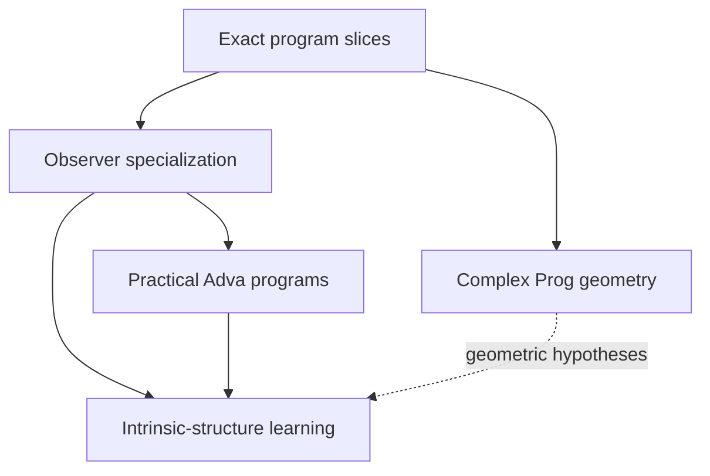

# Research and Engineering Agenda Beyond the Program-Slice Phase

Status: durable research backlog and dependency map. This document records
important directions that must not be lost while the exact `GraftTrace` and
`ProgramSlice` phase is in progress. It does not authorize premature stable
APIs or change the current implementation priority.

The phrase "Futamura projections" below is the intended reading of the
Chinese term 二村投影: the classical relationship among interpreters,
specializers, compilers, and compiler generators. Adva uses that theory as a
calibration point; the observer-conditioned problem described here is more
general than classical partial evaluation.

## Executive summary

Four future tracks must remain visible:

1. observer-conditioned specialization, calibrated against the Futamura
   projections;
2. geometric representations of complex-valued `Prog`, possibly by finite
   systems of Riemann surfaces or curves;
3. learning intrinsic world structure from the histories visible to finite
   observers;
4. practical Adva programs: arithmetic-expression evaluation, exact
   finite-field big-integer multiplication, and a Metamath verifier.

These tracks are related but must not be collapsed.



The current priority remains exact process structure. The specializer is the
first major successor because it explains how a finite observer obtains a
task-specific mechanism that need not be a literal subprogram of the world.
The complex-geometric track can proceed theoretically in parallel. Learning
depends on a precise observer/specialization semantics. Practical programs
both calibrate and pressure-test the language.

## 1. Track A: observer-conditioned specialization

### 1.1 Classical calibration: the Futamura projections

Let `I` be an interpreter, `p` a source program, and `mix` a partial evaluator
or specializer. The classical projections are schematically:

\[
\operatorname{mix}(I,p)
\simeq
\text{compiled form of }p,
\]

\[
\operatorname{mix}(\operatorname{mix},I)
\simeq
\text{compiler for }I,
\]

and

\[
\operatorname{mix}(\operatorname{mix},\operatorname{mix})
\simeq
\text{compiler generator}.
\]

These equations are a conceptual calibration, not current Adva claims. A
future Adva formulation must state the exact program identities, observation
policies, residuals, and certificates under which an equivalence symbol is
justified.

### 1.2 Why the observer problem is more general

Suppose a large world process is `W`, a finite observer is `Q`, and `B` is the
observer's finite interface or task boundary. The observer sees only a fibre
of world histories. That fibre need not be a literal causal slice or syntactic
subprogram of a characteristic world program.

The desired operation is therefore not merely

```text
take a subgraph of W
```

but something closer to

\[
\operatorname{Specialize}(W;Q,B,\Theta)
\longrightarrow
(P_{Q,B},R,\chi),
\]

where:

- `P_(Q,B)` is a task-specific residual program or mechanism;
- `R` records world structure forgotten or left unresolved;
- `chi` certifies the relationship between the specialized mechanism and the
  observations declared by `Q` under assumptions `Theta`.

The output may eventually include a specialized language or interpreter when
the observer boundary selects recurring constructions. It must not be called
the world itself.

### 1.3 Slice versus specialization

| Operation | Identity relation | Intended result |
|---|---|---|
| `ProgramSlice(P,U,V)` | same diagram, same original IDs | exact process interval |
| classical partial evaluation | transformed program with static inputs fixed | residual executable program |
| observer specialization | compiled mechanism sufficient for a finite observer/task | residual program plus forgotten structure and certificate |

This distinction is mandatory. A slice is intensional and identity-preserving.
A specialization may create a new program and must provide an explicit
correspondence back to its source process and observation policy.

### 1.4 Research questions

1. What is static information: values, boundaries, observations, histories,
   or a declared combination?
2. Is the specializer a `Prog -> Prog` transformation, a relation among open
   programs, or a program that also produces a residual certificate?
3. When the observer fibre is not a subprogram, what universal or minimality
   property selects the residual mechanism?
4. What information must `R` retain so specialization is auditable rather
   than silent forgetting?
5. Which observational commuting square expresses correctness?
6. Can a family of specialized observer languages share a common intrinsic
   program core?
7. Under what restricted conditions can an Adva specializer specialize
   itself and support analogues of the second and third Futamura projections?

### 1.5 Proposed progression

1. Complete exact `ProgramSlice` and graft-frame work.
2. Define a finite, certificate-bearing transformation result distinct from
   equality and slicing.
3. Calibrate structural specialization on an existing finite program with
   exact rational or syntactic static inputs; do not wait for a self-hosted
   interpreter.
4. Introduce the separately approved finite tagged-data and case/fold
   semantics needed by a bounded arithmetic-expression evaluator.
5. Specialize that evaluator with respect to a fixed grammar, depth, or static
   expression fragment, and check direct versus residual execution under an
   explicit observation policy.
6. Only after the specializer itself is representable in Adva should
   self-application be considered.

### 1.6 Promotion gates

Do not create a stable specializer until:

- input/static/dynamic boundaries are typed;
- residual program identities are fresh and explicit;
- the source-to-residual correspondence is certified;
- forgotten process information is recorded;
- specialization correctness is observation-relative rather than inferred
  from a few equal values;
- copy and discard cannot be introduced implicitly;
- failure and unknown conditions are representable.

## 2. Track B: geometric expression of complex `Prog`

### 2.1 Working hypothesis

The motivating conjecture is that a program over a complex semantic
completion may admit a geometric presentation by a finite system of special
Riemann surfaces or complex curves, with program composition reflected by
gluing, covering, correspondence, or another geometric operation.

The strong statement

> every `Prog` is a small finite collection of Riemann surfaces

is not yet justified. It must be treated as a hypothesis to refine or falsify.

### 2.2 Immediate mathematical obstacles

- A general program DAG has branching, boundaries, singular events, and
  explicit copy/discard. It is not automatically a manifold.
- A Riemann surface has complex dimension one. A multi-input or multi-output
  program may naturally require products, correspondences, or higher complex
  dimension.
- Rational maps fit naturally on the Riemann sphere, but `exp` is
  transcendental and interacts with the universal cover of the punctured
  plane rather than a compact algebraic curve alone.
- `log`, roots, and inverses introduce branches and ramified covers.
- Copy resembles a diagonal relation; it is not generally a holomorphic map
  between one-dimensional surfaces of the same role.
- Program holes and causal cuts may behave like punctures or boundaries, but
  that analogy requires a construction, not terminology.

The likely target may therefore be one of:

- a decorated finite diagram of Riemann surfaces;
- holomorphic or algebraic correspondences among curves;
- branched covers with marked points and cuts;
- singular or nodal complex curves;
- a stratified complex space assembled from curve-like pieces;
- a higher-dimensional complex presentation whose one-dimensional sections
  are Riemann surfaces.

### 2.3 Calibration ladder

Study increasingly difficult fragments:

1. translations and nonzero scalings on `CP^1`;
2. Möbius transformations and their projective fixed points;
3. rational expressions and branched rational maps;
4. multiplication and addition with multiple inputs;
5. explicit copy and discard;
6. `exp` and `log` through covering-space presentations;
7. shared DAGs whose branches later recombine;
8. open programs with multiple holes and outputs;
9. composition across certified program slices.

For each case, record:

- the exact program object;
- the chosen complex completion;
- geometric pieces and gluing data;
- what process identities survive;
- what the geometry forgets;
- whether the result is a curve, correspondence, surface diagram, or a
  counterexample to the current hypothesis.

### 2.4 First deliverable

The first deliverable should be a theorem/counterexample table, not an API:

- a precise representation theorem for the rational one-input/one-output
  fragment if available;
- explicit failure modes for copy, multi-input multiplication, and `exp`;
- the weakest geometric category that contains all tested programs without
  forcing a manifold ontology on program space.

No numerical plot or sampled complex trajectory is sufficient evidence for a
representation theorem.

## 3. Track C: learning intrinsic world structure

### 3.1 Problem statement

Let `W` be a world process and let finite observers `Q_i` produce observed
histories or fibres

\[
O_i(W).
\]

A learner receives finite samples of these histories, possibly together with
interventions and boundary declarations. It should produce a hypothesis
program `H` and evidence explaining what has been recovered.

The central problem is not ordinary curve fitting. It is:

> Under which observer family, interventions, and structural assumptions can
> finite observed histories identify the intrinsic process organization of
> the world, rather than merely predict another observed value?

### 3.2 Identifiability boundary

For a fixed finite observer family `Q`, observations generally determine only
an equivalence class

\[
W/{\sim_Q},
\]

not the literal world program. Claiming recovery of `W` requires an observer
family that separates the relevant structure or an explicit prior that
selects one representative.

A valid learning result should separate:

- predictive agreement under known observers;
- generalization to new cuts, boundaries, or interventions;
- recovery of source and occurrence structure;
- recovery only up to observational equivalence;
- choice of a minimal or canonical representative;
- unresolved residual structure.

### 3.3 Relationship to specialization

Observer specialization maps world structure into task-specific mechanisms.
Learning asks whether multiple such mechanisms or observed histories reveal a
common intrinsic generator.

The working triangle is:

\[
W
\longrightarrow
\{P_{Q_i,B_i}\}_i
\longrightarrow
H,
\]

with a required audit of what is lost at each arrow. The learner must not
silently identify equal specialized mechanisms with equal world programs.

### 3.4 First experiments

Begin with a finite exact setting before neural or statistical models:

1. generate a small checked world program from a known finite grammar;
2. declare several incomplete observer boundaries;
3. enumerate exact observed histories or specialized residual programs;
4. enumerate or synthesize candidate hypotheses;
5. determine the observational equivalence class exactly;
6. add interventions or observers and measure which ambiguities disappear;
7. test whether a declared minimality rule recovers the original generator or
   selects a different but observationally adequate program;
8. return a certificate, counterexample, or `Unknown`.

Only after this calibration should learned proposal models, search heuristics,
or neural systems be introduced. Their proposals must remain independently
checked by the Rust kernel.

### 3.5 Evaluation questions

- Which sources, occurrences, graft frames, or cuts are identifiable?
- What is the minimal observer family required for separation?
- How does active intervention reduce the residual class?
- Can specialization expose a stable mechanism shared across observers?
- Does a complex-geometric presentation supply useful but nonauthoritative
  priors?
- What notion of complexity or minimum description length is native to
  programs rather than imported from string encodings?
- When must the learner honestly return multiple hypotheses or `Unknown`?

## 4. Track D: practical Adva programs

Practical programs should be language calibrations, not demonstrations that
bypass missing semantics in Python. Each program should reveal which language
features are genuinely required and keep immature concepts in experiments.

### 4.1 Arithmetic-expression evaluation

Long-term target: parse and evaluate arithmetic expression strings inside an
Adva program.

Current limitation: PSC0 lacks general strings, inductive syntax trees, local
binders, and recursion. An arbitrary string evaluator cannot be honestly
implemented in the present core without extending the language.

Staged plan:

1. compile one fixed static expression into an ordinary Adva program as a
   baseline, while explicitly recording that this is compilation rather than
   interpretation;
2. design finite tagged AST data, bounded case analysis, and a certified fold
   or equivalent finite control mechanism;
3. implement a bounded-depth evaluator only after those semantics are
   approved;
4. compare direct evaluation with a specialized residual evaluator;
5. add exact error results for malformed operations;
6. design token and recursive-data semantics before moving parsing into Adva;
7. only then implement the full string front end.

This is the preferred first specializer calibration because an evaluator can
play the role of the interpreter in the first Futamura projection.

### 4.2 Finite-field big-integer multiplication

Long-term target: exact multiplication of large finite-field elements using
explicit limb or polynomial representations.

Current limitation: `Real = f64` is unsuitable. The task requires exact
integer/field semantics, bounded containers, carry or modular reduction, and
eventually iteration or recursion.

Staged plan:

1. introduce or research an exact, versioned bounded-integer operation family;
2. implement multiplication in one small fixed prime field;
3. implement fixed-limb multiplication with every limb and carry explicit;
4. compare schoolbook and a second declared algorithm without identifying
   their program histories;
5. specialize modulus, limb count, or reduction strategy;
6. scale only after exact arithmetic and resource behavior are certified.

No `f64` approximation may be used as the semantic oracle. Host big integers
may serve as an independent test oracle, not as Adva's hidden implementation.

### 4.3 Metamath verifier

Long-term target: implement a useful Metamath verifier whose accepted proof
steps are independently auditable through Adva's program semantics.

Current limitation: a complete verifier requires token streams, symbol tables,
scope frames, substitution, disjoint-variable constraints, a proof stack,
iteration, and precise failure reporting. PSC0 does not yet provide all of
these data and control structures.

Staged plan:

1. accept a pre-parsed, bounded theorem and proof-step representation;
2. verify one substitution step and its type/scope obligations;
3. add a fixed-depth proof stack and explicit error outcomes;
4. verify a small propositional fragment end to end;
5. add disjoint-variable checks and nested scopes;
6. design streaming/token semantics;
7. only then attempt a full `.mm` database verifier.

This program is a strong test of exactness, substitution frames, certificates,
and failure semantics. It should not be implemented as a Python verifier
merely wrapped by an Adva value call.

### 4.4 Language features exposed by the examples

| Feature | Expression evaluator | Field multiplication | Metamath verifier |
|---|---:|---:|---:|
| exact integers | useful | required | useful |
| finite tagged data | required | useful | required |
| bounded arrays/stacks | useful | required | required |
| recursion or certified folds | required for full target | required for scale | required for full target |
| strings/token streams | required for full target | no | required for full target |
| substitution frames | useful for specialization | useful | required |
| explicit failure results | required | required | required |
| specialization | primary calibration | modulus/size specialization | possible database specialization |

Missing features must become explicit language-design or IR decisions. Do not
smuggle them through host callbacks, hidden mutation, or untracked Python
objects.

## 5. Dependency-based schedule

The schedule is organized by research cycles rather than calendar promises.

### Phase 0: current exact-process milestone

- complete the `GraftTrace` and `ProgramSlice` task brief;
- establish or refute exact slice composition;
- retain original identities and internal discarded events.

Exit condition: the common finite process carrier between cuts is exact and
certified.

### Phase 1: bounded specialization calibration

- formalize slice versus specialization;
- define a certificate-bearing residual transformation;
- specialize an existing finite program under exact rational, syntactic, or
  boundary-static information;
- preserve the source-to-residual map and forgotten structure;
- specify, but do not smuggle in, the tagged data and finite control required
  for a later evaluator.

Exit condition: residual execution agrees under a declared observer while
source-to-residual correspondence and forgotten structure remain explicit.

### Phase 2: exact data and verification pressure tests

- implement approved finite tagged data and bounded control;
- build and specialize the bounded arithmetic AST evaluator;
- test the first Futamura-style interpreter-specialization observation;
- research exact bounded integers and finite fields;
- implement fixed-size finite-field multiplication;
- implement a bounded pre-parsed Metamath proof-step checker;
- use both examples to determine which data/control features deserve stable
  semantics.

Exit condition: at least two nontrivial programs run without `f64` as an
oracle and expose auditable resource histories.

### Phase 3: finite intrinsic-learning calibration

- define exact finite observer families and interventions;
- enumerate observed fibres or specialized mechanisms;
- recover the hypothesis equivalence class;
- test separation, minimality, residual ambiguity, and `Unknown` outcomes.

Exit condition: one finite theorem or counterexample states what world
structure is identifiable from which observer family.

### Parallel theory track: complex `Prog` geometry

- begin with rational one-port programs;
- test Riemann-surface, branched-cover, and correspondence presentations;
- add copy, multiple inputs, `exp`, and sharing as explicit stress tests;
- do not promote an API until a precise representation theorem or decisive
  counterexample identifies the correct geometric category.

This track may run in parallel because its first deliverable is theoretical.
Engineering promotion remains downstream of exact process slices.

## 6. Priority and resumption rules

| Priority | Track | Resume when |
|---|---|---|
| P0 | exact graft frames and program slices | now |
| P1 | observer specialization on existing finite programs | Phase 0 exit condition |
| P1-parallel | complex `Prog` geometry | theoretical work may begin now |
| P2 | bounded evaluator, finite-field, and Metamath programs | required exact data/control semantics are scoped |
| P2 | intrinsic-structure learning | observer specialization has an exact finite calibration |
| P3 | full strings, scalable big integers, full Metamath verifier | required recursive/data semantics are separately approved |
| deferred | process exponential, resolvent, spectral learning | exact slice transport and observation/error policies exist |

If a later experiment appears to require skipping a dependency, record the
missing assumption and stop. Do not silently widen PSC0.

## 7. Cross-track research questions

1. Is observer specialization a quotient, a residualization, a synthesis
   problem, or a composition of all three?
2. Can the specialized mechanism be characterized by a universal property
   relative to a finite boundary?
3. Does the correct complex geometry describe native programs or only one
   observation completion?
4. Can finite curve/surface pieces encode copy and source multiplicity without
   identifying occurrences?
5. What observer families separate graft-frame structure?
6. Can a learner recover a common program core from multiple specialized
   languages?
7. Which practical example first forces a justified move beyond the current
   finite binder-free core?
8. Can specialization turn a general verifier/interpreter into a small
   task-specific certified mechanism without erasing its residual history?

## 8. Governance and no-go boundaries

- This agenda records hypotheses and tasks, not stable claims.
- New exact claims belong in `claims.toml` with finite scope and
  counterexample boundaries.
- New semantic types belong in Rust and require certificates.
- Python may propose, test, visualize, or provide independent oracles; it may
  not authorize identities or semantic transformations.
- A successful bounded example does not prove a universal representation or
  learning theorem.
- A Riemann-surface presentation does not make program space a manifold.
- A specialized observer mechanism is not automatically the world's
  characteristic program.
- A learned observational representative is not automatically the intrinsic
  world program.
- Practical programs must expose language gaps rather than hide them in host
  code.
- The active task remains `NEXT_PHASE_PROGRAM_SLICES.md` until its exit
  condition is met or a checked counterexample changes the plan.

## 9. Deliverables to preserve across future conversations

When each track is activated, create a dedicated design note or ADR and a
bounded issue with:

- exact question;
- dependencies satisfied;
- native objects and observation policies;
- fixtures and counterexamples;
- success, failure, and `Unknown` criteria;
- promotion boundary;
- final report stating whether the motivating intuition survived.

This document remains the umbrella agenda. Update it when a track is promoted,
refuted, split, completed, or deliberately deferred.

## 10. Reference calibration

- Yoshihiko Futamura,
  [Partial Evaluation of Computation Process--An Approach to a Compiler-Compiler](https://doi.org/10.1023/A:1010095604496),
  *Higher-Order and Symbolic Computation* 12, 381--391 (1999 reprint of the
  1971 work).
- Brandon M. Williams and Saverio Perugini,
  [Revisiting the Futamura Projections: A Diagrammatic Approach](https://arxiv.org/abs/1611.09906),
  an overview of the three projections and their program relationships.
