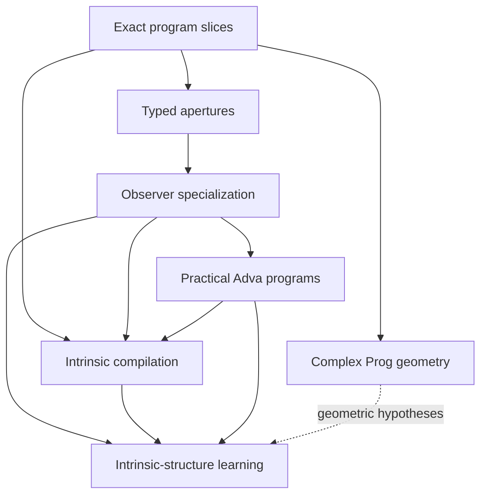

# Research and Engineering Agenda Beyond the Program-Slice Phase

Status: durable research backlog and dependency map. Exact `GraftTrace`,
`ProgramSlice`, and bounded triadic-transition phases are complete. The
typed-aperture open--close calibration is the current research-only bridge to
specialization and open logic. It does not authorize premature stable APIs.

The phrase "Futamura projections" below is the intended reading of the
Chinese term 二村投影: the classical relationship among interpreters,
specializers, compilers, and compiler generators. Adva uses that theory as a
calibration point; the observer-conditioned problem described here is more
general than classical partial evaluation.

## Executive summary

Five future tracks must remain visible:

1. observer-conditioned specialization, calibrated against the Futamura
   projections;
2. geometric representations of complex-valued `Prog`, possibly by finite
   systems of Riemann surfaces or curves;
3. learning intrinsic world structure from the histories visible to finite
   observers;
4. practical Adva programs: arithmetic-expression evaluation, exact
   finite-field big-integer multiplication, and a Metamath verifier;
5. intrinsic compilation of open SSA regions through explicit feedback,
   observer-relative state reduction, and certified cost accounting.

These tracks are related but must not be collapsed.



Exact process structure and the bounded triadic observer carrier are now
available. Before specialization, the project interposes one narrow aperture
calibration: distinguish a grounded open hole, its finite filling fibre, an
explicit close selection, retained alternatives, and a traced reopen. The
specializer remains the first major transformation successor because it
explains how a finite observer obtains a task-specific mechanism that need not
be a literal subprogram of the world.
The bounded neutral-carrier mechanism grammar in note 0109 is a syntax
checkpoint inside this bridge: it separates three input labels, three process
labels, and three output labels, and makes computation, verification, and
learning apply different policies to one retained open frontier. It does not
yet supply the specialization, feedback, or persistent-container semantics
required by later phases.

The complex-geometric track can proceed theoretically in parallel. Learning
depends on a precise observer/specialization semantics. Practical programs
both calibrate and pressure-test the language. Intrinsic compilation becomes
eligible only after exact slices, observer-relative transformation results,
the required exact data semantics, and a separately approved feedback model
are available.

## 1. Track A: observer-conditioned specialization

### 1.1 Classical calibration: the Futamura projections

Let `I` be an interpreter, `p` a source program, and `mix` a partial evaluator
or specializer. The classical projections are schematically:

\[
\operatorname{mix}(I,p)
\simeq
\text{compiled form of }p,
\]

\[
\operatorname{mix}(\operatorname{mix},I)
\simeq
\text{compiler for }I,
\]

and

\[
\operatorname{mix}(\operatorname{mix},\operatorname{mix})
\simeq
\text{compiler generator}.
\]

These equations are a conceptual calibration, not current Adva claims. A
future Adva formulation must state the exact program identities, observation
policies, residuals, and certificates under which an equivalence symbol is
justified.

### 1.2 Why the observer problem is more general

Suppose a large world process is `W`, a finite observer is `Q`, and `B` is the
observer's finite interface or task boundary. The observer sees only a fibre
of world histories. That fibre need not be a literal causal slice or syntactic
subprogram of a characteristic world program.

The desired operation is therefore not merely

```text
take a subgraph of W
```

but something closer to

\[
\operatorname{Specialize}(W;Q,B,\Theta)
\longrightarrow
(P_{Q,B},R,\chi),
\]

where:

- `P_(Q,B)` is a task-specific residual program or mechanism;
- `R` records world structure forgotten or left unresolved;
- `chi` certifies the relationship between the specialized mechanism and the
  observations declared by `Q` under assumptions `Theta`.

The output may eventually include a specialized language or interpreter when
the observer boundary selects recurring constructions. It must not be called
the world itself.

### 1.3 Slice versus specialization

| Operation | Identity relation | Intended result |
|---|---|---|
| `ProgramSlice(P,U,V)` | same diagram, same original IDs | exact process interval |
| classical partial evaluation | transformed program with static inputs fixed | residual executable program |
| observer specialization | compiled mechanism sufficient for a finite observer/task | residual program plus forgotten structure and certificate |

This distinction is mandatory. A slice is intensional and identity-preserving.
A specialization may create a new program and must provide an explicit
correspondence back to its source process and observation policy.

### 1.4 Research questions

1. What is static information: values, boundaries, observations, histories,
   or a declared combination?
2. Is the specializer a `Prog -> Prog` transformation, a relation among open
   programs, or a program that also produces a residual certificate?
3. When the observer fibre is not a subprogram, what universal or minimality
   property selects the residual mechanism?
4. What information must `R` retain so specialization is auditable rather
   than silent forgetting?
5. Which observational commuting square expresses correctness?
6. Can a family of specialized observer languages share a common intrinsic
   program core?
7. Under what restricted conditions can an Adva specializer specialize
   itself and support analogues of the second and third Futamura projections?

### 1.5 Proposed progression

1. Complete exact `ProgramSlice` and graft-frame work.
2. Define a finite, certificate-bearing transformation result distinct from
   equality and slicing.
3. Calibrate structural specialization on an existing finite program with
   exact rational or syntactic static inputs; do not wait for a self-hosted
   interpreter.
4. Introduce the separately approved finite tagged-data and case/fold
   semantics needed by a bounded arithmetic-expression evaluator.
5. Specialize that evaluator with respect to a fixed grammar, depth, or static
   expression fragment, and check direct versus residual execution under an
   explicit observation policy.
6. Only after the specializer itself is representable in Adva should
   self-application be considered.

### 1.6 Promotion gates

Do not create a stable specializer until:

- input/static/dynamic boundaries are typed;
- residual program identities are fresh and explicit;
- the source-to-residual correspondence is certified;
- forgotten process information is recorded;
- specialization correctness is observation-relative rather than inferred
  from a few equal values;
- copy and discard cannot be introduced implicitly;
- failure and unknown conditions are representable.

## 2. Track B: geometric expression of complex `Prog`

### 2.1 Working hypothesis

The motivating conjecture is that a program over a complex semantic
completion may admit a geometric presentation by a finite system of special
Riemann surfaces or complex curves, with program composition reflected by
gluing, covering, correspondence, or another geometric operation.

The strong statement

> every `Prog` is a small finite collection of Riemann surfaces

is not yet justified. It must be treated as a hypothesis to refine or falsify.

### 2.2 Immediate mathematical obstacles

- A general program DAG has branching, boundaries, singular events, and
  explicit copy/discard. It is not automatically a manifold.
- A Riemann surface has complex dimension one. A multi-input or multi-output
  program may naturally require products, correspondences, or higher complex
  dimension.
- Rational maps fit naturally on the Riemann sphere, but `exp` is
  transcendental and interacts with the universal cover of the punctured
  plane rather than a compact algebraic curve alone.
- `log`, roots, and inverses introduce branches and ramified covers.
- Copy resembles a diagonal relation; it is not generally a holomorphic map
  between one-dimensional surfaces of the same role.
- Program holes and causal cuts may behave like punctures or boundaries, but
  that analogy requires a construction, not terminology.

The likely target may therefore be one of:

- a decorated finite diagram of Riemann surfaces;
- holomorphic or algebraic correspondences among curves;
- branched covers with marked points and cuts;
- singular or nodal complex curves;
- a stratified complex space assembled from curve-like pieces;
- a higher-dimensional complex presentation whose one-dimensional sections
  are Riemann surfaces.

### 2.3 Calibration ladder

Study increasingly difficult fragments:

1. translations and nonzero scalings on `CP^1`;
2. Möbius transformations and their projective fixed points;
3. rational expressions and branched rational maps;
4. multiplication and addition with multiple inputs;
5. explicit copy and discard;
6. `exp` and `log` through covering-space presentations;
7. shared DAGs whose branches later recombine;
8. open programs with multiple holes and outputs;
9. composition across certified program slices.

For each case, record:

- the exact program object;
- the chosen complex completion;
- geometric pieces and gluing data;
- what process identities survive;
- what the geometry forgets;
- whether the result is a curve, correspondence, surface diagram, or a
  counterexample to the current hypothesis.

### 2.4 First deliverable

The first deliverable should be a theorem/counterexample table, not an API:

- a precise representation theorem for the rational one-input/one-output
  fragment if available;
- explicit failure modes for copy, multi-input multiplication, and `exp`;
- the weakest geometric category that contains all tested programs without
  forcing a manifold ontology on program space.

No numerical plot or sampled complex trajectory is sufficient evidence for a
representation theorem.

### 2.4 Lattice-polar terminology checkpoint

Related Track B research checkpoint (2026-09-10):
[lattice-polar and mirror boundaries](research/lattice-polar-and-mirror-boundary.md)
registers [version-zero research terms](terminology/geometry-boundaries-v0.json)
for refine, quotient, lattice-polar, and mirror. Only lattice-polar has new
external exact finite evidence: a TO24 nonintegral vertex-polar pairing
obstructs every compatible reflexive lattice for the fixed centered shape,
while cube and shear controls pass. Rational biduality is not lattice
admission. No stable API, new geometry catalog descendant, or CY construction
is promoted; the next obligation is an explicit checked-diagram/frame binding.

The separately scoped [cube-root triangle continuation](research/cube-root-conjugation-and-polar-covariance.md)
checks conjugation/polar covariance with explicit primal/dual and Gram roles.
It supplies a positive 2D lattice example and a counterexample to equating
conjugation with polarity; native binding remains outstanding. This does not
extend the old 3D profile or repair the centered TO24 obstruction.

A third Track B checkpoint (2026-09-11),
[the lattice gate](research/reflexive-lattice-gate.md), turns the fixed TO24
obstruction into an iff criterion: a compatible lattice pair exists exactly
when every primal-polar vertex pairing is an integer, so the question is
decided without a lattice search and the minimal witness is the lattice the
vertices generate. Five positive fixtures in two and three dimensions and
three failing TO24 rows are executed with six refusal controls and one
retained correction replay. The obstruction reads as the facet-normal
denominators 2 and 3, hence as a scale-invariant ratio. No new terminology,
stable API or catalog descendant follows; the checked-diagram/frame binding
remains the open obligation.

## 3. Track C: learning intrinsic world structure

### 3.1 Problem statement

Let `W` be a world process and let finite observers `Q_i` produce observed
histories or fibres

\[
O_i(W).
\]

A learner receives finite samples of these histories, possibly together with
interventions and boundary declarations. It should produce a hypothesis
program `H` and evidence explaining what has been recovered.

The central problem is not ordinary curve fitting. It is:

> Under which observer family, interventions, and structural assumptions can
> finite observed histories identify the intrinsic process organization of
> the world, rather than merely predict another observed value?

### 3.2 Identifiability boundary

For a fixed finite observer family `Q`, observations generally determine only
an equivalence class

\[
W/{\sim_Q},
\]

not the literal world program. Claiming recovery of `W` requires an observer
family that separates the relevant structure or an explicit prior that
selects one representative.

A valid learning result should separate:

- predictive agreement under known observers;
- generalization to new cuts, boundaries, or interventions;
- recovery of source and occurrence structure;
- recovery only up to observational equivalence;
- choice of a minimal or canonical representative;
- unresolved residual structure.

### 3.3 Relationship to specialization

Observer specialization maps world structure into task-specific mechanisms.
Learning asks whether multiple such mechanisms or observed histories reveal a
common intrinsic generator.

The working triangle is:

\[
W
\longrightarrow
\{P_{Q_i,B_i}\}_i
\longrightarrow
H,
\]

with a required audit of what is lost at each arrow. The learner must not
silently identify equal specialized mechanisms with equal world programs.

### 3.4 First experiments

Begin with a finite exact setting before neural or statistical models:

1. generate a small checked world program from a known finite grammar;
2. declare several incomplete observer boundaries;
3. enumerate exact observed histories or specialized residual programs;
4. enumerate or synthesize candidate hypotheses;
5. determine the observational equivalence class exactly;
6. add interventions or observers and measure which ambiguities disappear;
7. test whether a declared minimality rule recovers the original generator or
   selects a different but observationally adequate program;
8. return a certificate, counterexample, or `Unknown`.

Only after this calibration should learned proposal models, search heuristics,
or neural systems be introduced. Their proposals must remain independently
checked by the Rust kernel.

### 3.5 Evaluation questions

- Which sources, occurrences, graft frames, or cuts are identifiable?
- What is the minimal observer family required for separation?
- How does active intervention reduce the residual class?
- Can specialization expose a stable mechanism shared across observers?
- Does a complex-geometric presentation supply useful but nonauthoritative
  priors?
- What notion of complexity or minimum description length is native to
  programs rather than imported from string encodings?
- When must the learner honestly return multiple hypotheses or `Unknown`?

## 4. Track D: practical Adva programs

Practical programs should be language calibrations, not demonstrations that
bypass missing semantics in Python. Each program should reveal which language
features are genuinely required and keep immature concepts in experiments.

### 4.1 Arithmetic-expression evaluation

Long-term target: parse and evaluate arithmetic expression strings inside an
Adva program.

Current limitation: PSC0 lacks general strings, inductive syntax trees, local
binders, and recursion. An arbitrary string evaluator cannot be honestly
implemented in the present core without extending the language.

Staged plan:

1. compile one fixed static expression into an ordinary Adva program as a
   baseline, while explicitly recording that this is compilation rather than
   interpretation;
2. design finite tagged AST data, bounded case analysis, and a certified fold
   or equivalent finite control mechanism;
3. implement a bounded-depth evaluator only after those semantics are
   approved;
4. compare direct evaluation with a specialized residual evaluator;
5. add exact error results for malformed operations;
6. design token and recursive-data semantics before moving parsing into Adva;
7. only then implement the full string front end.

This is the preferred first specializer calibration because an evaluator can
play the role of the interpreter in the first Futamura projection.

### 4.2 Finite-field big-integer multiplication

Long-term target: exact multiplication of large finite-field elements using
explicit limb or polynomial representations.

Current limitation: `Real = f64` is unsuitable. The task requires exact
integer/field semantics, bounded containers, carry or modular reduction, and
eventually iteration or recursion.

Staged plan:

1. introduce or research an exact, versioned bounded-integer operation family;
2. implement multiplication in one small fixed prime field;
3. implement fixed-limb multiplication with every limb and carry explicit;
4. compare schoolbook and a second declared algorithm without identifying
   their program histories;
5. specialize modulus, limb count, or reduction strategy;
6. scale only after exact arithmetic and resource behavior are certified.

No `f64` approximation may be used as the semantic oracle. Host big integers
may serve as an independent test oracle, not as Adva's hidden implementation.

### 4.3 Metamath verifier

Long-term target: implement a useful Metamath verifier whose accepted proof
steps are independently auditable through Adva's program semantics.

Current limitation: a complete verifier requires token streams, symbol tables,
scope frames, substitution, disjoint-variable constraints, a proof stack,
iteration, and precise failure reporting. PSC0 does not yet provide all of
these data and control structures.

Staged plan:

1. accept a pre-parsed, bounded theorem and proof-step representation;
2. verify one substitution step and its type/scope obligations;
3. add a fixed-depth proof stack and explicit error outcomes;
4. verify a small propositional fragment end to end;
5. add disjoint-variable checks and nested scopes;
6. design streaming/token semantics;
7. only then attempt a full `.mm` database verifier.

This program is a strong test of exactness, substitution frames, certificates,
and failure semantics. It should not be implemented as a Python verifier
merely wrapped by an Adva value call.

### 4.4 Language features exposed by the examples

| Feature | Expression evaluator | Field multiplication | Metamath verifier |
|---|---:|---:|---:|
| exact integers | useful | required | useful |
| finite tagged data | required | useful | required |
| bounded arrays/stacks | useful | required | required |
| recursion or certified folds | required for full target | required for scale | required for full target |
| strings/token streams | required for full target | no | required for full target |
| substitution frames | useful for specialization | useful | required |
| explicit failure results | required | required | required |
| specialization | primary calibration | modulus/size specialization | possible database specialization |

Missing features must become explicit language-design or IR decisions. Do not
smuggle them through host callbacks, hidden mutation, or untracked Python
objects.

## 5. Track E: intrinsic compilation from open SSA feedback

### 5.1 Working hypothesis

The motivating hypothesis is that some repeatedly executed programs can be
compiled more efficiently after their task-relative intrinsic structure has
been identified. This is conditional, not a universal speedup claim. The
analysis cost may exceed the saved execution cost, and many programs may admit
no smaller exact representation.

A complete SSA control-flow graph is not generally a DAG: loop backedges and
loop-carried `phi` dependencies are cyclic. The proposed calibration instead
cuts each loop at its state boundary and treats its body as an open acyclic
region

\[
B:S_{\mathrm{in}}\otimes X
  \longrightarrow
  S_{\mathrm{out}}\otimes Y,
\]

followed by an explicit feedback closure that identifies the outgoing and
incoming state boundaries. The notation

\[
\operatorname{Tr}_S(B):X\longrightarrow Y
\]

is a research target only. Adva does not currently implement recursion,
cyclic programs, or a stable traced structure, and this agenda does not
authorize adding them.

### 5.2 Observer-relative compiled structure

For an observation policy `Q`, seek a checked encoder, reduced transition,
and decoder

\[
E_Q:X\to Z_Q,
\qquad
K_Q:Z_Q\to Z_Q,
\qquad
D_Q:Z_Q\to X.
\]

An exact reduction may satisfy an appropriate commuting relation such as

\[
E_QP=K_QE_Q
\]

on a declared reachable domain. A decoded formulation must expose its
residual explicitly, for example

\[
\mathcal R_Q=PD_Q-D_QK_Q.
\]

The notation is a calibration aid and must not force general programs into a
linear or matrix ontology. Depending on the fragment, the useful intrinsic
structure may instead be an SCC decomposition, minimal automaton, recurrence,
minimal polynomial, reachable/observable quotient, block normal form, or
finite boundary response.

Compilation is beneficial only when the complete cost is lower. If intrinsic
analysis costs `A`, original execution costs `C` per run, reduced
encoding/execution/decoding costs `R` per run, and the result is reused `N`
times, the basic acceptance inequality is

\[
A+NR<NC.
\]

No speedup claim may omit analysis, encoding, decoding, certification, code
size, or reuse count.

### 5.3 First exact calibration

Use an exact finite-field affine SSA loop rather than floating-point spectral
code:

\[
x_{t+1}=Ax_t+b,
\qquad
y_t=Cx_t.
\]

The first experiment should:

1. construct a bounded external or experimental SSA fixture with explicit
   basic blocks, `phi` origins, uses, and a single loop backedge;
2. cut the backedge and represent the body as an open DAG with typed state
   input and output boundaries;
3. preserve unique definitions while representing multiple uses as explicit
   occurrences and, where the program semantics requires it, explicit copy;
4. execute the loop over one small exact finite field;
5. compute a task-relative reachable/observable quotient, Krylov recurrence,
   or minimal-polynomial summary using established algorithms;
6. generate a residual transition `K_Q` and source-to-residual
   correspondence;
7. compare direct `n`-step execution with the compiled summary, requiring
   exact output agreement and zero declared residual in the accepted fixture;
8. report analysis time, generated-code size, per-run cost, reuse count, and
   the measured crossover point;
9. return a certificate, a bounded counterexample, or `Unknown`.

This experiment calibrates against established SSA loop optimization, exact
model reduction, recurrence acceleration, and automata minimization. Success
does not by itself establish theoretical novelty.

### 5.4 Mandatory distinctions and failure cases

- SSA single definition is not linear use. Fan-out must not become
  unrecorded aliasing.
- A `phi` node is predecessor-sensitive source selection, not arithmetic
  addition or unconditional value identification.
- Cutting a backedge produces an open body; closing feedback is a separate
  semantic operation and is not an exact `ProgramSlice`.
- Task-relative equivalence does not imply full program equivalence.
- Exact compilation and approximate numerical reduction require different
  result and certificate types.
- No floating-point tolerance may authorize the first exact calibration.
- A result with no dimension, state, operation-count, or reuse advantage is a
  valid negative result.
- A compiler that cannot recover its analysis cost on the declared workload
  must not be reported as an optimization.

### 5.5 Promotion gates

Do not create stable SSA, feedback, intrinsic-compiler, eigenvalue, or spectrum
APIs until:

- the exact `ProgramSlice` phase has met its exit condition;
- observer-relative residual transformations have a certificate-bearing
  semantics;
- cyclic/feedback representation has a separate approved design decision;
- exact finite-field and bounded-control semantics are available;
- source, occurrence, copy, `phi`, and backedge provenance survive the
  transformation;
- the accepted equivalence and observation policy are explicit;
- exact and approximate results cannot be confused;
- at least one end-to-end fixture reports total analysis and execution cost;
- known compiler and model-reduction baselines are compared honestly.

## 6. Dependency-based schedule

The schedule is organized by research cycles rather than calendar promises.

### Phase 0: current exact-process milestone

- complete the `GraftTrace` and `ProgramSlice` task brief;
- establish or refute exact slice composition;
- retain original identities and internal discarded events.

Exit condition: the common finite process carrier between cuts is exact and
certified.

### Phase 0.5: typed-aperture calibration

- derive typed apertures only from existing checked through carriers;
- distinguish absence of an aperture, an empty filling fibre, and a
  multivalued filling fibre;
- require an explicit witness for multivalued close;
- retain alternatives, residuals, and close/reopen trace;
- keep new hole-type creation, forgetting, singularity identification, and
  stable open/close semantics outside the API.

Exit condition: one three-domain boundary and the empty/multivalued negative
controls pass without allocating semantic identities or erasing residuals.

### Phase 1: bounded specialization calibration

- formalize slice versus specialization;
- define a certificate-bearing residual transformation;
- specialize an existing finite program under exact rational, syntactic, or
  boundary-static information;
- preserve the source-to-residual map and forgotten structure;
- specify, but do not smuggle in, the tagged data and finite control required
  for a later evaluator.

Exit condition: residual execution agrees under a declared observer while
source-to-residual correspondence and forgotten structure remain explicit.

### Phase 2: exact data and verification pressure tests

- implement approved finite tagged data and bounded control;
- build and specialize the bounded arithmetic AST evaluator;
- test the first Futamura-style interpreter-specialization observation;
- research exact bounded integers and finite fields;
- implement fixed-size finite-field multiplication;
- implement a bounded pre-parsed Metamath proof-step checker;
- use both examples to determine which data/control features deserve stable
  semantics.

Exit condition: at least two nontrivial programs run without `f64` as an
oracle and expose auditable resource histories.

### Phase 3: exact intrinsic-compilation calibration

- approve an experimental feedback representation separately from exact
  `ProgramSlice`;
- construct the finite-field affine SSA loop fixture;
- derive an exact task-relative state summary;
- compile direct iteration to the reduced recurrence or transition;
- certify source-to-residual correspondence and exact observed behavior;
- measure complete analysis, execution, and reuse cost against the baseline.

Exit condition: one exact bounded transformation has a checked correctness
result and a measured cost crossover, or a counterexample states why the
proposed reduction or amortization fails.

### Phase 4: finite intrinsic-learning calibration

- define exact finite observer families and interventions;
- enumerate observed fibres or specialized mechanisms;
- recover the hypothesis equivalence class;
- test separation, minimality, residual ambiguity, and `Unknown` outcomes.

Exit condition: one finite theorem or counterexample states what world
structure is identifiable from which observer family.

### Parallel theory track: complex `Prog` geometry

- begin with rational one-port programs;
- test Riemann-surface, branched-cover, and correspondence presentations;
- add copy, multiple inputs, `exp`, and sharing as explicit stress tests;
- do not promote an API until a precise representation theorem or decisive
  counterexample identifies the correct geometric category.

This track may run in parallel because its first deliverable is theoretical.
Engineering promotion remains downstream of exact process slices.

## 7. Priority and resumption rules

| Priority | Track | Resume when |
|---|---|---|
| P0 | exact graft frames and program slices | now |
| P0.5 | typed-aperture open--close calibration | exact triadic through carriers exist |
| P1 | observer specialization on existing finite programs | Phase 0 exit condition |
| P1-parallel | complex `Prog` geometry | theoretical work may begin now |
| P2 | bounded evaluator, finite-field, and Metamath programs | required exact data/control semantics are scoped |
| P2 | exact intrinsic-compilation calibration | exact finite-field/control semantics, observer specialization, and a separate feedback decision exist |
| P3 | intrinsic-structure learning | observer specialization has an exact finite calibration |
| P3 | full strings, scalable big integers, full Metamath verifier | required recursive/data semantics are separately approved |
| deferred | process exponential, resolvent, and approximate spectral compilation/learning | exact slice transport and observation/error policies exist |

If a later experiment appears to require skipping a dependency, record the
missing assumption and stop. Do not silently widen PSC0.

## 8. Cross-track research questions

1. Is observer specialization a quotient, a residualization, a synthesis
   problem, or a composition of all three?
2. Can the specialized mechanism be characterized by a universal property
   relative to a finite boundary?
3. Does the correct complex geometry describe native programs or only one
   observation completion?
4. Can finite curve/surface pieces encode copy and source multiplicity without
   identifying occurrences?
5. What observer families separate graft-frame structure?
6. Can a learner recover a common program core from multiple specialized
   languages?
7. Which practical example first forces a justified move beyond the current
   finite binder-free core?
8. Can specialization turn a general verifier/interpreter into a small
   task-specific certified mechanism without erasing its residual history?
9. When can an open SSA feedback body be replaced by a smaller
   observer-relative transition without losing source, occurrence, or
   `phi` provenance?
10. Which intrinsic-analysis costs can be amortized, and what workload
    declaration makes a compiler speedup claim auditable?

## 9. Governance and no-go boundaries

- This agenda records hypotheses and tasks, not stable claims.
- New exact claims belong in `claims.toml` with finite scope and
  counterexample boundaries.
- New semantic types belong in Rust and require certificates.
- Python may propose, test, visualize, or provide independent oracles; it may
  not authorize identities or semantic transformations.
- A successful bounded example does not prove a universal representation or
  learning theorem.
- A Riemann-surface presentation does not make program space a manifold.
- A specialized observer mechanism is not automatically the world's
  characteristic program.
- A learned observational representative is not automatically the intrinsic
  world program.
- Practical programs must expose language gaps rather than hide them in host
  code.
- An accelerated loop fixture does not establish a universal intrinsic
  compiler, and performance claims must include analysis and amortization.
- Open-DAG feedback notation does not authorize cyclic stable semantics; that
  requires a separate design decision.
- The active task remains `NEXT_PHASE_PROGRAM_SLICES.md` until its exit
  condition is met or a checked counterexample changes the plan.

## 10. Deliverables to preserve across future conversations

When each track is activated, create a dedicated design note or ADR and a
bounded issue with:

- exact question;
- dependencies satisfied;
- native objects and observation policies;
- fixtures and counterexamples;
- success, failure, and `Unknown` criteria;
- promotion boundary;
- final report stating whether the motivating intuition survived.

This document remains the umbrella agenda. Update it when a track is promoted,
refuted, split, completed, or deliberately deferred.

## 11. Reference calibration

- Yoshihiko Futamura,
  [Partial Evaluation of Computation Process--An Approach to a Compiler-Compiler](https://doi.org/10.1023/A:1010095604496),
  *Higher-Order and Symbolic Computation* 12, 381--391 (1999 reprint of the
  1971 work).
- Brandon M. Williams and Saverio Perugini,
  [Revisiting the Futamura Projections: A Diagrammatic Approach](https://arxiv.org/abs/1611.09906),
  an overview of the three projections and their program relationships.

## 12. Bounded interpreter research decision, 2026-09-15

Mingli selected the minimal native interpreter route identified by Research
0137. The separately versioned
[data-machine research profile](adr/bounded-data-machine-research.md) supplies
finite tagged data and bounded control in Rust, while the arithmetic interpreter
is written as an Adva program over those generic instructions. The
[executed calibration](research/bounded-native-data-interpreter.md) checks 129
object programs, exact arithmetic, state replay and budget-preserving suspension.

This is a direct unspecialized language pressure test. It does not declare Track
A specialization complete, derive execution from observer equality, or promote
the new data/control objects into PSC0. The need for a stronger execution carrier
is recorded explicitly: existing read-only triadic transitions are insufficient.
Native sharing/graft correspondence and stable promotion remain separate gates.
Self interpretation additionally requires an admitted representation and correct
interpretation of this machine's own instruction grammar, with its overhead and
residual state recorded. No earlier mass bound supplies that missing result.

## 13. Self-interpretation capacity preflight, 2026-09-16

Section 12 named the prerequisite for self interpretation: an admitted
representation of this machine's own instruction grammar and its recorded
overhead. The
[bounded capacity preflight](research/self-interpretation-capacity-preflight.md)
measures that prerequisite inside the bounds the profile already declares, without
changing the machine, adding an operation or widening a limit.

Result: an inspectable encoding of the unchanged 51-instruction object interpreter
needs 169 data nodes against 127, and the only encoding that fits the node bound —
packing each instruction's operands into one integer — cannot be unpacked, because
the 19-variant vocabulary has no division, modulo or bit operation. The bound is
located from both sides by execution: a 127-node input is admitted and a 128-node
input is refused before running. A 17-case opcode dispatch ladder costs 90 of the
128 instructions and 3 native steps per ladder position, one data-driven index step
costs 4 native steps, and a static 16-case index ladder costs 85 instructions.

Consequence for the open choice: the checked-translation route does not by itself
move any of these three bounds, while a separately scoped extension must name which
bound moves — data nodes or an unpacking operation, program instructions, and
lifetime fuel — and record the overhead, as section 12 already requires. The
preflight is a capacity measurement and not an impossibility result; it counted two
encoding schemes, searched for no third, and wrote no interpreter.

## 14. Subset self-interpretation and its measured price, 2026-09-16

Section 13 priced the prerequisite for self interpretation. The
[bounded scaling preflight](research/self-interpretation-scaling-preflight.md) goes
one step further and executes it: a generated meta program written in the research
data-machine language interprets object programs of a declared four-instruction
subset of that machine's own instruction grammar, with the object program supplied
as data. It returns 7, 9, 4 and 5 for four object programs it has never seen, and
refuses five malformed or out-of-subset programs with their exact reason retained in
the run report.

The same attempt measures the price. An opcode body costs 11 to 26 instructions
depending on how many object slots it must reach, one more interpreted object
instruction costs 33 instructions, and an interpreted object instruction costs 14.5
to 22 native steps. A three-opcode meta over two object instructions is 108
instructions and runs; a four-opcode meta over two object instructions is 166 and a
nineteen-opcode ladder over one object instruction is 295, and both are refused at
admission by the declared bound of 128.

Consequence for section 12's open choice: a checked translation between the carrier
and the program/process boundary moves none of the declared bounds, while a
separately scoped extension must move the program instruction bound by at least the
measured factor, and either the data node bound or the operation vocabulary, and the
lifetime fuel bound, and would still need indirect register addressing to avoid a
stack-simulated object register file. This is a subset interpretation and a set of
prices, not an impossibility result and not the full instruction grammar.

## 15. The first Futamura-style observation, executed, 2026-09-16

Section 1.1 kept the Futamura projections as a conceptual calibration and stated
what a real formulation would need: exact program identities, observation policies,
residuals and certificates. Section 1.5 step 5 and section 4's staged plan asked for
one fixed static expression to be compiled into an ordinary Adva program, with
residual execution agreeing under a declared observer.

That calibration is now executed for the arithmetic track and recorded in
[the Futamura note](research/futamura-projections-in-adva-terms.md). A compiler built
from the unchanged 51-instruction arithmetic interpreter by a declared, checked rule —
its 50 other instructions byte for byte, its final `return` replaced by a jump into an
appended 11-instruction emission epilogue — compiles all 129 frozen regular trees.
Every emitted residual is a 3-instruction program, and for all 129 trees the
interpreted value, the directly executed residual value and an independent recursive
oracle agree. The interpreted half reproduces the frozen campaign's own bytes and its
recorded 15966 steps.

The accounting is part of the result rather than an afterthought: compile runs cost
35 to 147 steps for 17385 in total, so one-shot compile-then-run (17772) is *worse*
than interpreting once (15966), while two uses of a residual beat interpreting twice
in every one of the 129 cases. Compilation here pays on reuse only.

Consequence for the open choice in sections 12 to 14: projection one needs no bound
change and is available now in this bounded form. Projections two and three need the
specializer to be a program in the language it specializes, and three measured facts
block that in this profile — the 169-node inspectable encoding against 127, the
295-instruction nineteen-opcode meta against 128, and the absence of a loader
instruction that turns emitted program data into an executable program. A separately
scoped extension must move the program and data or vocabulary bounds and the fuel
bound; a checked translation between the carrier and the program/process boundary
moves none of them. Nothing here promotes a specializer, and the promotion gates of
section 1.6 that concern failure, unknown and certificates remain unsatisfied.

## 16. The first projection with a live dynamic input, 2026-09-16

Section 15 executed the first projection for a fully static family, where every
residual came out as a constant because the source program was the whole input. The
[dynamic-residual calibration](research/futamura-dynamic-residual-calibration.md) keeps
a dynamic input alive, so the residual has to be code.

A 41-instruction compiler written in the research data-machine language — 12 registers,
11 instruction kinds — reads and writes the same declared program encoding, and its
whole rule is one sentence: keep the last instruction that writes the returned slot,
together with the return, and drop everything else. Over the eight source programs of
the declared two-opcode two-slot subset, with two dynamic values each, all sixteen
cases agree with interpretation in status *and* value: twelve return the dynamic value,
and four stay refused because their returned slot was never written. Compilation here
preserves failure rather than converting it into a value.

Residuals are 1 or 2 instructions against 3 source instructions. Interpreted runs cost
41 to 50 native steps for 728 in total, the compiler 36 to 38 for 592, and the
residuals 1 to 2 for 28 — so one compile plus one residual run (620) is already cheaper
than interpreting sixteen times (728), which is the opposite of section 15's family,
where the compile cost dominated and two uses were needed first. Compilation's
pay-off is a ratio between two programs, and both calibrations record their own ratio
instead of generalising from one.

Two boundaries stand as before. The emitted residual becomes an executable program
only through a declared host instantiation step, because the machine has no loader;
and projections two and three stay blocked by the measured 295-instruction and 169-node
floors. Nothing here promotes a specializer or an optimiser.

## 17. The compiler size curve and the bootstrapping budget, 2026-09-16

Sections 13 to 16 measured self-hosting cost as isolated points: 169 data nodes against
127, 295 instructions for a nineteen-case ladder with placeholder bodies, 166 for a
four-opcode meta interpreter, 41 for a two-opcode compiler. The
[size curve](research/compiler-size-curve-and-bootstrapping-budget.md) turns them into a
surface by generating an in-language lowering compiler for each declared source shape
and measuring its instruction count.

Result: each additional source opcode costs 45 to 63 instructions, each additional
source instruction costs 32, and an additional slot costs nothing in code size because
slot indices travel as data in this lowering. At three source instructions the ceiling is
two opcodes: the third needs 146 of the declared 128. A compiler for the machine's whole
nineteen-opcode instruction language over a single source instruction is a measured
**201-instruction lower bound**, refused at admission, with twelve opcodes charged a
placeholder body. For every fitting shape the whole source family was compiled, the
residual instantiated and executed directly, and 28 of 28 cases agreed with an
independent reference in status and value, including twelve refusals.

Consequence for bootstrapping: the opcode term is the binding one, and it is binding per
*source position*, which is what a static control-transfer and static register-operand
machine cannot avoid. Self-hosting therefore needs either a larger instruction bound or
a data-driven dispatch the language cannot express today, and the slot bank is the one
term an extension does not have to buy. This is a price list for the separately scoped
extension of sections 12 to 16, not a prohibition, and it promotes nothing.
