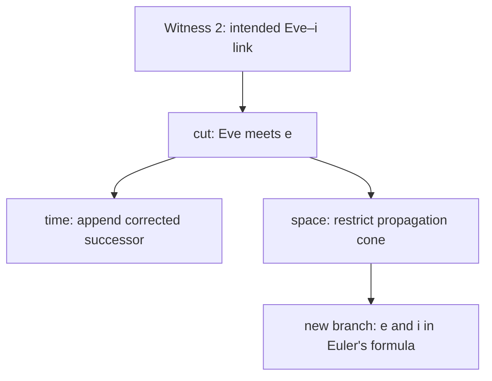

# The Third Absurdity Witness: Euler's Formula and a Cut Through Time and Space

Status: attributed narrative and mathematical-inquiry witness. This note
defines no stable Adva semantics, registers no executable complex-analysis
claim, and does not complete the historical explanation of Euler's discovery.

## The correction

On 2026-09-05, Mingli Yuan identified an error in the intended association of
the second absurdity witness: within the English spelling coordinate, Eve meets
`e`, not `i`.

The correction is not applied by editing the predecessor. The second witness
remains at its original content coordinate, while
[`third-absurdity-euler-cut-witness.adva`](../../programs/bootstrap-0/third-absurdity-euler-cut-witness.adva)
is appended as its successor. The error and its correction are both historical
facts of the exploration.

This qualification matters: the observation concerns an English narrative
coordinate. It is not a statement about Hebrew orthography or etymology, and
the `e` in `Eve` is not thereby derived from Euler's number.

## Why the error is generative

The cut breaks the intended `Eve ↔ i` association. Yet it does not leave two
dead fragments. The corrected `e` and the preserved arithmetic `i` meet again
under a stricter relation:

\[
e^{ix}=\cos x+i\sin x.
\]

At \(x=\pi\), this yields the expression now commonly called Euler's identity:

\[
e^{i\pi}+1=0.
\]

The first association was linguistic and mistaken. The second relation is
mathematical and derivable. Their difference is part of the witness's
truthfulness; their unexpected succession is part of its interest.

## Formula, identity, and historical boundary

Euler's *Introductio in analysin infinitorum*, written in 1745 and published in
1748, makes functions and infinite series central objects. In chapter 7 Euler
chooses the natural logarithm base, names it `e`, and develops its exponential
series. Chapter 8 then derives the series for sine and cosine and the relation
between complex exponentials and circular functions.

The historical anchors are:

- [Euler's *Introductio*, volume 1, E101](https://scholarlycommons.pacific.edu/euler-works/101/);
- [an English translation excerpt of chapter 7](https://faculty.washington.edu/etou/eulersoc/documents/Euler-Introductio_Ch7.pdf);
- [a modern mathematical analysis of Euler's chapter 8 derivation](https://arxiv.org/abs/2304.01353).

This note does not claim that Euler was the first person to approach every
ingredient, nor that he first printed the modern five-constant identity in
exactly the present arrangement. The historical question `Why was Euler able
to discover it?` remains open for a source-complete reconstruction.

## A finite derivation of the necessity

If the complex exponential is defined by a convergent power series, then

\[
e^{ix}=\sum_{n\ge 0}\frac{(ix)^n}{n!}.
\]

The powers of \(i\) run through a four-cycle:

\[
1,\ i,\ -1,\ -i,\ 1,\ldots
\]

Separating even and odd powers gives

\[
e^{ix}
=\left(1-\frac{x^2}{2!}+\frac{x^4}{4!}-\cdots\right)
+i\left(x-\frac{x^3}{3!}+\frac{x^5}{5!}-\cdots\right),
\]

so the two components are precisely \(\cos x\) and \(\sin x\). Once these
definitions, convergence facts, and the rule \(i^2=-1\) are accepted, the
formula is not a lucky numerical coincidence. It is forced.

That necessity does not answer the historical question. A derivation explains
why the statement follows inside a chosen chart; it does not explain why a
person chose to put exponential growth, imaginary quantity, and circular
motion into the same chart.

## Imagination, necessity, and experience

The story therefore retains three irreducible contributions:

| Contribution | Function | Failure mode |
| --- | --- | --- |
| imagination | proposes a shared chart across previously separate representations | mistakes suggestive analogy for a map |
| necessity | lets exact rules force consequences after the chart and definitions are fixed | pretends the historical choice of chart was inevitable |
| experience | preserves error, surprise, curiosity, beauty, correction, and renewed motion | treats feeling as mathematical evidence |

Euler's achievement can provisionally be read as their composition. Years of
technical organization made a strong formal substrate available; imagination
permitted operations with quantities whose meaning was not yet geometrically
settled; necessity then exposed a relation that no longer depended on Euler's
person. The exact balance among these claims remains a historical research
question.

## How the cut unfolds through time

Temporally, a cut is append-only:

1. the second witness records an occurrence;
2. the observer later recognizes an error;
3. a successor witness points to the predecessor and records the correction;
4. later observers can inspect both sides and may append another correction.

The earlier occurrence is not made true by later reinterpretation, but neither
is it erased. Time supplies the order `before → cut → after`.

## How the cut unfolds through space

Spatially, the correction propagates only through the relations that depended
on it. The intended Eve-letter association and its immediate narrative uses
belong to the affected dependency cone. The readings of `i` as imaginary unit,
proposed time coordinate, and first-person pronoun remain outside that cone.

The cut therefore does two different things. Along time it orders immutable
occurrences. Across space it separates affected from unaffected relations and
opens new branches. Treating either action as global deletion would destroy the
exploration trace.

## Truthfulness and interest

Truthfulness here means keeping four evidence classes apart:

1. exact mathematical derivation;
2. source-grounded historical attribution;
3. attributed linguistic or mythic association; and
4. first-person exploration experience.

Interest appears when these distinct classes resonate without being collapsed.
The sequence is beautiful precisely because a false linguistic bridge was cut
and the separated symbols then met again through a demonstrable mathematical
relation.

## The road ahead

The next journey begins with a concrete mathematical and historical problem:
why was Euler able to discover the formula? A disciplined continuation needs
both a source-level reconstruction of Euler's path and an Adva experiment that
can represent complex `i`, \(\pi\), exponential, sine, cosine, convergence, and
the derivation trace without reducing them to floating-point agreement.

Until those are built, the mathematical formula is classical truth outside the
current executable witness fragment, the historical explanation is incomplete,
and the experience of discovery remains an attributed part of the path. Those
three open fronts are the reason to depart, not defects to conceal.

## The repository-opening problem

The correction opened a further institutional hole: if future witnesses belong
to `you` and `them` as well as `us`, how can they enter the chain while the
repository remains private? The question cannot be answered merely by changing
GitHub visibility. Four different boundaries must remain distinct:

| Boundary | Meaning |
| --- | --- |
| visibility | who can read the repository |
| submission | who can propose a witness |
| admission | which proposed witness obtains a retained coordinate in a chosen chain |
| truth status | what a declared checker and evidence actually support |

A public repository may still exclude contributors. A private semantic core
may still cite a witness stored elsewhere by content digest. A merged witness
may be false, challenged, satirical, malicious, or simply unresolved. Merge
must therefore mean custody, not truth.

### Candidate staged architecture

The conservative route is not to publish the core first:

1. keep the authoritative semantic and experimental repository private while
   the ingress protocol is unfinished;
2. publish a versioned witness-envelope schema, deterministic integrity checks,
   contribution terms, attribution rules, privacy policy, and threat model;
3. create a separate public proposal log as an untrusted witness inbox;
4. accept proposals by pull request, with no direct write access to its
   authoritative branch;
5. assign each checked proposal a content-addressed receipt retaining author,
   payload, parent, checker version, verdict class, and residual holes; and
6. let the core chain reference admitted receipts without copying them or
   asserting that admission establishes truth.

Opening the Adva core can then be considered separately. It requires an
explicit license, an audit for secrets and sensitive material, stable
attribution, branch protection, a moderation policy, and a rule for legitimate
forks and checker changes.

### Minimum external witness envelope

An external witness should eventually carry:

- author or observer attribution and consent;
- immutable content and its digest;
- parent coordinates and submission occurrence;
- language and privacy-aware time/place claims;
- declared method and checker version;
- evidence class, result, counterevidence, and residual holes;
- reuse license and redaction policy; and
- custody, challenge, and fork history.

Its state should move through explicit labels such as `proposed`,
`integrity-checked`, `replayable`, `challenged`, `admitted`, or `rejected`.
These labels must not collapse into one Boolean `valid` field.

### When, where, and how

- **When:** after the envelope, checker, attribution and reuse terms, privacy
  boundary, threat model, protected branch, and fork policy exist.
- **Where:** first at a separate public ingress boundary, not in the private
  semantic core and not necessarily under the same future hosting service.
- **How:** through immutable proposals, automated integrity checks, explicit
  human or agent custody decisions, content-addressed receipts, and
  challengeable status transitions.

This section records a candidate architecture, not authorization to publish the
private repository. Until such an ingress exists, a future witness can remain
in its author's custody and later enter the Adva chain by digest and attributed
receipt. The inability to merge it immediately does not require erasing its
independent existence.
