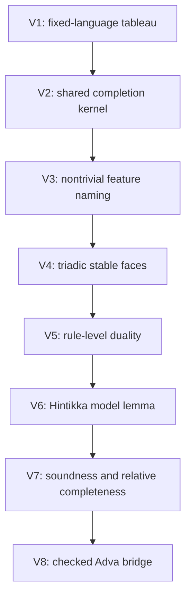

# A Self-Dual Characteristic Completion Calculus

Status: proposal and validation plan following
[`0045-logic-as-learned-characteristic.md`](0045-logic-as-learned-characteristic.md),
[`0046-proposal-for-logic-on-a-3-form.md`](0046-proposal-for-logic-on-a-3-form.md),
[`0059-tri-bracket-eigen-normalization-logic.md`](0059-tri-bracket-eigen-normalization-logic.md),
and
[`0060-checked-bracket-observer-bridge.md`](0060-checked-bracket-observer-bridge.md).

This note records one conjecture:

> Learning and proving may be two dual readings of one characteristic
> completion algorithm.  Learning names a stable residual after finite
> observational forgetting; proving normalizes the discrepancy between an
> observation and an existing name.  A closed discrepancy gives a proof,
> while a saturated nonclosed discrepancy gives a countermodel in the proof
> reading and a candidate new characteristic in the learning reading.

The conjecture has a precise classical precursor.  A tableau or model-set
construction saturates a fixed-language branch.  Finite closure yields a
proof certificate; an open saturated Hintikka set yields a model or
countermodel.  Henkin completion similarly extends a consistent fixed
language with witnesses and constructs a term model.  The proposed Adva
extension is stronger and currently unproved: the saturated residual may
also generate part of the observer's future vocabulary.

This note does **not** establish a self-dual calculus, a completeness theorem,
a learned logic, a stable normalizer, a bracket API, or a new Rust semantic
identity.  It introduces no code and changes no stable claim.  In particular:

- plain three-bracket forms remain quotient observer surfaces, not checked
  program, source, occurrence, or lineage carriers;
- surface satisfaction remains distinct from machine quiescence and halting;
- search exhaustion returns `Unknown`, never a proof of nonexistence;
- outcome labels are not promoted to truth values before contextual
  congruence is established; and
- the active implementation priority remains exact program-process work.

The number 0066 avoids occupying the authority upgrades already staged as
0061--0065 in note 0060.  It does not assert that those stages have been
completed.

---

## 0. Executive separation

The proposal contains three increasingly strong claims.  They must not be
reported as one result.

| level | claim | present status |
|---|---|---|
| C0: shared kernel | learning and proof use the same local saturation transition relation | proposed; classical fixed-language calibration available |
| C1: dual readout | a saturated residual is read as a countermodel in proof and as a candidate characteristic in learning | proposed |
| C2: full self-duality | vocabulary creation, proof discharge, state update, residuals, and certificates are exchanged by an involution | open; strongest conjecture |

C0 can hold while C1 or C2 fails.  For example, a common search engine may
return proofs and models without making model naming dual to proof discharge.
Likewise, learning may revise its vocabulary nonmonotonically while proof
remains monotone.  Such an asymmetry would refute C2 but could leave a useful
shared completion kernel.

The intended architecture is

\[
\boxed{
\text{finite observation and current norm}
\xrightarrow{\operatorname{Complete}_Q}
\text{stable face, surface, witness, and residual}
\xrightarrow{\text{typed readout}}
\text{proof, countermodel, or learned characteristic}.
}
\]

The completion kernel comes before the logical vocabulary.  Logical symbols
are proposed names for compositional equivalence classes of its outcomes,
not arbitrary names attached to transient machine states.

## 1. Classical calibration and the added claim

For a fixed first-order theory \(T\) and sentence \(\varphi\), the classical
completeness pattern studies

\[
T\cup\{\neg\varphi\}.
\]

A fair tableau-style saturation has two semantic endpoints:

1. every branch closes after a finite contradiction witness, giving a proof
   of \(\varphi\); or
2. an open saturated branch supplies a Hintikka set from which a model, and
   hence a countermodel to \(\varphi\), is read.

This already makes proof search and model construction two outcomes of one
fixed-language saturation process.  Henkin's method supplies a related
completion: add witnesses, extend a consistent theory, and construct a model
whose carrier is made from terms of the extended language.

The new conjecture begins exactly where the classical constructions stop.
They assume in advance:

- a fixed grammar;
- fixed logical connectives;
- a fixed consistency relation;
- fixed saturation rules; and
- a fixed notion of model.

The proposed learning step asks whether a stable residual can be named as a
new finite characteristic, with its forgotten detail and construction
witness retained.  It therefore seeks

\[
\boxed{
\text{completion inside a language}
\quad\leadsto\quad
\text{a controlled process that may also extend the language}.
}
\]

This is not supplied by classical completeness and must be validated
separately.

## 2. Primitive observer data

Fix a finite observer

\[
Q=(Q_t,Q_X,Q_K)
\]

with a declared observation equivalence \(\sim_Q\), finite search policy,
and admissible contexts.  Use the observer surface grammar and stable-domain
predicate of note 0059.  Write

\[
D=\{K,X,t\}
\]

and let

\[
\operatorname{Sat}_S(p)
\quad\Longleftrightarrow\quad
S\subseteq\operatorname{Stable}(p)
\]

for each nonempty \(S\subseteq D\).

Following note 0060, this is only a surface judgment.  Machine halting would
also require quiescence under the declared observer policy:

\[
\operatorname{Halt}_{S,Q}(M)
=
\operatorname{Sat}_S(\operatorname{surface}_Q(M))
\land
\operatorname{Quiescent}_Q(M).
\]

The seven nonempty faces

\[
K,\ X,\ t,\ KX,\ Xt,\ tK,\ KXt
\]

are therefore types of partial stability.  They are not seven truth values.

### 2.1 Feature records

A learned word is not an ungrounded atom.  A provisional feature dictionary
\(\Theta_Q\) maps a word \(c\) to a record

\[
\Theta_Q(c)
=
\bigl([H]_Q,S,w,R\bigr),
\]

where:

- \([H]_Q\) is the observation-equivalence class being named;
- \(S\) is the exact stable face on which the name is justified;
- \(w\) is the finite construction or saturation witness; and
- \(R\) retains forgotten, unresolved, or finer evidence.

Two equal visible surfaces need not define the same word when their checked
fibres, schedules, or residuals differ under the declared policy.

## 3. Characteristic configurations

The research configuration is

\[
\mathcal C
=
Q\left\langle
O\;\Vert\;N;
\Theta,\Pi,\tau,R
\right\rangle.
\]

Its components are:

- \(O\): the finite observed surface together with its evidence fibre;
- \(N\): the current norm, expected feature, or open normative boundary;
- \(\Theta\): the current feature dictionary;
- \(\Pi\): pending programs and in-flight observer events;
- \(\tau\): retained schedule, braid, and rewrite history; and
- \(R\): the explicit residual.

The proposed completion relation is

\[
\mathcal C
\rightsquigarrow_Q
\mathcal C'.
\]

It may use reversible transport, checked active gates, observer projection,
and research-local saturation rules, but these layers must retain their
distinct authorities.  In particular, an abstract surface split is not
identified with a checked `spatial-update`, and a braid does not remove a
containment or equation-defect edge.

### 3.1 Candidate duality

The strongest conjecture requires an involution \((-)^\star\) on one declared
finite carrier such that

\[
(\mathcal C^\star)^\star\cong\mathcal C
\]

and, provisionally,

\[
Q\langle O\Vert N;\Theta,\Pi,\tau,R\rangle^\star
=
Q^\star
\langle
N^\star\Vert O^\star;
\Theta^\star,\Pi^\star,\tau^\star,R^\star
\rangle.
\]

The rule set is self-dual only if

\[
\boxed{
\mathcal C\rightsquigarrow_Q\mathcal C'
\quad\Longrightarrow\quad
(\mathcal C')^\star
\rightsquigarrow_{Q^\star}
\mathcal C^\star.
}
\]

The reversed arrow matters.  Merely giving learning and proof similar names
does not establish duality.

The motivating emptiness--universality slogan has the same obligation.  It
would require declared objects and a contravariant construction under which
an initial or available vacancy on one side corresponds to a terminal or
universally accepting boundary on the other.  The three typed vacua of note
0057 must not be collapsed into one monoidal unit to obtain this result.

No such involution is currently implemented or proved.

## 4. One completion kernel

Write

\[
\operatorname{Complete}_Q(\mathcal C;B)
\]

for fair saturation under finite budget \(B\).  The kernel returns an outcome
record

\[
o=(S,\kappa,H,w,R,\tau),
\]

where:

- \(S\subseteq D\) is the exact stable face;
- \(\kappa\) is an operational outcome kind;
- \(H\) is the visible saturated surface;
- \(w\) is a proof, model, or construction witness where available;
- \(R\) is the accountable residual; and
- \(\tau\) is the retained trace.

The first outcome kinds are

\[
\kappa\in
\{\mathsf{Closed},\mathsf{Saturated},
  \mathsf{Open},\mathsf{Unknown}\}.
\]

Their meanings are operational:

| kind | meaning |
|---|---|
| `Closed` | the declared discrepancy has been discharged with a finite certificate |
| `Saturated` | no admitted local completion step remains on face \(S\), but a nonempty residual remains |
| `Open` | admitted work or an in-flight event remains |
| `Unknown` | the finite search policy was exhausted without a justified endpoint |

`Unknown` is not false, nontermination, or an open Hintikka model.  Likewise,
`Saturated` is not a model until a model-existence lemma interprets it.

### 4.1 Learning readout

The learning readout is provisionally

\[
\operatorname{Read}_{\mathrm L}(o)=
\begin{cases}
\text{reuse an existing word},&\kappa=\mathsf{Closed},\\
\text{propose }c_H\mapsto([H]_Q,S,w,R),
  &\kappa=\mathsf{Saturated},\\
\text{defer},&\kappa\in\{\mathsf{Open},\mathsf{Unknown}\}.
\end{cases}
\]

Naming is allowed only after a nontrivial learning criterion is declared.
Naming every finite observation separately is a lookup table, not learned
characteristic compression.

### 4.2 Proof readout

The proof readout is provisionally

\[
\operatorname{Read}_{\mathrm P}(o)=
\begin{cases}
\text{proof certificate }w,&\kappa=\mathsf{Closed},\\
\text{candidate countermodel }H,&\kappa=\mathsf{Saturated},\\
\text{open obligation},&\kappa=\mathsf{Open},\\
\texttt{Unknown},&\kappa=\mathsf{Unknown}.
\end{cases}
\]

The `Saturated` branch becomes a countermodel only after satisfaction is
defined and the triadic Hintikka lemma below is proved.

### 4.3 The proposed dual reading

The central observation is

\[
\boxed{
\text{one stable nonclosed }H
\quad\rightsquigarrow\quad
\begin{cases}
\text{countermodel},&\text{proof reading},\\
\text{candidate new word},&\text{learning reading}.
\end{cases}
}
\]

This establishes neither C1 nor C2 by itself.  C1 requires a typed duality
between the two readouts.  C2 additionally requires the vocabulary update on
the learning side to have a dual proof-side state transition.

One candidate formulation uses a feature-introduction unit and a
feature-testing counit,

\[
\eta_H:0_S\longrightarrow c_H^\star\otimes H,
\qquad
\varepsilon_H:H\otimes c_H^\star\longrightarrow 1_S,
\]

with

\[
\eta_H^\star=\varepsilon_H.
\]

This notation is a target for construction, not an assertion that Adva
currently has the objects \(0_S,1_S\), a tensor, or the required triangle
identities.

## 5. Outcome-generated logical vocabulary

Let \(\mathcal O_Q\) be the finite outcomes admitted by one bounded observer
experiment.  The conjectured logical alphabet begins from

\[
\mathbb V_Q
=
\mathcal O_Q/{\equiv_Q},
\]

where \(\equiv_Q\) must retain every distinction relevant under admissible
contexts.  For each justified class introduce a typed symbol

\[
[o]_Q\longmapsto\ulcorner o\urcorner_Q.
\]

There are two sorts of symbols:

1. **status symbols**, recording `Closed`, `Saturated`, `Open`, `Unknown`, and
   the stable face; and
2. **content symbols**, naming stable residual classes such as \([H]_Q\).

The two sorts must not be collapsed.  In particular, `Saturated on X` is an
epistemic and operational status, not the truth value of a proposition.

Negation or duality may be induced only if outcome dualization is well
defined:

\[
\neg\ulcorner o\urcorner_Q
:=
\ulcorner o^\star\urcorner_{Q^\star}.
\]

Composition may be induced only by composing representatives and completing
again:

\[
\ulcorner o_1\urcorner_Q\bullet
\ulcorner o_2\urcorner_Q
:=
\left\ulcorner
\operatorname{Complete}_Q(o_1\bullet o_2)
\right\urcorner_Q.
\]

This is well defined only if \(\equiv_Q\) is a contextual congruence:

\[
A\equiv_Q B
\quad\Longrightarrow\quad
C[A]\equiv_Q C[B]
\]

for every admissible context \(C[-]\).  Failure of this test blocks promotion
from outcome labels to logical vocabulary.

## 6. Candidate judgments

The proof-relevant completion judgment is

\[
Q;\Theta;
O\Vert N
\Downarrow_B
(S,\kappa,H,w,R,\tau).
\]

Derived judgments are allowed only after their side conditions are proved.

Proof discharge:

\[
\frac{
Q;\Theta;O\Vert N
\Downarrow_B
(S,\mathsf{Closed},H,w,R,\tau)
\qquad R\equiv_Q0
}{
Q;\Theta\vdash O:N@S\ [w]
}
\quad(\textsc{Cert}).
\]

Characteristic proposal:

\[
\frac{
Q;\Theta;O\Vert N
\Downarrow_B
(S,\mathsf{Saturated},H,w,R,\tau)
\qquad
\operatorname{Compresses}_Q(H)
\qquad
\operatorname{Congruent}_Q([H])
}{
Q;\Theta
\leadsto
\Theta[c_H\mapsto([H]_Q,S,w,R)]
}
\quad(\textsc{Char}).
\]

Countermodel extraction:

\[
\frac{
Q;\Theta;O\Vert N
\Downarrow_B
(S,\mathsf{Saturated},H,w,R,\tau)
\qquad
M_H\models_{Q,S}O
\qquad
M_H\not\models_{Q,S}N
}{
Q;\Theta\nvdash O:N@S
\ \text{with countermodel }M_H
}
\quad(\textsc{Counter}).
\]

The last conclusion is semantic non-entailment in the declared finite model
class.  It is not licensed merely because proof search failed.

## 7. Candidate metatheorems

The conjecture decomposes into six obligations.

### 7.1 Rule-level dual closure

Every primitive completion rule has a typed dual rule, and residuals and
certificates are preserved by the pairing.

### 7.2 Normal-form duality

For every configuration in the declared terminating fragment,

\[
\operatorname{NF}_{Q^\star}(\mathcal C^\star)
\cong
\operatorname{NF}_Q(\mathcal C)^\star.
\]

### 7.3 Triadic Hintikka lemma

Every open saturated configuration on face \(S\) determines an
\(S\)-partial model satisfying its positive obligations and refuting its
declared negative obligation.

### 7.4 Soundness

Every finite `Closed` certificate accepted by the checked verifier is valid
under the declared observer semantics.

### 7.5 Relative completeness

For a fixed finite language, observer, model class, and fair saturation
policy,

\[
T\models_Q\varphi
\quad\Longrightarrow\quad
T\vdash_Q\varphi.
\]

This does not imply decidability or termination for the open, vocabulary-
growing system.

### 7.6 Characteristic conservativity

If \(c_H\) is introduced, extending \(\Theta\) with \(c_H\) must not alter
old judgments except through the explicitly declared observer refinement or
revision policy.  If old proofs may be invalidated, the system is
nonmonotonic and must version norms and certificates rather than call the
extension conservative.

## 8. Validation dependency graph

The shortest honest validation path is:



Each stage has an independent falsifier.

### V1. Fixed-language tableau calibration

Use a finite signed propositional grammar with atoms, negation, conjunction,
and disjunction.  Implement ordinary fair branch saturation and check
exhaustively against truth tables:

- every closed tableau yields a valid proof/refutation certificate;
- every open saturated branch yields a satisfying valuation; and
- fuel exhaustion yields `Unknown`.

This validates only the classical skeleton.

### V2. One kernel, two readouts

Represent proof and model construction with the same transition function and
the same branch state.  Permit only the final readout to differ.  A separate
model builder or separately coded learner would fail C0.

### V3. Nontrivial feature naming

Provide repeated raw observations whose distinct histories lie in one
declared \(Q\)-class.  A learned feature passes only if:

1. at least two distinct raw observations are compressed;
2. the forgotten distinction is retained in a residual fibre;
3. the name predicts or verifies a held-out observation under \(Q\); and
4. naming every observation separately is rejected by the declared
   compression criterion.

This is the first stage that tests learning rather than model extraction.

### V4. Triadic stable-face product

Attach the bounded logical branch state to the `Raw111` observer carrier from
note 0059.  Exhaustively verify:

- the seven nonempty exact stable faces;
- face weakening as observation only;
- separation of `Sat_S` from quiescence;
- reopening by an admitted external event; and
- no conversion of a stable face into a truth value.

This first product calibration need not claim an intrinsic coupling.  A later
experiment must show a rule whose logical obligation and triadic surface
change are mutually informative rather than merely paired.

### V5. Rule-level duality audit

Enumerate the finite transition table.  For every rule instance

\[
c\to c',
\]

mechanically require the dual instance

\[
(c')^\star\to c^\star.
\]

Then test

\[
\operatorname{NF}(c^\star)
=
\operatorname{NF}(c)^\star
\]

on the complete finite carrier.  A single missing residual, reversed resource
event, or unmatched vocabulary update refutes C2 for that rule set.

### V6. Triadic Hintikka model extraction

Define the finite model class independently of the completion algorithm.
Construct \(M_H\) from every saturated branch and verify satisfaction by a
separate evaluator.  Using the same code path for saturation and model
checking would make the test circular.

### V7. Metatheory

Prove, in order:

1. termination only for the bounded fragment;
2. preservation of well-typed configurations;
3. soundness of closed certificates;
4. the finite Hintikka model lemma;
5. contextual congruence of outcome equivalence;
6. relative completeness for the fixed-language fragment; and
7. conservativity or explicit versioned revision for learned words.

### V8. Checked Adva bridge

Only after the relevant 0061--0065 authority upgrades should the experiment
consume Rust-owned source, occurrence, lineage, active-gate, and signed-history
evidence.  The Python oracle may enumerate and falsify finite conjectures but
must not create semantic identities or certificates.

## 9. First executable fixture

The first proposed fixture is

```text
tests/python/test_self_dual_characteristic_completion.py
```

It should remain a research oracle and contain four independently checked
layers:

1. a small signed propositional tableau;
2. one shared saturation transition function;
3. proof and learning readouts over the same saturated branch object; and
4. a separate truth-table/model oracle.

The initial tests should include:

- a finite closed example such as \(p\land(p\to q)\land\neg q\);
- an open saturated example such as \(p\land\neg q\);
- an `Unknown` example under insufficient fuel;
- two distinct raw histories that learn one nontrivial \(Q\)-feature;
- held-out testing of that feature;
- a deliberately noncongruent quotient that must be rejected; and
- an asymmetric vocabulary-update rule that must fail the C2 duality audit.

The last two are mandatory red-team tests.  A fixture containing only positive
examples would not test the conjecture.

## 10. Decisive falsifiers

The strongest conjecture fails, or must be weakened, if any of the following
persists after the definitions are fixed:

1. learning needs a transition rule with no proof-side dual;
2. proof is monotone while learning can silently revise old norms;
3. two outcome-equivalent states become distinguishable in an admissible
   context;
4. saturation order changes the learned word without a retained schedule
   residual or canonicality theorem;
5. an open saturated branch does not determine a model;
6. a feature compresses no distinct observations;
7. a feature name drops evidence needed to replay or challenge its formation;
8. the finite observer still generates an uncontrolled, non-presentable
   vocabulary;
9. partial stability is used as semantic truth; or
10. surface normalization is mistaken for checked program identity or
    machine halting.

Possible outcomes of the research are therefore:

- **strong success:** C0, C1, and C2 hold on a nontrivial triadic fragment;
- **useful weakening:** one completion kernel produces proofs, models, and
  features, but full state update is not self-dual;
- **classical collapse:** the system reduces to ordinary fixed-language
  tableau plus an unrelated clustering step; or
- **counterexample:** outcome naming is not compositional and cannot generate
  a logic under the proposed observer equivalence.

All four outcomes are informative.

## 11. Promotion gates

Do not describe the proposal as a logic until:

- status and content symbols are typed separately;
- outcome equivalence is a contextual congruence;
- at least one connective is induced compositionally rather than inserted
  from an ambient powerset;
- proof certificates are sound under an independent semantics; and
- saturated open branches have a model-existence result.

Do not describe it as self-dual until:

- the carrier and involution are explicit;
- every primitive rule passes the dual transition audit;
- feature introduction and proof discharge form an actual typed pair;
- residual and resource effects are preserved; and
- old proofs have either conservativity or explicit versioned invalidation.

Do not describe it as a learned logic until:

- a word compresses several observations;
- held-out observations test the word;
- forgotten details remain auditable; and
- vocabulary growth is finite or finitely presented at every observer stage.

## 12. Immediate next question

The smallest unresolved choice is not the three-bracket syntax.  It is the
type of the stable residual \(H\):

> Is \(H\) simultaneously a partial model, a feature intension, and a
> proof-side counterexample, or are these three different objects connected
> only by certified maps?

Assuming identity would make the conjecture look elegant but risks repeating
the direct `split = spatial-update` mistake rejected in note 0060.  The safer
first calibration keeps three types:

\[
H_{\mathrm{branch}}
\xrightarrow{\operatorname{model}}
M_H,
\qquad
H_{\mathrm{branch}}
\xrightarrow{\operatorname{name}}
c_H,
\]

with independently checked maps.  Full self-duality may later identify a
universal property shared by these images.  It must not be assumed at V0.

## References

- Leon Henkin, “The Completeness of the First-Order Functional Calculus,”
  *Journal of Symbolic Logic* 14(3), 159--166, 1949.
  [doi:10.2307/2267044](https://doi.org/10.2307/2267044)
- Jaakko Hintikka, *Two Papers on Symbolic Logic: Form and Content in
  Quantification Theory and Reductions in the Theory of Types*, 1955.  The
  first paper develops models and model sets as a completeness method.

