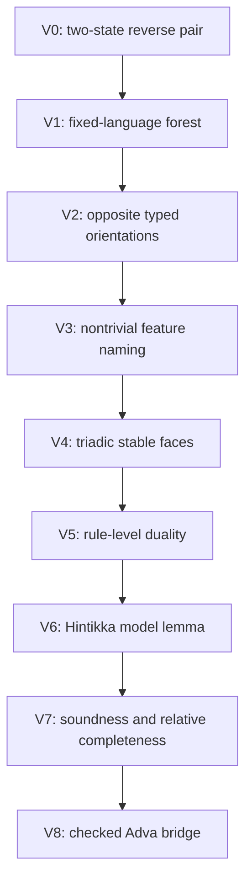

# A Reverse-Dual Characteristic Completion Calculus

Status: corrected proposal with a bounded executable V0 calibration following
[`0045-logic-as-learned-characteristic.md`](0045-logic-as-learned-characteristic.md),
[`0046-proposal-for-logic-on-a-3-form.md`](0046-proposal-for-logic-on-a-3-form.md),
[`0059-tri-bracket-eigen-normalization-logic.md`](0059-tri-bracket-eigen-normalization-logic.md),
[`0060-checked-bracket-observer-bridge.md`](0060-checked-bracket-observer-bridge.md),
and
[`0061-lineage-aware-bracket-events.md`](0061-lineage-aware-bracket-events.md).

The executable V0 fixture is
[`test_reverse_dual_characteristic_completion.py`][fixture].

[fixture]: ../../tests/python/test_reverse_dual_characteristic_completion.py

Revision note: the first merged version already required the arrow to reverse
under \((-)^\star\), but later stated an incompatible forward-normal-form
equation.  This revision makes the intended reading explicit: proving is a
normalizing direction, while learning is its reverse generative direction.
Operational learning starts from observations and infers a generator by
searching *against* that generative arrow.  V0 makes the old `NF/NF` equation
fail on purpose so that this distinction cannot silently regress.

This note records one conjecture:

> Learning and proving may be reverse-dual processes over one typed rule
> complex.  Proving normalizes a discrepancy toward a certified sink.
> Learning gives the reverse path a generative reading and, from an
> observation, tries to infer a certified source that can serve as a
> characteristic.  Proof closure, countermodel extraction, and feature
> naming remain differently typed readouts.

The conjecture has a precise classical precursor.  A tableau or model-set
construction saturates a fixed logical grammar.  Finite closure of every
branch yields a proof certificate; one open saturated Hintikka branch may
yield a model or countermodel.  Henkin completion does extend the language
with witness constants, so it must not be described as literally
fixed-language.  The proposed additional step is different and currently
unproved: observed residual structure may generate a data-dependent,
contentful characteristic in the observer's future vocabulary.

This note does **not** establish a full reverse-dual calculus, a completeness
theorem, a learned logic, a stable normalizer, a bracket API, or a new Rust
semantic identity.  Its V0 fixture is a pure-Python finite oracle and creates
no Rust authority.  In particular:

- plain three-bracket forms remain quotient observer surfaces, not checked
  program, source, occurrence, or lineage carriers;
- surface satisfaction remains distinct from machine quiescence and halting;
- search exhaustion may derive `Unknown`, never a proof of nonexistence;
- `Pending`, `Defect`, `Unknown`, and `NotRepresentable` are kept distinct;
- operational statuses are never inserted into the object language; and
- the active implementation priority remains exact program-process work.

Note 0061 has now completed one bounded lineage-aware observer stage.  The
later signed-history and program-process authority upgrades remain open.

---

## 0. Executive separation

The proposal contains three increasingly strong claims.  They must not be
reported as one result.

| level | claim | present status |
|---|---|---|
| C0: shared rule complex | proof and learning rules are the two opposite orientations of one typed rule complex | V0 finite calibration |
| C1: certified maps | branch, model, and characteristic are separate types connected by checked maps | proposed |
| C2: full reverse duality | vocabulary creation, proof discharge, branching, state update, residuals, and certificates are exchanged by a contravariant involution | open; strongest conjecture |

C0 can hold while C1 or C2 fails.  It means neither "the same forward
transition function" nor "the same branch object".  For example, a common
typed dispatcher may expose opposite rule orientations without making model
naming dual to proof discharge.
Likewise, learning may revise its vocabulary nonmonotonically while proof
remains monotone.  Such an asymmetry would refute C2 but could leave a useful
paired rule complex.

The intended architecture is

\[
\boxed{
\text{exact evidence, finite observation, and current norm}
\xrightarrow{\operatorname{Search}_{Q,N}}
\text{search forest, typed axes, witnesses, and residuals}
\xrightarrow{\text{certified maps}}
\text{proof, countermodel, or learned characteristic}.
}
\]

The typed rule complex comes before the logical vocabulary.  Logical symbols
are proposed names for compositional equivalence classes of its outcomes,
not arbitrary names attached to transient machine states.

## 1. Classical calibration and the added claim

For a fixed first-order theory \(T\) and sentence \(\varphi\), the classical
completeness pattern studies

\[
T\cup\{\neg\varphi\}.
\]

A fair tableau-style saturation has two semantic endpoints:

1. every branch closes after a finite contradiction witness, giving a proof
   of \(\varphi\); or
2. an open saturated branch supplies a Hintikka set from which a model, and
   hence a countermodel to \(\varphi\), is read.

This already makes proof search and model construction two outcomes of one
fixed-language saturation process.  Henkin's method supplies a related
completion: add witnesses, extend a consistent theory, and construct a model
whose carrier is made from terms of the extended language.

The new conjecture begins after the classical calibration.  Tableau assumes
a fixed logical vocabulary for the run.  Henkin completion may add fresh
witness symbols, but their role and extension scheme are fixed in advance.
Both assume:

- a fixed logical grammar and symbol-formation policy;
- fixed logical connectives;
- a fixed consistency relation;
- fixed saturation rules; and
- a fixed notion of model.

The proposed learning step asks whether a stable residual can justify a new
data-dependent characteristic, with its hidden detail and construction
witness retained.  It therefore seeks

\[
\boxed{
\text{completion inside a language}
\quad\leadsto\quad
\text{a controlled process that may also extend the language}.
}
\]

This is not supplied by classical completeness and must be validated
separately.

## 2. Primitive observer data

Fix a versioned finite observer package

\[
Q=(Q_0,\pi,\rho,\mathsf{Tests},\mathsf{Contexts},\nu_Q),
\]

where \(Q_0=(Q_t,Q_X,Q_K)\), \(\pi\) is a named projection policy,
\(\rho\) is any named promotion policy, and \(\nu_Q\) is the observer-policy
version.  The separate run header is
\((N,B,\Sigma,\nu)\), where \(N\) is the versioned norm, \(B\) the finite
budget, \(\Sigma\) the scheduler, and \(\nu\) the rule and vocabulary
versions.  These fields occur once; later expanded subscripts refer to this
same header.  The fixed public shells remain

```text
{}[]()
```

They are a fixed observer/display interface.  They do not become nested
checked terms.  Following note 0061, checked evidence first determines an
exact lineage-support object \(\mathcal H_Q\).  Projection is a separate
partial observation:

\[
\operatorname{project}_{\pi}(\mathcal H_Q)
\in
\mathsf{ObservedWithResidual}(V_\pi,R_{\rm prov})
\;\uplus\;
\mathsf{NotRepresentable}(e,\mathcal H_Q).
\]

`Raw111` is therefore a potentially failing observer view, never the exact
carrier.  Strict direct-incidence and weak strict-ancestry projections are
different policies; a theorem proved for one may not silently use the other.

The descendant-based stable-domain predicate of note 0059 aligns specifically
with note 0061's weak strict-ancestry projection.  It must not be transported
to strict direct-incidence views without a separate theorem.  For
\(\pi=\pi_{\rm ancestry}\), write

\[
D=\{K,X,t\}
\]

and define the exact stable and unresolved faces only for a represented view:

\[
\operatorname{ExactStable}_{Q,\pi_{\rm ancestry}}
(V;S,U_{\rm face})
\Longleftrightarrow
S=\operatorname{Stable}_{Q,\pi_{\rm ancestry}}(V)\cap D
\land U_{\rm face}=D\setminus S.
\]

For `NotRepresentable`, \(V,S,U_{\rm face}\) are undefined under that
projection; the failure must not be encoded as
\(S=\varnothing,U_{\rm face}=D\).

The weakening judgment remains

\[
\operatorname{Sat}_T(p)
\quad\Longleftrightarrow\quad
T\subseteq\operatorname{Stable}(p)
\]

for each nonempty \(T\subseteq D\).  `Sat_T` is not the exact-face record.
The unresolved face \(U_{\rm face}\) says only where no stability claim is
currently justified.  It is not a negative face, nontermination, semantic
falsehood, or the resolution state of a logical goal.

Following note 0060, this is only a surface judgment.  Machine halting would
also require quiescence under the declared observer policy:

\[
\operatorname{Halt}_{T,Q}(M)
=
\operatorname{Sat}_T(\operatorname{surface}_Q(M))
\land
\operatorname{Quiescent}_Q(M).
\]

The seven nonempty exact stable faces

\[
K,\ X,\ t,\ KX,\ Xt,\ tK,\ KXt
\]

are therefore types of partial stability.  They are not seven truth values.

### 2.1 Feature records

A learned word is not an ungrounded atom.  A provisional feature dictionary
\(\Theta_{Q,N}\) maps a word \(c\) to a record

\[
\Theta_{Q,N}(c)
=
\bigl([F]_{Q,N,S},S,w,R\bigr),
\]

where:

- \([F]_{Q,N,S}\) is the feature/intension class being named;
- \(S\) is the exact stable face on which the name is justified;
- \(w\) is the finite construction or saturation witness; and
- \(R\) retains provenance, obligations, defects, and search evidence.

The exact support \(\mathcal H_Q\), visible view \(V_\pi\), logical branch
\(\Gamma\), model \(M\), and feature \(F\) are five different types.  Equal
visible surfaces need not define the same word when their checked fibres,
schedules, or residuals differ under the declared policy.

## 3. Characteristic configurations

Proof and learning configurations are differently typed.  A schematic
configuration on side \(a\in\{\mathrm P,\mathrm L\}\) is

\[
\mathcal C_a
=
a;Q,N,\Theta
\left\langle
\mathcal H_Q,P_\pi,\mathcal F,\Pi,\tau,R
\right\rangle,
\]

where:

- \(\mathcal H_Q\) is exact lineage-support evidence;
- \(P_\pi\) is the projection-result sum
  `ObservedWithResidual(V, R_prov) | NotRepresentable(e, H_Q)`; only its left
  branch contains \(V_\pi,S,U_{\rm face}\);
- \(\mathcal F\) is a proof search forest, not one overloaded branch;
- \(N\) is the versioned norm;
- \(\Theta\) is the current feature dictionary;
- \(\Pi\) contains pending obligations, programs, and observer events;
- \(\tau\) retains schedule, braid, and rewrite history; and
- \(R=(R_{\rm prov},R_{\rm obl},R_{\rm search})\) is a typed residual, with
  \(R_{\rm obl}=R_{\rm defect}\times R_{\rm pending}\).

Reversible transport, checked active gates, observer projection, and
research-local logical rules retain distinct authorities.  An abstract
surface split is not a checked `spatial-update`; a braid does not remove an
equation defect; and hiding an observer incidence does not discharge a
logical obligation.

### 3.1 Reverse-dual rule complex

The strongest conjecture first requires an involution on the disjoint union
of two declared finite typed carriers,

\[
(-)^\star:\mathcal C_{\mathrm P}\uplus\mathcal C_{\mathrm L}
\longrightarrow
\mathcal C_{\mathrm P}\uplus\mathcal C_{\mathrm L},
\qquad
\star(\mathcal C_{\mathrm P})=\mathcal C_{\mathrm L},
\qquad
(c^\star)^\star\cong c.
\]

Only after rule paths have been defined as categories may this be summarized
as
\(\operatorname{Path}(\mathcal C_{\mathrm P})^{op}
\simeq\operatorname{Path}(\mathcal C_{\mathrm L})\).
The candidate data must also declare \(Q\mapsto Q^\star\), including policy
and version transport, with \((Q^\star)^\star=Q\); no such construction is
assumed here.

It acts on proof-relevant rule instances, not merely on the fact that an
unlabelled edge exists:

\[
\boxed{
\mathsf{Rule}_{\mathrm P,Q}(c,c')
\cong
\mathsf{Rule}_{\mathrm L,Q^\star}(c'^\star,c^\star).
}
\]

Equivalently,

\[
\rho:c\to_{\mathrm P}c'
\quad\Longleftrightarrow\quad
\rho^\star:c'^\star\to_{\mathrm L}c^\star,
\qquad
(\rho^\star)^\star=\rho.
\]

Paths reverse rule and schedule order:

\[
(c_0\xrightarrow{\rho_1}c_1\xrightarrow{\rho_2}c_2)^\star
=
(c_2^\star\xrightarrow{\rho_2^\star}c_1^\star
\xrightarrow{\rho_1^\star}c_0^\star).
\]

Thus "one algorithm" means one typed rule complex and dispatcher with two
opposite orientations.  Proof runs along \(\to_{\mathrm P}\).  The learning
relation runs generatively from a characteristic source toward possible
observations; actual inference from an observation searches backward along
\(\to_{\mathrm L}\) for such a source.

The motivating emptiness--universality slogan has the same obligation.  It
would require declared objects and a contravariant construction under which
an initial or available vacancy on one side corresponds to a terminal or
universally accepting boundary on the other.  The three typed vacua of note
0057 must not be collapsed into one monoidal unit to obtain this result.

Rule-level reversal still does not define how \((-)^\star\) exchanges proof
branching with a learning-side merge or co-branching operation.  No full
involution is currently implemented or proved.

## 4. Orthogonal outcome record

Finite search under \((Q,N,B,\Sigma,\nu)\) returns a `SearchForest` plus
orthogonal evidence.  It does not return one mutually exclusive
`Closed | Saturated | Open | Unknown` tag.

| dimension | alternatives |
|---|---|
| projection | \(\mathsf{ObservedWithResidual}(V,R_{\rm prov})\) or \(\mathsf{NotRepresentable}(e,\mathcal H_Q)\) |
| observer face | \(\mathsf{Face}(S,U_{\rm face})\), on the represented weak-ancestry branch only |
| goal resolution | `Proven(cert)`, `Refuted(model_cert)`, or `Undecided(goal, frontier)` |
| local rules | `Reducible(steps)` or `LocallySaturated` |
| value evidence | `DefectFree(cert)`, `Defects(items)`, or `Unchecked` |
| causal work | `Quiescent(cert)`, `Pending(items)`, or `Unchecked` |
| search execution | `Running`, `FixedPoint(cert)`, or `BudgetExhausted(B, frontier, scheduler, version, continuation)` |

`Undecided` records the goal, norm, observer, snapshot, and frontier.  It has
only resume, observer-refinement, proof, or countermodel transitions.  There
is no elimination rule from it to negation, divergence, or a model.  It is
orthogonal to \(U_{\rm face}\): a fully stable view can contain an undecided
goal, and a proof may be scoped to \(S\) while \(U_{\rm face}\ne\varnothing\).
`LocallySaturated` can coexist with either.  `Unknown` is a derived
metalanguage readout, not a run disposition:

\[
\mathsf{Unknown}(r)
\Longleftrightarrow
r.\mathsf{execution}=\mathsf{BudgetExhausted}
\land\neg\operatorname{AllClosed}(r.\mathsf{forest})
\land\neg\operatorname{ExistsOpen}(r.\mathsf{forest}).
\]

Its evidence retains the budget, complete frontier, scheduler and rule
version, and continuation.  Here `ExistsOpen` is a certified search endpoint;
turning that leaf into a semantic countermodel still requires the independent
map of Section 4.2.  `Unknown` can coexist with pending work and defects.

`Defect` is an unmet value or semantic equation.  `Pending` is known causal
or in-flight work.  `NotRepresentable` is a deterministic counterexample to
one projection policy while the exact support object remains valid.  None of
these is another spelling of `Unknown`.

The residual is proof-relevant and typed:

\[
R=(R_{\rm prov},R_{\rm obl},R_{\rm search}),
\qquad
R_{\rm obl}=R_{\rm defect}\times R_{\rm pending}.
\]

Logical closure may leave \(R_{\rm prov}\) nonempty.  Provenance is not an
undischarged formula, and erasing it is not how a proof reaches normal form.

### 4.1 Forest aggregation

Let \(\operatorname{Leaf}(\mathcal F)\) contain every current leaf of a
nonempty search forest, including closed, open-saturated, and pending leaves.
Define

\[
\operatorname{AllClosed}(\mathcal F)
:=\operatorname{Leaf}(\mathcal F)\ne\varnothing
\land\forall\Gamma\in\operatorname{Leaf}(\mathcal F),
\ \exists w_\Gamma.\operatorname{ClosedCert}(\Gamma,w_\Gamma),
\]

\[
\operatorname{OpenSat}(\Gamma;w_o,w_s)
:=\operatorname{OpenCert}(\Gamma,w_o)
\land\operatorname{SaturationCert}(\Gamma,w_s)
\land R_{\rm pending}(\Gamma)=\varnothing,
\]

and

\[
\operatorname{ExistsOpen}(\mathcal F)
:=\exists\Gamma\in\operatorname{Leaf}(\mathcal F),w_o,w_s.
\operatorname{OpenSat}(\Gamma;w_o,w_s).
\]

`OpenCert` is positive finite evidence that the declared branch contains no
clash; it is not inferred merely from failure to find a `ClosedCert`.

A proof needs the universal aggregation `AllClosed`.  A countermodel path
needs one `OpenSat` leaf plus an independent Hintikka/model certificate.
When fuel is exhausted with a pending leaf, both predicates can be false.
Thus `AllClosed(F) iff not ExistsOpen(F)` is licensed only after a separately
proved exhaustiveness condition.

### 4.2 Proof and countermodel readout

The proof-side maps are

\[
\mathcal F\xrightarrow{\operatorname{allClosed}}
W_{\rm proof},
\qquad
\Gamma\xrightarrow{\operatorname{model}}
(M_\Gamma,w_M).
\]

The first map aggregates every branch certificate.  The second uses one
open saturated branch and a model evaluator independent of saturation.
A countermodel first establishes semantic non-entailment.  Syntactic
non-provability follows only after soundness of the proof system is known.
Projection failure does not by itself block a graph-native branch or model;
it blocks only the failed observer serialization.

### 4.3 Learning readout

The learning-side map has a different codomain:

\[
\Gamma^\star
\xrightarrow{\operatorname{name}}
(c_\Gamma,F_\Gamma,w_F,R).
\]

It may propose a content word only after nontrivial compression, contextual
congruence, and a scoped `MayAbstract@S` certificate.  Naming every finite
observation separately is a lookup table.  `Unknown`, `Pending`,
`NotRepresentable`, and a nonempty \(U_{\rm face}\) are status evidence; none
automatically generates an object-language word.

There may be several open leaves and several learning generators.  The rule
for merging or choosing among them is not yet defined.  In particular,
rule-level reversal alone does not establish
\(\operatorname{AllClosed}(\mathcal F)^\star
=\operatorname{ExistsOpen}(\mathcal F^\star)\).

## 5. Outcome-generated logical vocabulary

Let \(\mathcal O_{Q,N,S}\) be the finite represented content outcomes
admitted by one bounded observer experiment.  The conjectured logical
alphabet may begin from

\[
\mathbb V_{Q,N,S}
=
\mathcal O_{Q,N,S}/{\equiv_{Q,N,S}},
\]

where equivalence must retain every distinction relevant under admissible
tests and contexts.  For each justified content class one may introduce a
typed symbol

\[
[o]_{Q,N,S}\longmapsto\ulcorner o\urcorner_{Q,N,S}.
\]

Only content records are eligible for the object language.  Resolution,
local phase, projection result, search disposition, \(S\), and \(U\) stay in
the metalanguage.  In particular, `Unknown` and `LocallySaturated@X` are not
propositions or truth values.

Negation or duality may be induced only if outcome dualization is well
defined:

\[
\neg\ulcorner o\urcorner_{Q,N,S}
:=
\ulcorner o^\star\urcorner_{Q^\star,N^\star,S^\star}.
\]

Composition may be induced only by composing representatives and completing
again:

\[
\ulcorner o_1\urcorner_{Q,N,S}\bullet
\ulcorner o_2\urcorner_{Q,N,S}
:=
\left\ulcorner
\operatorname{Search}_{Q,N}(o_1\bullet o_2)
\right\urcorner_{Q,N,S}.
\]

This is well defined only if equivalence is a contextual congruence while
the observer, norm, face, admissible tests and contexts, budget, scheduler,
rule version, and vocabulary version are frozen:

\[
A\equiv_{Q,N,S,B,\Sigma,\nu} B
\quad\Longrightarrow\quad
C[A]\equiv_{Q,N,S,B,\Sigma,\nu} C[B]
\]

for every admissible context \(C[-]\).  Failure of this test blocks promotion
from outcome labels to logical vocabulary.

### 5.1 Scoped forgetting authority

Four proof-relevant capabilities must not be conflated.  They are scoped to
an artifact, policy, norm, face, and version; they are not booleans and do
not form a permission chain.

| capability | permitted effect | required evidence |
|---|---|---|
| `MayHide` | move one complete visible fibre into \(R_{\rm prov}\), leaving \(\mathcal H_Q\) exact | before/after snapshot, complete ordered fibre, lossless partition witness |
| `MayAbstract@S` | introduce a name or quotient on face \(S\), retaining every member | common norm, at least two histories, exhaustive admitted tests and contexts, congruence certificate |
| `MayForget@Q` | remove a proved \(Q\)-invisible distinction from active state but append it to the audit residual | `MayAbstract` evidence, no live dependency, versioned indistinguishability certificate, replayable residual |
| `MayErase` | physically delete residual evidence | sealed policy and norm, no certificate dependency, external retention authority, independent deletion certificate |

`MayHide` and `MayAbstract@S` are incomparable lossless-view effects.
`MayForget@Q` is observer-lossy but remains system-lossless because recall is
possible from the residual.  `MayErase` is system-lossy.  No capability
automatically constructs any other capability:

\[
\mathsf{MayX}\not\Rightarrow\mathsf{MayY}
\qquad(X\ne Y).
\]

Note 0061's `ProvenanceHideWitness` inhabits only `MayHide`.  It may change
the view and hence its computed \(S/U_{\rm face}\), but never the exact support,
discharges no defect or pending work, and supplies no authority to abstract,
forget, or erase.

The relative indistinguishability gate is

\[
x\approx_{N,Q,S}y
\Longleftrightarrow
\operatorname{CommonNorm}_{N,S}(x,y)
\land
\forall C\in\mathsf{Contexts}_{N,S},
\forall T\in\mathsf{Tests}_{N,Q,S},
\operatorname{Obs}_Q(T(C[x]))
=\operatorname{Obs}_Q(T(C[y])).
\]

`CommonNorm` binds at least type and carrier, `NormId`, face, observer and
projection policy, and vocabulary version.  On a declared finite carrier,
exhaustive enumeration may construct a certificate.  Sampling and held-out
success construct only a candidate abstraction, never `MayForget@Q`.

A forget step of the form

\[
(A,\Delta,R)\longmapsto(A/{\sim_Q},R\uplus\Delta)
\]

can still have a `Recall/Refine` reverse supported by \(R\).  True erasure is
non-injective and normally has no reverse arrow.  This calculus therefore
provides no `MayErase` constructor; granting one would directly threaten C2.
An audit entry must retain IDs, order, multiplicity, snapshots, versions,
test/context manifest, capability witness, and dependency set.  A digest
alone is not replayable provenance.

## 6. Candidate judgments

The proof-relevant search judgment is

\[
Q;N;\Theta\vdash
\operatorname{Search}(O;B,\Sigma,\nu)
\Downarrow
(\mathcal F,\mathsf{Axes},w,R,\tau).
\]

Derived judgments are allowed only after their side conditions are proved.

Proof discharge aggregates the whole forest:

\[
\frac{
\operatorname{AllClosed}(\mathcal F)
\qquad
\operatorname{VerifyAll}(\mathcal F,w)
\qquad
R_{\rm defect}^{N,S}=R_{\rm pending}^{N,S}=\varnothing
}{
Q;\Theta\vdash O:N@S\ [w]
}
\quad(\textsc{Cert}).
\]

The target-scoped obligation ledgers must be discharged; the provenance
residual may be nonempty and remains auditable.  Machine-wide quiescence is
still a separate claim.

Characteristic proposal uses a learning generator and a scoped abstraction
capability:

\[
\frac{
\operatorname{OpenSat}(\Gamma;w_o,w_s)
\qquad
\operatorname{Gen}_{\mathrm L}(g;\Gamma^\star)
\qquad
\operatorname{Compresses}_Q(F_g)
\qquad
\operatorname{Congruent}_{Q,N,S}([F_g])
\qquad
a:\mathsf{MayAbstract}@S
}{
Q;\Theta
\leadsto
\Theta[c_g\mapsto([F_g]_{Q,N,S},S,w,R)]
}
\quad(\textsc{Char}).
\]

Removing the represented differences from active state would additionally
require `MayForget@Q`; name introduction alone does not.

Countermodel extraction uses one leaf and an independent evaluator:

\[
\frac{
\Gamma\in\operatorname{Leaf}(\mathcal F)
\qquad
\operatorname{OpenSat}(\Gamma;w_o,w_s)
\qquad
\operatorname{ModelCert}(\Gamma,M_\Gamma,w_M)
\qquad
M_\Gamma\models_{Q,S}O
\qquad
M_\Gamma\not\models_{Q,S}N
}{
O\not\models_{Q,S}N
\ \text{with countermodel }M_\Gamma
}
\quad(\textsc{Counter}).
\]

Only after proof-system soundness is established may this semantic conclusion
be used to infer \(Q;\Theta\nvdash O:N@S\).  Search failure alone licenses
neither conclusion.

A projection failure has only the typed propagation rule

\[
\operatorname{project}_\pi(\mathcal H_Q)
=\mathsf{NotRepresentable}(e,\mathcal H_Q)
\Longrightarrow
\mathsf{ProjectionStatus}=\mathsf{NotRepresentable}(e,\mathcal H_Q).
\]

It yields no `Unknown`, falsehood, program failure, or empty stable face.
Likewise, `ProvenanceHide` may change \(V_\pi\) but cannot by itself create a
`ClosedCert`, discharge a defect, or empty a pending ledger.

## 7. Candidate metatheorems

The conjecture decomposes into independent obligations.

### 7.1 Rule-level dual closure

Every primitive proof rule instance has exactly its typed learning-side
reverse, including labels, residual deltas, resource effects, and certificate
transport:

\[
\mathsf{Rule}_{\mathrm P,Q}(c,c')
\cong
\mathsf{Rule}_{\mathrm L,Q^\star}(c'^\star,c^\star).
\]

### 7.2 Normal-form duality

Use relations until confluence or a canonical strategy has been proved:

\[
\operatorname{NF}_{\mathrm P}(c,n)
:=c\to_{\mathrm P}^{*}n
\land\nexists n'.\ n\to_{\mathrm P}n',
\]

\[
\operatorname{Gen}_{\mathrm L}(g;x)
:=g\to_{\mathrm L}^{*}x
\land\nexists h.\ h\to_{\mathrm L}g.
\]

The correct reverse-dual target is

\[
\boxed{
\operatorname{NF}_{\mathrm P}(c,n)
\Longleftrightarrow
\operatorname{Gen}_{\mathrm L}(n^\star;c^\star).
}
\]

Equivalently, with
\(\operatorname{CoNF}_{\mathrm L}\) defined as normalization along the
inverse learning relation,

\[
\operatorname{CoNF}_{\mathrm L}(c^\star)
=
\{n^\star\mid\operatorname{NF}_{\mathrm P}(c,n)\}.
\]

Only after uniqueness is established may this be written as a function
equation.  The old forward `NF_L(c*) = NF_P(c)*` equation is false for every
nontrivial two-state reverse pair and is an explicit V0 negative test.

### 7.3 Forest duality

A rule-instance involution does not yet exchange proof branching and
universal `AllClosed` aggregation with a learning-side merge, co-branching,
or existential generator choice.  Defining that structure is an additional
C2 theorem, not a corollary of Section 7.1.

### 7.4 Triadic Hintikka lemma

Every certified `OpenSat` leaf on face \(S\) determines an \(S\)-partial
model satisfying its positive obligations and refuting its declared negative
obligation, as checked by an independent evaluator.

### 7.5 Soundness

Every aggregated `AllClosed` certificate accepted by the checked verifier is
valid under the declared observer semantics.

### 7.6 Relative completeness

For a fixed finite language, observer, model class, and fair saturation
policy,

\[
T\models_Q\varphi
\quad\Longrightarrow\quad
T\vdash_Q\varphi.
\]

This does not imply decidability or termination for the open, vocabulary-
growing system.

### 7.7 Conservativity or versioned revision

If \(c_H\) is introduced, extending \(\Theta\) with \(c_H\) must not alter
old judgments under the frozen old version.  Separately, a declared revision
may refine \(Q\), the norm, or vocabulary and invalidate old certificates.
The first is a conservativity theorem; the second is a versioned transition.
Neither substitutes for the other.

### 7.8 Authority and residual preservation

No rule may escalate one capability into another without a new certificate.
Every reverse-dual pair must preserve enough typed residual to reconstruct
its opposite transition.  If a rule truly erases non-reconstructible
evidence, C2 fails for any carrier containing that rule unless a separate
quotient universal property is supplied.

## 8. Validation dependency graph

The shortest honest validation path is:



Each stage has an independent falsifier.

### V0. Reverse-dual direction calibration

Use the complete two-stage carrier

\[
P_1\to_{\mathrm P}P_0,
\qquad
L_0\to_{\mathrm L}L_1,
\qquad
P_i^\star=L_i.
\]

Mechanically check involution and the reverse edge bijection.  This carrier
is deterministic and finite, so V0 alone writes `nf` for the unique forward
normal form and `generator` for the unique backward learning source.  Require

\[
\operatorname{nf}_{\mathrm P}(P_1)^\star
=L_0
=\operatorname{generator}_{\mathrm L}(L_1),
\]

and, as a mandatory counterexample to the rejected forward `NF/NF`
statement,

\[
\operatorname{nf}_{\mathrm L}(L_1)=L_1\ne L_0.
\]

This validates direction and typing only.  It does not validate a logical
rule, learning, or full C2.

### V1. Fixed-language tableau calibration

Use a finite signed propositional grammar with atoms, negation, conjunction,
and disjunction.  Implement ordinary fair branch saturation and check
exhaustively against truth tables:

- every `AllClosed` forest yields an aggregated certificate;
- every certified `ExistsOpen` leaf yields a satisfying valuation under an
  independent evaluator; and
- a zero-budget or exhausted run preserves its pending frontier as
  `BudgetExhausted` and derives `Unknown` only when neither certified endpoint
  is available.

This validates only the classical skeleton.

### V2. One typed dispatcher, opposite orientations

Represent proof reduction and learning generation with one dispatcher over
paired typed rule cells.  The directions and state types differ.  A
separately coded learner whose steps cannot be paired with proof rules would
fail C0; requiring one common forward transition function would also fail the
reverse-dual specification.

### V3. Nontrivial feature naming

Provide repeated raw observations whose distinct histories lie in one
declared \(Q\)-class.  A learned feature passes only if:

1. at least two distinct raw observations are compressed;
2. every distinction abstracted or forgotten from the active view is retained
   in a residual fibre;
3. the name predicts or verifies a held-out observation under \(Q\); and
4. naming every observation separately is rejected by the declared
   compression criterion.

This is the first stage that tests learning rather than model extraction.

### V4. Triadic stable-face product

Attach the bounded logical forest to note 0061's exact lineage-support object
and then apply a named observer projection.  Exhaustively verify:

- the seven nonempty exact stable faces;
- face weakening as observation only;
- strict-lineage and weak-ancestry projections are not exchanged;
- `NotRepresentable` retains exact support and never becomes `Unknown`;
- separation of `Sat_S` from quiescence;
- reopening by an admitted external event; and
- no conversion of a stable or unresolved face into a truth value.

This first product calibration need not claim an intrinsic coupling.  A later
experiment must show a rule whose logical obligation and triadic surface
change are mutually informative rather than merely paired.

### V5. Rule-level duality audit

Enumerate the finite transition table.  For every rule instance

\[
c\to_{\mathrm P}c',
\]

mechanically require the dual instance

\[
(c')^\star\to_{\mathrm L}c^\star.
\]

Then test

\[
\operatorname{NF}_{\mathrm P}(c,n)
\Longleftrightarrow
\operatorname{Gen}_{\mathrm L}(n^\star;c^\star)
\]

on the complete finite carrier, and separately test the learning `CoNF` set.
A single missing residual, wrong orientation, resource event, permission
escalation, or unmatched vocabulary update refutes C2 for that rule set.

### V6. Triadic Hintikka model extraction

Define the finite model class independently of the completion algorithm.
Construct \(M_\Gamma\) from every open saturated branch and verify
satisfaction by a separate evaluator.  Using the same code path for
saturation and model checking would make the test circular.

### V7. Metatheory

Prove, in order:

1. termination only for the bounded fragment;
2. preservation of well-typed configurations;
3. soundness of closed certificates;
4. the finite Hintikka model lemma;
5. contextual congruence of outcome equivalence;
6. relative completeness for the fixed-language fragment; and
7. conservativity or explicit versioned revision for learned words.

### V8. Checked Adva bridge

The bounded 0061 observer bridge may now supply Rust-owned source,
occurrence, lineage, and copy evidence.  Signed-history and later
program-process upgrades 0062--0065 remain open.  Python may enumerate and
falsify finite conjectures but must not create Rust identities, erase
provenance, or issue stable semantic permissions.

## 9. First executable fixture

The V0 fixture is

```text
tests/python/test_reverse_dual_characteristic_completion.py
```

It is a pure-Python research oracle with four independently checked layers:

1. one complete two-stage typed rule complex;
2. proof forward normalization and learning backward generator inference;
3. branch and forest aggregation records; and
4. an object-language evaluator independent of run disposition.

Its tests cover the exact two edges, involution, reverse edge closure,
proof-normal-form/learning-generator correspondence, an explicit failure of
the old forward `NF/NF` equation, `AllClosed` versus `ExistsOpen`, zero-budget
exhaustion with pending work retained, and rejection of derived
`UnknownEvidence` by the object-language evaluator.  One closed branch
deliberately retains a provenance residual, demonstrating that logical
closure does not erase it.

V0 does not implement full propositional tableau expansion, feature
formation, observer projection, or forgetting capabilities.  Those remain
V1, V3, and V4 work; documenting their gates is not evidence that the
capabilities exist.

## 10. Decisive falsifiers

The strongest conjecture fails, or must be weakened, if any of the following
persists after the definitions are fixed:

1. learning needs a transition rule with no proof-side dual;
2. proof is monotone while learning can silently revise old norms;
3. two outcome-equivalent states become distinguishable in an admissible
   context;
4. saturation order changes the learned word without a retained schedule
   residual or canonicality theorem;
5. an open saturated branch does not determine a model;
6. a feature compresses no distinct observations;
7. a feature name drops evidence needed to replay or challenge its formation;
8. the finite observer still generates an uncontrolled, non-presentable
   vocabulary;
9. partial stability is used as semantic truth;
10. surface normalization is mistaken for checked program identity or
    machine halting;
11. proof and learning are forced through one forward transition function or
    the rejected forward `NF/NF` equation;
12. one closed branch is used as a certificate for a branching root;
13. `Defect`, `Pending`, `Unknown`, or `NotRepresentable` is converted into
    another without a typed witness;
14. `ProvenanceHide` creates logical closure or forgetting authority;
15. a partial exact face is promoted to a global conclusion; or
16. non-reconstructible erasure is admitted while C2 is retained.

Possible outcomes of the research are therefore:

- **strong success:** C0, C1, and C2 hold on a nontrivial triadic fragment;
- **useful weakening:** one paired rule dispatcher supports proofs, models,
  and features, but forest aggregation or full state update is not
  reverse-dual;
- **classical collapse:** the system reduces to ordinary fixed-language
  tableau plus an unrelated clustering step; or
- **counterexample:** outcome naming is not compositional and cannot generate
  a logic under the proposed observer equivalence.

All four outcomes are informative.

## 11. Promotion gates

Do not describe the proposal as a logic until:

- operational status is excluded from the object-language alphabet;
- outcome equivalence is a contextual congruence;
- at least one connective is induced compositionally rather than inserted
  from an ambient powerset;
- proof certificates are sound under an independent semantics; and
- saturated open branches have a model-existence result.

Do not describe it as fully reverse-dual until:

- both typed carriers and the contravariant involution are explicit;
- every primitive rule passes the dual transition audit;
- proof branching has a declared learning-side dual aggregation;
- feature introduction and proof discharge form an actual typed pair;
- residual and resource effects are preserved; and
- no admitted erase step destroys the reverse path; and
- old proofs have either conservativity or explicit versioned invalidation.

Do not describe it as a learned logic until:

- a word compresses several observations;
- held-out observations test the word;
- exhaustive admitted contexts justify the actual abstraction or forgetting
  capability being claimed;
- hidden or forgotten details remain replayably auditable; and
- vocabulary growth is finite or finitely presented at every observer stage.

Do not describe an observer action as forgetting merely because it hides a
surface incidence.  This note grants no authority to delete Rust provenance,
equates no finite sample with semantic equivalence, and gives no elimination
rule from \(U_{\rm face}\) or an undecided goal to falsehood, divergence, or
a countermodel.

## 12. Immediate next question

The former overloaded residual question is now resolved by typing rather than
identity:

\[
\mathcal H_Q
\dashrightarrow
V_\pi
\dashrightarrow
\Gamma,
\qquad
\Gamma\xrightarrow{\operatorname{model}}M_\Gamma,
\qquad
\Gamma^\star\xrightarrow{\operatorname{name}}c_\Gamma.
\]

The dashed arrows are partial observer/branch construction maps; the last
two are independently certified interpretations.  None of
\(\mathcal H_Q,V_\pi,\Gamma,M_\Gamma,c_\Gamma\) is definitionally another.

The next smallest nontrivial gate is one paired rule beyond the two-state V0:

\[
r:\Gamma\to_{\mathrm P}\Gamma'
\quad\text{(`DefectDischarge')},
\qquad
r^\star:(\Gamma')^\star\to_{\mathrm L}\Gamma^\star
\quad\text{(`FeatureGeneration')}.
\]

The experiment must preserve exact lineage support and \(R_{\rm prov}\),
transport the rule certificate backward, and prove that no `MayHide` witness
is promoted into abstraction or forgetting authority.  Only after that local
pair works should the project choose a learning-side dual for proof
branching and `AllClosed` aggregation.  The permanent juxtaposed boundary
`{}[]()` can remain unchanged throughout; cross-domain dependence belongs to
the separate support and rule complexes.

## References

- Leon Henkin, “The Completeness of the First-Order Functional Calculus,”
  *Journal of Symbolic Logic* 14(3), 159--166, 1949.
  [doi:10.2307/2267044](https://doi.org/10.2307/2267044)
- Jaakko Hintikka, *Two Papers on Symbolic Logic: Form and Content in
  Quantification Theory and Reductions in the Theory of Types*, 1955.  The
  first paper develops models and model sets as a completeness method.
