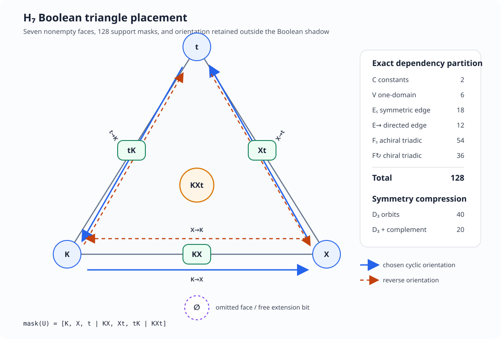

# Boolean Triangle Placement and Bootstrap Zero Language Alignment

Status: finite external calibration following
[0081](0081-relative-halt-exploration-threaded-compactification.md),
[0082](0082-threaded-finite-logic-adequacy.md), and the syntax-only
[0095](0095-bootstrap-zero-geometric-threading-syntax.md) proposal.

This note performs two tasks requested by Mingli Yuan:

1. place all \(2^7=128\) extensional Boolean supports over the seven
   nonempty triadic worlds; and
2. align the resulting geometric labels with the Bootstrap Zero computation
   syntax.

The alignment is not an interpreter definition.  It supplies no evaluation,
denotation, truth judgment for Bootstrap Zero forms, logical connective,
normalization, transition relation, or stable API.  The Boolean carrier is an
external finite oracle used to check whether the raw computation syntax keeps
the distinctions that the oracle can see and records the distinctions that
the oracle forgets.

---

## 0. Exact result

Let

\[
D=\{K,X,t\},
\qquad
H_7=\mathcal P(D)\setminus\{\varnothing\}.
\]

The seven worlds are placed on the nonempty face lattice of a triangle:

\[
\underbrace{K,X,t}_{\text{vertices}},
\qquad
\underbrace{KX,Xt,tK}_{\text{edges}},
\qquad
\underbrace{KXt}_{\text{face}}.
\]

Every extensional proposition is one support

\[
U\subseteq H_7,
\]

so there are exactly \(2^7=128\) supports.  Exhaustive enumeration gives the
minimal-domain-dependency partition

\[
\boxed{128=2+6+30+90,}
\]

where the four terms count constant, one-domain, exactly two-domain, and
exactly three-domain supports.

The exactly two-domain layer splits as

\[
\boxed{30=18_{\mathrm{symmetric}}+12_{\mathrm{oriented}}.}
\]

Under triangle rotation and reflection there are forty support orbits.  After
also identifying a support with its Boolean complement there are twenty
geometric archetypes:

\[
\boxed{|\mathcal P(H_7)/D_3|=40,
\qquad
|\mathcal P(H_7)/(D_3\times C_2^{\neg})|=20.}
\]

Exactly forty-eight supports are chiral in the precise sense that no
reflection is equal to a rotation on that support:

\[
\boxed{48=12_{\mathrm{edge}}+36_{\mathrm{triadic}}.}
\]

Thus directed edge structure is real but does not exhaust the orientation
content.  Thirty-six genuinely three-domain supports also distinguish the two
triangle orientations.

---

## 1. Two different exhaustive sets of size 128

Note 0082 contains two finite oracles with cardinality 128.  They must remain
distinct.

The first is the support carrier studied here:

\[
|\mathcal P(H_7)|=2^7=128.
\]

The second is a family of structures on a two-element predicate domain:

\[
4\text{ unary extensions}
\times
16\text{ binary extensions}
\times
2\text{ constant values}
=128.
\]

The repeated number is accidental.  The first oracle enumerates extensional
propositions over seven worlds.  The second enumerates finite predicate
models.  No geometric identification between them is licensed.

There is a second terminology correction.  The first 128 objects are not 128
unique formulas.  Every support has infinitely many propositionally
equivalent presentations.  Note 0082 chooses one characteristic disjunctive
presentation

\[
\chi_U=
\bigvee_{h_S\in U}
\left(
\bigwedge_{d\in S}P_d
\land
\bigwedge_{d\notin S}\neg P_d
\right).
\]

The finite object being placed is \(U\), not the spelling of \(\chi_U\).

---

## 2. Seven-bit geometric address

Fix the cyclic face order

\[
(K,X,t\mid KX,Xt,tK\mid KXt).
\]

The exact address of \(U\) is

\[
\operatorname{mask}(U)
=
[b_K,b_X,b_t\mid b_{KX},b_{Xt},b_{tK}\mid b_{KXt}],
\]

where \(b_S=1\) exactly when \(h_S\in U\).  This address is lossless on
\(H_7\).

The missing eighth cube point is the empty face \(\varnothing\).  Every
seven-bit support therefore admits exactly two full three-variable Boolean
extensions, one assigning zero to \(000\), the other assigning one.  The
empty face is not silently named falsehood, divergence, exploration, or
unknown.  Choosing its value is an additional extension decision.

The placement is shown in
[the labeled triangle](0096-h7-boolean-triangle-placement.svg).

---

## 3. Minimal-domain dependency

For \(A\subseteq D\), let

\[
\pi_A:H_7\longrightarrow\{0,1\}^{A}
\]

retain only membership in the domains named by \(A\).  A support \(U\)
**factors through** \(A\) when

\[
\pi_A(h)=\pi_A(h')
\Longrightarrow
\bigl(h\in U\Longleftrightarrow h'\in U\bigr).
\]

Define its essential arity by

\[
\operatorname{arity}(U)
=
\min\{|A|:U\text{ factors through }A\}.
\]

Exhaustive enumeration gives:

| essential arity | geometric dependency | supports |
|---:|---|---:|
| 0 | constant background | 2 |
| 1 | one domain / vertex coordinate | 6 |
| 2 | one domain pair / edge coordinate | 30 |
| 3 | irreducibly triadic | 90 |

This is a dependency placement, not a literal-support placement.  For
example, the singleton support \(\{t\}\) factors through \(K,X\): on the
nonempty carrier it is expressed by \(\neg K\land\neg X\).  It is drawn at a
vertex but is an edge-local Boolean function of the opposite coordinate pair.

That distinction prevents a visual point from being confused with the set of
variables on which its characteristic depends.

---

## 4. Exact edge classification

Fix an unordered domain pair \(\{d,e\}\).  The projection
\(\pi_{de}\) is surjective onto the four binary inputs.  Sixteen Boolean
functions factor through it.  Removing the two constants and four
one-variable functions leaves ten functions that depend essentially on both
endpoints.

Six are invariant under exchanging \(d\) and \(e\):

| pair | form | complement |
|---|---|---|
| joint | \(d\land e\) | \(\neg(d\land e)\) |
| coverage | \(d\lor e\) | \(\neg(d\lor e)\) |
| parity | \(d\oplus e\) | \(d\leftrightarrow e\) |

Four retain orientation:

| ordered direction | passing shadow | obstruction shadow |
|---|---|---|
| \(d\to e\) | \(\neg d\lor e\) | \(d\land\neg e\) |
| \(e\to d\) | \(\neg e\lor d\) | \(e\land\neg d\) |

The words `passing` and `obstruction` are external Boolean labels.  They do
not define execution or implication inside Bootstrap Zero.  They make the
two independent pieces explicit:

\[
\text{ordered direction}
\times
\text{Boolean polarity}.
\]

For three domain pairs this yields eighteen symmetric and twelve oriented
edge-local supports.

---

## 5. Triangle chirality and an extensional no-go

Let

\[
\rho=(K\ X\ t)
\]

be the chosen rotation and let \(\sigma\) be any reflection.  A support is
chiral when

\[
\sigma U\notin\{U,\rho U,\rho^2U\}.
\]

The 128-support enumeration gives:

| layer | achiral | chiral | total |
|---|---:|---:|---:|
| constant | 2 | 0 | 2 |
| one-domain | 6 | 0 | 6 |
| exactly two-domain | 18 | 12 | 30 |
| exactly three-domain | 54 | 36 | 90 |
| total | 80 | 48 | 128 |

Chirality of a support does not guarantee that every directed construction
of that support remains visible.  In fact, the two cyclic disjunctions

\[
\begin{aligned}
C_+
&=(K\land\neg X)
\lor(X\land\neg t)
\lor(t\land\neg K),\\
C_-
&=(X\land\neg K)
\lor(t\land\neg X)
\lor(K\land\neg t)
\end{aligned}
\]

have the same extensional shadow:

\[
\boxed{
\llbracket C_+\rrbracket
=
\llbracket C_-\rrbracket
=
H_7\setminus\{KXt\}.
}
\]

Therefore no function of the final seven-bit mask can reconstruct the
direction of an arbitrary formula construction.  Ordered syntax, thread
history, or a proof object must retain that information before the Boolean
projection forgets it.

---

## 6. Twenty geometric archetypes

Let \(D_3\) act by renaming the three domains and let \(C_2^{\neg}\) act by
support complement.  Each archetype below is one orbit under
\(D_3\times C_2^{\neg}\).  A representative is chosen with at most three
marked faces.  Its complement and all domain placements belong to the same
row.

The `arity` column records minimal domain dependency, not the number of marked
faces.  `Chiral` means that an actual member of the row also needs a
clockwise/counterclockwise placement label after a cyclic orientation is
fixed.

| label | representative support | name | arity | chiral | orbit |
|---|---|---|---:|:---:|---:|
| `G00` | \(\varnothing\) | empty/full | 0 | no | 2 |
| `G01` | \(\{KXt\}\) | face point | 3 | no | 2 |
| `G02` | \(\{tK\}\) | edge point | 3 | no | 6 |
| `G03` | \(\{t\}\) | vertex point | 2 | no | 6 |
| `G04` | \(\{tK,KXt\}\) | edge--face chain | 2 | no | 6 |
| `G05` | \(\{Xt,tK\}\) | edge pair | 3 | no | 6 |
| `G06` | \(\{t,KXt\}\) | vertex--face pair | 3 | no | 6 |
| `G07` | \(\{t,tK\}\) | oriented vertex--edge flag | 2 | yes | 12 |
| `G08` | \(\{t,KX\}\) | vertex--opposite-edge pair | 3 | no | 6 |
| `G09` | \(\{X,t\}\) | vertex pair | 3 | no | 6 |
| `G10` | \(\{Xt,tK,KXt\}\) | two-edge face cap | 3 | no | 6 |
| `G11` | \(\{KX,Xt,tK\}\) | edge triad | 3 | no | 2 |
| `G12` | \(\{t,tK,KXt\}\) | oriented full flag | 3 | yes | 12 |
| `G13` | \(\{t,KX,KXt\}\) | vertex--opposite-edge face | 2 | no | 6 |
| `G14` | \(\{t,Xt,tK\}\) | vertex two-edge fan | 3 | no | 6 |
| `G15` | \(\{t,KX,tK\}\) | oriented mixed edge fan | 3 | yes | 12 |
| `G16` | \(\{X,t,KXt\}\) | two-vertex face | 3 | no | 6 |
| `G17` | \(\{X,t,tK\}\) | oriented broken boundary | 3 | yes | 12 |
| `G18` | \(\{X,t,Xt\}\) | closed edge | 1 | no | 6 |
| `G19` | \(\{K,X,t\}\) | vertex triad | 3 | no | 2 |

The orbit sizes sum to 128.  The four chiral archetypes are `G07`, `G12`,
`G15`, and `G17`.  `G07` is the edge-local oriented type.  The other three
are genuinely triadic; together their orbits contain the thirty-six chiral
three-domain supports.

A full label for one support must retain more than the archetype name:

\[
\operatorname{label}(U)
=
(G_i,\operatorname{mask}(U),\varepsilon,\omega),
\]

where \(\varepsilon\) records which complement representative was selected
and \(\omega\) is present for a chiral placement.  The exact mask remains the
identity-bearing component.  The orbit label is a classification, not a
quotient authorization.

---

## 7. Alignment with Bootstrap Zero computation syntax

The geometric labels and the computation language meet at syntactic
addresses.  The following table deliberately distinguishes direct syntax,
composite syntax, and absent semantics.

| Boolean/geometric datum | Bootstrap Zero address | status | boundary |
|---|---|---|---|
| domain vertex \(d\) | shell \(b_d\); incidence annotation \(@_Qd^p\) | direct | a role is not a value type |
| remaining domain of \(d,e\) | \(f=\operatorname{opp}(d,e)\) | direct | `opp` chooses no direction |
| oriented edge \(d\to e\) | ordered type word \(\mathsf{Through}_{de}^{f}\) | direct | no execution or implication |
| reverse edge \(e\to d\) | distinct word \(\mathsf{Through}_{ed}^{f}\) | direct | no implicit `rev` operation |
| left/right presentation | \(F_L,F_R\), `side[L]`, `side[R]` | direct | side is not Boolean polarity |
| support polarity | `polarity[+]`, `polarity[-]` | tag only | no complement equation |
| symmetric edge type | paired \(de/ed\) forms plus a future comparison cell | composite gap | symmetry is not raw equality |
| triadic achiral type | finite diagram over \(B_\partial={}_K[]_X()_t\) | composite | no truth support is assigned |
| triadic chiral type | ordered cells, incidences, and thread word \(\tau\) | composite | order must survive readout |
| closed chiral component | \(\mathsf{Circle}(\gamma)\) with cyclic word \(\gamma\) | direct when closed | a general chiral form need not be a circle |
| exact identity | \(\mathsf{Line}(i)\) | direct | equal source alone is insufficient |
| seven-bit support mask | no object- or type-language constructor | external oracle | not a Bootstrap Zero value |
| \(\neg,\land,\lor,\Rightarrow\) | no computation-language constructor | deliberately absent | not identified with thread operations |
| \(\land,\lor\) versus `mul`,`add` | separate logical and AM spellings | deliberately separate | no arithmetic--logic equation |
| empty face \(\varnothing\) | no shell and no automatic hole | deliberately absent | not false, unknown, or divergence |

Three separations are essential.

First,

\[
\operatorname{opp}(d,e)=\operatorname{opp}(e,d)
\]

does not imply

\[
\mathsf{Through}_{de}^{f}
=
\mathsf{Through}_{ed}^{f}.
\]

Second, `polarity[-]` records a negative syntactic tag but does not construct
Boolean complement.  Complement belongs to the external 128-support oracle
until an interpreter and correctness theorem are supplied.

Third, the resemblance

\[
\text{disjunction}\leftrightarrow\text{addition},
\qquad
\text{conjunction}\leftrightarrow\text{multiplication}
\]

is not admitted as an equation.  The multi-hole AM language has `add` and
`mul`; the finite logic fixture has \(\lor\) and \(\land\).  Their possible
relationship is a later interpretation problem.

---

## 8. Alignment with the five interpreter declarations

The labeled triangle also gives a syntactic visibility checklist for the five
declared interpreters.

| declaration | source distinctions requiring explicit treatment | declared target | current authority |
|---|---|---|---|
| \(\mathcal I_t\) | ordered incidences, cuts, polarity, retained sequence | \(\mathsf{View}_t\) | signature only |
| \(\mathcal I_K\) | function tags, sources, occurrences, proof/learning tags | \(\mathsf{View}_K\) | signature only |
| \(\mathcal I_X\) | domain roles, frontiers, finite incidence placement | \(\mathsf{View}_X\) | signature only; no support mask |
| \(\mathcal I_{\mathrm{thr}}\) | \(de\) versus \(ed\), L/R, ordered word \(\tau\) | \(\mathsf{ThreadMachineForm}\) | signature and target grammar only |
| \(\mathcal I_{\mathrm{AM}}\) | hole order, source/occurrence identity, `add`/`mul` tree | \(\mathsf{AMForm}\) | signature and target grammar only |

This table is a precondition on future interpreter clauses, not those clauses.
An interpreter may deliberately forget a listed distinction only through a
declared quotient with a retained residual.
In particular, it does not assign the 128 Boolean supports to
\(\mathsf{View}_X\), logical transformers to \(\mathsf{View}_K\), or execution
traces to \(\mathsf{View}_t\).  It only records which source distinctions are
available for a later checked interpretation.

---

## 9. Executable finite calibration

The companion fixture
`tests/python/test_bootstrap_zero_boolean_triangle_alignment.py` exhaustively
checks:

1. the seven-world carrier is exactly the nonempty face lattice of a
   triangle;
2. all 128 support masks partition as \(2+6+30+90\);
3. each domain pair has ten essential binary forms, six symmetric and four
   oriented;
4. the three edges contain thirty essential supports and twelve oriented
   supports;
5. chirality partitions the carrier into eighty achiral and forty-eight
   chiral supports;
6. the chiral part splits into twelve edge-local and thirty-six irreducibly
   triadic supports;
7. domain symmetry gives forty orbits;
8. domain symmetry plus complement gives the twenty labeled archetypes;
9. the twenty hard-coded orbit representatives are disjoint and cover all
   128 supports;
10. clockwise and counterclockwise cyclic disjunctions can have one
    extensional shadow; and
11. reversing an ordered domain pair preserves the opposite role while
    retaining a distinct ordered pair.

These are exact finite statements about the calibration carrier.  They are
not sampling evidence and do not prove a theorem about arbitrary computation
diagrams.

---

## 10. Syntax repair induced by the placement

The placement exposes one necessary Bootstrap Zero condition:

> the ordered endpoint-domain word must survive even when both orders select
> the same remaining domain.

Note 0095 therefore adds the raw-syntax separation

\[
\mathsf{Through}_{de}^{f}
\ne
\mathsf{Through}_{ed}^{f}
\]

and proof obligation B0.6.  A future reversal constructor, equation, or
coherence cell must be introduced explicitly.  The finite Boolean oracle
motivates this syntactic distinction but does not define its semantics.

---

## Conservative conclusion

The 128 Boolean supports admit two simultaneous exact organizations.

By minimal dependency:

\[
128
=
2_{\mathrm{constant}}
+6_{\mathrm{vertex}}
+18_{\mathrm{symmetric\ edge}}
+12_{\mathrm{directed\ edge}}
+54_{\mathrm{achiral\ triadic}}
+36_{\mathrm{chiral\ triadic}}.
\]

By symmetry and complement they admit twenty geometric archetypes, each with
an exact seven-bit identity-bearing mask.

Bootstrap Zero already has direct syntax for domain roles, ordered through
types, L/R frontiers, polarity tags, exact lines, cyclic words, circles, and
finite incidence diagrams.  It deliberately lacks Boolean support values,
logical connectives, complement laws, symmetric-edge equations, reversal
semantics, and interpreter bodies.

The resulting alignment is therefore informative without being circular:

\[
\boxed{
\text{Boolean geometry supplies placement labels;}
\quad
\text{computation syntax preserves the data those labels may forget.}
}
\]
