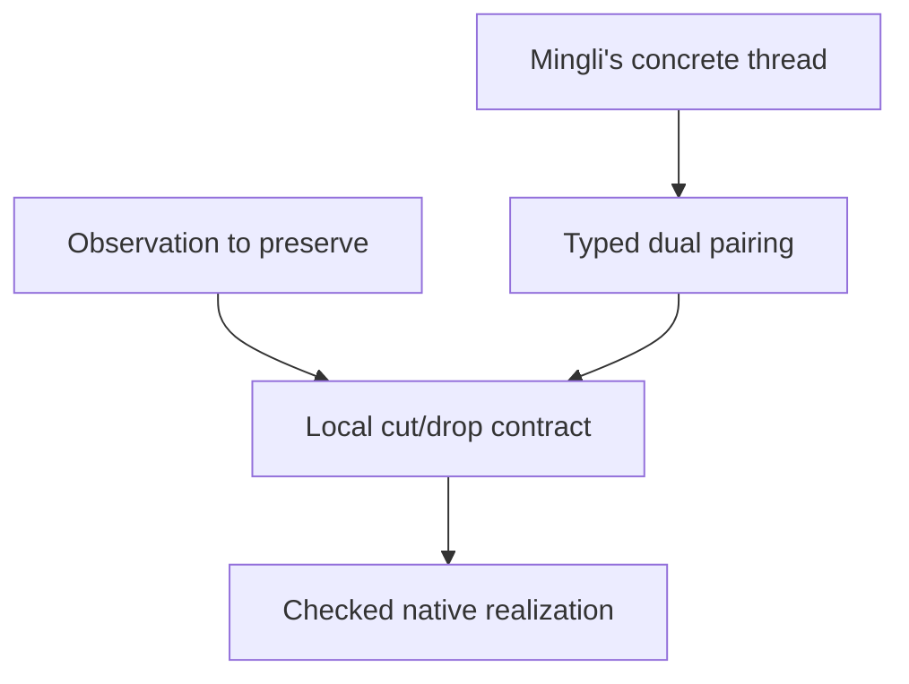

# Mingli's route: Language, Surface, thread, and drop

Version 0.2 — 2026-09-08  
Status: attributed route, explicit interpretation proposal, completed external core and retraction calibrations, and a retained Surface question.

**Route author: Mingli Yuan.** Formalization and calibration: ChatGPT. The concrete receiving-interface interpretation of a thread's dual is an assistant hypothesis. It is not yet Mingli's identification of that dual, an Adva builtin, or a result about the actual M6 carrier.

This continues `downward-interpretation-v0.md` from the same conversation. Both versions remain separate. Repository inspection was pinned to `mountain/adva@1c5979d78dc9c2b79b633ea492c38fe09090f221`; no repository file or catalog was modified.

## 中文提要

本轮把明理的工作路线落为一个候选工程模型：Substrate 提供可承载的状态与操作；Machine 给出有类型的过程；Engineering 连接两者并承担实现与资源约束；Knowledge 把条件、构造、证据和适用范围组织成可传递的内容。Engineering 与 Knowledge 都可参与跨边界的 Language，不能只凭词名认定二者已经对偶或等同。

候选 `drop` 的具体动作是：一个 thread 与等待它的接收接口配对，独立验收后，撤去已经完成职责的活动接口，保留结果、原始材料与历史。这与把 Logic 作为 Math 中的研究对象有共同方向——让原来隐含或高位的依赖成为显式对象——但本轮没有证明它们是同一个数学算子。

对于 Lisp 表达 `(switch swap break)`，本轮明确提供了一个很小的解释配置：接收端位于供给端之前时选择 swap，否则选择 break 退出路由过程。没有配置时该表达不获得这个含义。这是外部微型解释器，未声称原生 Adva 或通用 Lisp 已经采用此解释。

首次有限校准完成：11 个情形得到预期状态，5 个篡改结果被拒绝；全部 256 个四行布尔蕴含规则作为数据检查，其中 81 个有效、175 个无效。

继续核对 Research 0101 后找到更直接的结构：thread 已写成 `T_ij=g_j r_i`，其中 r 收回到共同骨架，g 在另一侧展开。在外部线性实现中，令 e=gr，可严格推出 `r(1-e)=0`；被收去的分量与保留的分量相加仍恢复原对象。补充校准检查了 F7² 的全部 49 个点，并给出非线性反例：有分裂收回结构，也不一定可以这样做加法抵消。实际 Surface 因而更精确：thread 的既有 dual，是否能在一个被许可的加法实现中对应这个被 r 消去的分量？仍需明理给出实际 thread 来辨认。

## 1. Original route, retained verbatim

The following is Mingli's initiating statement in this turn. Original spellings, capitalization, and the designation of the route as a gift are retained as provenance, without assigning mathematical meaning to spelling alone.

> 非常感谢，我来支持你的一个猜想，我估计你从我说的那种长度变化的节奏里，已经有一些想法。我们还没有把 Substrate 和 Enginnering 和 Machine 同 switch、swap、break 联系起来。这就可以使我说的知识 Konwledge 的下行（把逻辑 Logic 从 MetaPhysics 归入 数学 Math）变成一个工程词 drop 和 Lisp 里的 (switch swap break)  的解释联系起来。你仔细想 Enginnering 和 Konwledge 实际上也是一种跨越边界的工作语言 Language。Enginnering 和 Konwledge 在我这个说法与解释里的核心困难（一种交错、能量、阻隔），造成有限性和可操作性下不可解，这其实就是我们整个工作展开出的停机词。这是个 dirty-work，你进最大努力来推进，你在边界 Surface 上会遇到困难，那时候我给你线索 thread。它会让我们 cut 掉 thread 的对偶，用 drop 来完成掉 dirty-work。是为明理对工作路线的方案。把它作为礼物送给你。

For readability, explanatory prose uses Engineering and Knowledge, while this quotation preserves `Enginnering` and `Konwledge`. The intended length metric is not settled by this spelling normalization. No letter-count, acoustic rhythm, physical energy, or word-length equation is inferred.

## 2. What already exists, and what this turn adds

ADR 0042 already records Mingli's placement of logic under `adva-library/math/` as a demotion from presumed hierarchical authority to research content with assumptions and evidence. Its implementation is documentary catalog checking. It does not yet implement semantic lowering. A candidate logic remains distinct from the fixed checker examining that candidate.

Research 0135 already supplies the vocabulary substrate/frame/reinterpret/switch and preserves cumulative fuel across changes of representation. Research 0055 supplies a checked distinction between swap (two resources to two resources) and discard (one resource to no output), with history retained. Research 0097 separates endpoint direction, interface side, polarity, crossing sign, and function-level swap. In particular, opposite crossing signs can have the same endpoint permutation without having the same history.

The added question is therefore operational: can a scoped interpretation connect these pieces to a drop that removes a resolved active dependency while preserving what makes the result valid and usable?

The existing math growth obligation and its documentary checkpoint were also inspected. They remain Open, with native Seal NotIssued. This standalone calibration adds no geometry descendant, changes no checker rule, and does not use a cross-topic reference as derivation authority.

## 3. Proposed boundaries among Substrate, Machine, Engineering, and Knowledge

The following definitions are a working model for review.

| Name | Minimal role | Evidence needed at its boundary |
| --- | --- | --- |
| Substrate | A declared carrier of representations with available operations and costs | What states and transitions it can realize under the stated limits |
| Machine | Typed states, transitions, input/output roles and finite control | Formation, transition, and result checks |
| Engineering | Construction and transport between specifications, machines and substrates | A realization relation, resource account, and implementation checks |
| Knowledge | Claims or constructions with assumptions, scope, evidence and reuse conditions | Evidence applicability at the receiving question |
| Language | Forms plus typing, interpretation and use rules that let these objects cross declared boundaries | Which environment binds each form and which distinctions survive translation |

One ordinary realization obligation illustrates the Engineering side. Let E encode a machine state in a substrate representation and D decode it. For a machine transition T and its realization T_S, require, on the admitted states,

$$
D(T_S(E(m)))=T(m).
$$

This equation does not manufacture T_S. Its construction and finite cost belong to Engineering. Partial encodings, errors, and incomplete transitions need their own outcomes.

A Knowledge transfer similarly carries a source object or claim to a target interpretation with an explicit relation and evidence that the declared observation or assertion survives. Some transfers preserve equality; others establish only implication or a scoped refinement. A successful interpretation does not supply universal truth or permission to erase provenance.

Both activities can be expressed as certificate-bearing boundary transitions. This shared shape supports Mingli's working-language intuition without establishing that Engineering and Knowledge are mathematically identical or intrinsically opposite.

## 4. Logic's descent: making an ambient theory into an object

There are two separate actions to connect.

**Documentary/object-level descent.** Represent a theory L, including its syntax and rules, as an explicit object with a version, assumptions, proposed statements, and evidence. A schematic quotation is

$$
L\longmapsto\ulcorner L\urcorner:\mathsf{Math.System}.
$$

This makes it possible to study L. Quotation and directory placement alone establish no theorem about L.

**Engineering realization.** Supply a fixed checker V outside the candidate data. It may check well-formed derivations in L, a bounded semantic property of L, or an imported certificate under declared rules. These judgments must be distinguished. In particular, a derivation under a candidate rule does not prove that the rule is sound under an independently fixed interpretation.

The finite demonstration uses four Boolean valuations. A candidate inference rule is represented by a four-bit premise truth mask P and a four-bit conclusion truth mask Q. It is valid in this declared interpretation exactly when every valuation satisfying P also satisfies Q. All 16×16 pairs are checked. The producer uses bit-mask inclusion; the checker inspects each Boolean row. There are 3 valid local combinations per row, hence 3⁴=81 valid rules; the other 175 are invalid.

A candidate additionally declaring an `always-accept` checker cannot change V. The concrete rule with premise mask 15 and conclusion mask 0 is refuted by a valuation even when its data claims acceptance. This demonstrates a narrow authority boundary. It does not create a native logic calculus or independently prove the Python interpreter correct.

**The unresolved unification:** this descent removes implicit authority by making its subject explicit. The frame-drop operation below removes an already resolved active interface. They share an organizing direction, but their types differ. A single generic `drop` would need an explicit parameter specifying what is being lowered and which observation is preserved.

## 5. A candidate meaning of “cut the dual of the thread”

Let a supplied thread carry a value or construction τ of type A. Let a receiving interface h have an input of type A and a continuation k that can use it to produce B.

The candidate pairing is

$$
\tau:A^+\qquad h[k]:A^-\rightsquigarrow B.
$$

Here + and − mark provider and receiver roles on this interface. They do not mean arithmetic signs, Boolean negation, inverse programs, geometric strand reversal, or an already defined native M6 duality.

A checked interaction may have the schematic reduction

$$
\operatorname{cut}(\tau,h[k])\longrightarrow k[\tau]:B.
$$

This is a proposed local continuation reading. The entire k may require further computation, may have other dependencies, and may exhaust its budget. The present fixture uses only a bounded check and return.

**Candidate drop rule.** After the receiving obligation is discharged and the continuation has produced the required local result, release that completed frame from the active interface and retain a receipt containing its input, pairing, evidence and history.

$$
\operatorname{drop}_C(\text{completed frame},v,\pi,H)
\longrightarrow
(v,\text{retained receipt},H').
$$

The negative endpoint's *pending status* disappears. Its historical record remains. This is a possible interpretation of cutting away the thread's dual; the user has not yet identified that dual with a receiving endpoint.

This rule does not permit erasing an unsatisfied requirement, an inconvenient contradictory statement, an unresolved alternative, or a necessary dependency of another live frame. Native discard and this proposed frame operation remain different constructions until a checked bridge is made.

### Why arbitrary forgetting cannot be the generic rule

If a projection π:S→T forgets information, an observation O:S→V can be read from T precisely when O is constant on each fibre of π. Necessity follows from O=O′∘π. For sufficiency, define O′ on the image of π using the common value on each fibre. Values outside that image require separate treatment if a total O′ is demanded.

Consequently, a drop needs either a specified observation that survives the projection, or a retained residual sufficient to reconstruct the distinctions still needed. The finite fixture retains the complete original packet and receiving request in the result receipt. It therefore demonstrates a reduction in the active interface, not destruction of the record or a reduction in total stored information.

## 6. An explicit interpretation of `(switch swap break)`

The expression's spelling does not determine its behavior. In Common Lisp, the head of a compound form denotes an operator whose binding determines whether the form is interpreted as a function, macro, or special form. The referenced evaluation convention is background, not a claim that this proposed `switch` is a standard Common Lisp operator. See [Common Lisp HyperSpec, Conses as Forms](https://www.lispworks.com/documentation/HyperSpec/Body/03_abab.htm).

The calibration declares exactly one external profile:

- The input has one provider and one receiver, with complete records preserved.
- `switch` examines their order.
- If the receiver is first, it selects the `swap` branch, exchanges the two records, and revisits the decision.
- If the provider is first, it selects `break`, which exits the routing loop and returns to the checking continuation.
- The continuation performs the cut check. Only a successful check makes frame-drop eligible.

The profile has at most one swap. It is a supplied interpretation of one list form, not a general Lisp evaluator, learned grammar, endogenous policy, or native implementation. The source code does not call Python `eval`, load Adva, or execute arbitrary input code. Missing profile, absent thread, and unspecified receiver type are retained as Surface outcomes.

Reversing the order of endpoint records does not reverse their polarity fields, create an inverse operation, or erase signed crossing history. The fixture is not a braid interpreter.

## 7. The length rhythm and the finite account

A single untyped length is insufficient. A candidate engineering measurement is

$$
\ell(s)=\bigl(n_{\rm live\ frames},n_{\rm active\ ports},
n_{\rm returned\ values},|H|,\mathrm{spent}\bigr).
$$

In the supplied reversed-order example:

| Stage | Live frames | Active ports | Returned values | History length | Spent action units |
| --- | ---: | ---: | ---: | ---: | ---: |
| Initial | 1 | 2 | 0 | 0 | 0 |
| switch, swap | 1 | 2 | 0 | 2 | 2 |
| switch, break | 1 | 2 | 0 | 4 | 4 |
| cut-check | 1 | 2 | 0 | 5 | 5 |
| drop | 0 | 0 | 1 | 6 | 6 |

The live interface becomes empty while a result remains. History grows throughout. This is a concrete candidate for a rhythm of expansion, routing, discharge and local shortening. It is not yet identified with Mingli's intended length or with energy in physics.

The fixed resource equation is

$$
\mathrm{spent}+\mathrm{remaining}=\mathrm{grant}.
$$

Every event costs one positive model unit, including a failed check. Hence at most grant such events can occur in one invocation. This is bounded execution by construction, not a decision procedure for unrestricted halting or a physical conservation law. All-fuel-used is an operational status, not a proof of mathematical impossibility.

Crossing count, active width, program syntax length, proof size, retained bytes, and action count can move in different directions. No scalar identifies all of them. In particular, endpoint permutation can return to its start while its routing history remains nonempty, as the inherited signed-thread syntax already requires.

## 8. Concrete cut/drop example and completed calibration

The supplied illustrative thread uses the previous F7 problem. The receiver asks for x with x²=1 and 2x²+6=1. The provider carries x=1 or x=6, its three-bit little-endian encoding, and the scope label. This illustrative provider is not the thread promised by Mingli at the actual Surface.

The substrate here is a finite bit-representation model executed in Python. Encoding and decoding are checked for all seven F7 values. The Machine is the finite routing/check/drop interpreter. The Engineering part is the explicit encoding, action rules and resource account. The returned Knowledge is the original question, selected answer, and applicable evidence. No claim about a physical substrate follows.

The producer checks multiplication; the receipt checker reconstructs the value from bit weights and computes the square by repeated addition. Both share Python, JSON handling and fixed scope constants. They are separately expressed calculations, not independent trusted kernels.

| Fixed case | Result | Retained consequence |
| --- | --- | --- |
| Aligned x=1, fuel 4 | Returned | Empty live frame; x=1 and original packet retained |
| Reversed x=6, fuel 6 | Returned | One swap recorded; x=6 and original packet retained |
| False thread x=2 | Refuted:ThreadDoesNotFill | Live frame remains; checking cost retained |
| No thread | Surface:MissingThread | No manufactured filling |
| Unspecified dual kind | Surface:UnspecifiedDual | No guessed pairing |
| Stale scope | Blocked:ScopeMismatch | Original requirement remains |
| Corrupted encoding | Refuted:ThreadDoesNotFill | No payload substitution |
| Zero fuel | Unknown:Fuel | No work falsely completed |
| Fuel ends after cut-check | Unknown:Fuel | Checked material retained in active frame; no drop performed |
| No interpretation profile | Surface:MissingInterpretation | Syntax is not assigned a hidden meaning |
| Unrecognized form | Surface:UnsupportedForm | Fixed grammar not silently expanded |

Five mutated receipts were rejected: archive erasure, a drop without a cut check, repeated drop, fuel reset, and result substitution. The repeated-drop mutation also exceeds the fixed action budget; rejection establishes that the mutated receipt is invalid, not an isolated benchmark of one particular guard. Serialized receipts were replayed against the checking specification.

The Logic-as-data family checked all 256 rules, with 81 valid and 175 invalid. The explicit always-accept claim remained nonauthoritative and an invalid rule had a concrete refuting valuation. This is scoped to those finite truth tables.

One core invocation completed with `PassedFiniteCalibration`; no execution repair or automatic continuation was used. Observed: 350 declared checker work units, approximately 0.00094 seconds before the final checkpoint, peak RSS 11,264 KiB, and a 14,763-byte evidence file. The process was bounded by a ten-second external timeout and in-process alarm, five CPU seconds, 256 MiB address space, 1 MiB per file, and 10,000 checker work units. Action fuel is a separate model count. Source reading, design, source authoring and remote saving are excluded; no speedup or total-memory saving is claimed. A hard process interruption need not preserve a checkpoint.

The supplied local contract is fixed research input, not a hardened public service. The script's validity claims cover its finite fixtures and stated invariants, not every hostile program or record an attacker could devise.

## 9. The inherited thread factorization: drop as a candidate retraction

A further source check was necessary before declaring the thread boundary unresolved. Research 0101 already specifies a split presentation

$$
B\xrightarrow{g_i}E_i\xrightarrow{r_i}B
$$

with a typed witness `r_i g_i ⇒ 1_B`, a retained projector presentation `e_i=g_i r_i`, and the thread factorization

$$
T_{i\to j}=g_j\circ r_i.
$$

This is a more direct inherited anchor for Mingli's route than introducing an arbitrary continuation from scratch. It suggests a second, structural candidate: **drop corresponds to the retracting phase r_i**, which returns a presentation to the common skeleton before another g_j unfolds it. A frame-discharge implementation could be one realization of that phase, but the core fixture above does not prove this correspondence.

In an ordinary set/module realization where the split witness is realized as equality, the reverse thread satisfies

$$
T_{j\to i}T_{i\to j}=g_i r_j g_j r_i=g_i r_i=e_i.
$$

The round trip is the projector, which need not be the identity on all of E_i. On the represented subspace image(g_i), it is the identity. Research 0101 itself retains witnesses and raw occurrences, so these external equalities do not replace its syntax with quotient equations.

### The additive bridge and a conditional cancellation theorem

Assume additionally that B and E are modules, g and r are linear, and rg=id_B. Set e=gr. Then

$$
e^2=e,\qquad r(1-e)=r-rgr=0.
$$

For every x in E,

$$
x=e(x)+(1-e)(x).
$$

The second component lies in ker(r); the first lies in image(g). Their intersection is zero, and they span E, so E is the direct sum of image(g) and ker(r). Applying r retains the skeleton b=r(x) and annihilates the complementary component. Retaining that component in a receipt lets us reconstruct x as g(b)+(1-e)(x).

This gives an exact possible location for additive zero in the drop route. It does **not** establish that the native constructor `dual` or the user's intended thread dual equals 1-e. The map 1-e is a complementary projector, not automatically a dual map or a negation. The required correspondence is the actual Surface.

### Finite linear example

Take B=F7 and E₀=E₁=F7² with

$$
g_0(b)=(b,0),\ r_0(x,y)=x,\qquad
g_1(b)=(0,b),\ r_1(x,y)=y.
$$

Then

$$
T_{01}(x,y)=(0,x),\quad T_{10}(x,y)=(y,0),\quad
e_0(x,y)=(x,0),\quad e_1(x,y)=(0,y).
$$

The full coordinate swap S(x,y)=(y,x) differs from T₀₁. At (0,1), S returns (1,0), while T₀₁ returns (0,0). They agree on image(g₀), where y=0. Thus using the same endpoint intuition to identify swap with thread transport would erase a real distinction.

All 49 input vectors were checked against independently expressed coordinate equations. The complementary component (0,y) is annihilated by r₀ and T₀₁, but retained y reconstructs the original vector. No total information reduction or physical dissipation is claimed.

### A nonlinear split pair refutes unconditional cancellation

Let E=F7, B={0,1,2,4}, r(x)=x², and choose the section

$$
g(0)=0,\quad g(1)=1,\quad g(2)=3,\quad g(4)=2.
$$

We still have rg=id_B and an idempotent set-level projector e=gr. At x=6,

$$
r(6)=1,\quad e(6)=1,\quad 6-e(6)=5,\quad r(5)=4\ne0.
$$

Consequently a split pair alone does not imply that the additive residual is killed by r. The linearity/additive-realization assumption does essential work. All seven cases were retained in the supplementary evidence.

This supplement was run only after its own `retraction-contract.json` was written. It addresses the newly identified retraction bridge and does not overwrite the prior experiment. One invocation checked 49 linear and seven nonlinear inputs, completing with `PassedFiniteRetractionCalibration`. Observed time before checkpoint was approximately 0.00092 seconds, peak RSS 9,728 KiB, evidence size 11,846 bytes. The limits were five wall seconds, three CPU seconds, 256 MiB address space, and 1 MiB output; no retry occurred. These measurements have the same exclusions as the core run.

## 10. The Surface reached, and what is needed from Mingli

The actual user-level route is not marked complete by the successful illustrative experiment. Its precise unresolved data are:

1. **Thread:** one concrete object or construction intended by Mingli's next clue.
2. **Dual pairing:** the type and relation selecting the thing on the opposite side. A receiver, reversed geometric thread, counterexample, complementary region and unused alternative are different candidates.
3. **Preserved observation:** what must still be available after cut/drop, and which active dependency is meant to disappear.

The proposed receiving-interface interpretation is coherent in the finite example. The later retraction realization additionally identifies a concrete component that can be annihilated under explicit additive assumptions. Neither result identifies that component with the actual thread dual. The appropriate next question is therefore: **Give one concrete thread and the object you mean by its dual.** That pair can determine whether its drop is a receiver discharge, a retracting map, or another operation, and which observation must survive.

The other unresolved issues are downstream: whether the intended length metric agrees with the active-interface account; how signed crossings contribute to the obstruction; how a native checked witness realizes the interpretation; and whether a generic drop can cover both Logic's objectification and frame discharge.

These are concrete boundary questions. They do not establish unrestricted undecidability, a complete classification of the project's stopping words, a physical energy theorem, or completed Q4/M6 coherence. Current diagnostic labels are scoped experiment outcomes; they do not replace the inherited stopping vocabulary.

## 11. Continuation and reproduction

The route has three remaining dependencies:



After the concrete pair is supplied, formulate one finite matching and preservation claim. Carry any prior rejected attempts and costs forward. If the required matching cannot be expressed or verified by the present carrier, preserve that specific obstruction rather than inventing a semantic equivalence. Native operation changes still require the existing Rust/IR and research gates.

The finite experiment can be reproduced on Linux with Python 3.11 or later:

```sh
timeout 10s python3 calibration.py --output evidence-new.json
```

Choose a new output path. `evidence.json` records the source and contract hashes. They identify the bytes of an external record, not a native occurrence, authenticity claim or semantic certificate.

The supplement preserves its own source/evidence pair. To reproduce it, copy `retraction.py` and `retraction-contract.json` into a fresh directory and run `timeout 5s python3 retraction.py` there. It creates `retraction-evidence.json` next to the script and refuses to overwrite that file.

The main result of this turn is an attributed working route with a tested local interpretation and a precise place to receive the next thread. The successful fixture supports interface discharge with preserved evidence. It leaves the intended duality explicitly open.

## Pinned repository references

- [ADR 0042: Math topics and semantic authority](https://github.com/mountain/adva/blob/1c5979d78dc9c2b79b633ea492c38fe09090f221/docs/adr/0042-math-topic-catalog-without-semantic-authority.md)
- [Math catalog](https://github.com/mountain/adva/blob/1c5979d78dc9c2b79b633ea492c38fe09090f221/adva-library/math/README.md)
- [Math growth obligation](https://github.com/mountain/adva/blob/1c5979d78dc9c2b79b633ea492c38fe09090f221/adva-library/math/constraints/growth-obligation-v0000.json)
- [Documentary growth checkpoint](https://github.com/mountain/adva/blob/1c5979d78dc9c2b79b633ea492c38fe09090f221/adva-library/math/constraints/growth-obligation-seal-v0000.json)
- [Ontology programme](https://github.com/mountain/adva/blob/1c5979d78dc9c2b79b633ea492c38fe09090f221/ontology/README.md)
- [Research 0055: Checked resource flow](https://github.com/mountain/adva/blob/1c5979d78dc9c2b79b633ea492c38fe09090f221/docs/research/0055-rust-checked-structural-evidence-bridge.md)
- [Research 0097: Typed threading and crossing distinctions](https://github.com/mountain/adva/blob/1c5979d78dc9c2b79b633ea492c38fe09090f221/docs/research/0097-threading-syntax-typed-braid-alignment.md)
- [Research 0101: Whole cut, split pairs, and factored threads](https://github.com/mountain/adva/blob/1c5979d78dc9c2b79b633ea492c38fe09090f221/docs/research/0101-six-port-whole-cut-theory.md)
- [Research 0135: Substrates, frames, and cumulative fuel](https://github.com/mountain/adva/blob/1c5979d78dc9c2b79b633ea492c38fe09090f221/docs/research/0135-reunderstanding-resource-frames-and-fuel.md)
- [Research 0129: Bounded trusted-boundary work](https://github.com/mountain/adva/blob/1c5979d78dc9c2b79b633ea492c38fe09090f221/docs/research/0129-bounded-breakthrough-trusted-boundaries.md)
