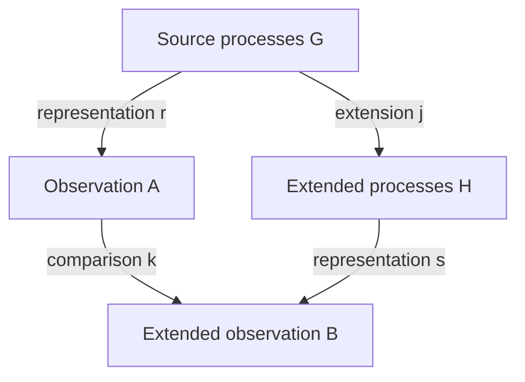

# Research 0160: Faithful representation switches and reverse observer search

Date: 2026-09-08. Status: completed external exact calibration; native local
faithfulness and strong objectification remain **Open**.

Direction and connection: **Mingli Yuan**. Formalization, bounded implementation,
and review: ChatGPT. Base: `mountain/adva@1a2ef7154bae5a646c5fa4ec1d31d798a787b11c`.
Classical algebra below is not claimed as new mathematics. The tested observer
search is externally specified, not an endogenous discovery mechanism.

## 1. Source and research question

Mingli linked `https://mp.weixin.qq.com/s/OnsL-5E1HoNIQyfZD5666w`, suggesting
that preserving faithfulness should involve conversion between two
representations. He subsequently added:

> 如果推进有困难，可以靠反向学习 switch swap 的方法来推进搜索

The WeChat body could not be opened directly. An independently indexed post
explicitly citing the same URL identified the subject, and the corresponding
primary mathematical paper was retrieved. We do not claim to have read the
complete WeChat article.

The July 2026 [Bharathram–Birman–Brendle preprint](https://arxiv.org/abs/2607.05283v1)
claims faithfulness of the four-strand Burau representation. Its argument uses
graded intersection data and parity to control cancellation, together with
a five-strand auxiliary construction and a kernel-exclusion test. The relevant
locations are Sections 2, 4, and 6. This note does not independently certify
its geometric construction or reprove its main theorem.

Our concrete question is different and bounded: can two independently computed
representations agree exactly, can we locate information lost by a coarser
observation, and can a finite reverse search find the smallest separating
observation in a declared ladder?

## 2. The inherited faithfulness obligation

The earlier research target concerned local faithfulness of `N_(Q_min)` on
the K1–K5 finite fragment, with

$$
Q_{\min}=Q_{\mathrm{proj}}\vee Q_{\mathrm{src}}\vee Q_{\mathrm{hist}}
\vee Q_{\mathrm{cell}}\vee Q_{\mathrm{var}}.
$$

Its crucial boundary persists: weak observational agreement does not produce
an explicit strong objectification cell or higher coherence. Current
`SEMANTIC_SCOPE.md` still excludes general faithfulness, fullness, full
abstraction, and lifting observations to cells. `PROGRAM_PROCESS_CORE.md`
likewise requires occurrence, source, construction, and history residuals to
survive compiled presentations.

Research 0019 already separates occurrence-decorated symbolic sections from
their coefficient-table shadow. Research 0158 requires a witnessed return
fibre; Research 0159 preserves old judgments under conservative frame
extension. A new question can preserve old meanings without separating any
previously indistinguishable processes. Faithfulness adds that separation
obligation.

## 3. Four claims that require different evidence

| Claim | Required content |
| --- | --- |
| Well-defined representation | The declared source relations survive the map |
| Compatible conversion | The two routes through a comparison diagram agree |
| Faithfulness | Equal represented morphisms imply equal source morphisms in the declared equivalence |
| Strong objectification | A checked explicit cell, with the required source/target and coherence |

A commuting comparison diagram proves compatibility. It does not by itself
make a lossy map injective. Even a faithful group representation identifies
different raw words representing the same group element. Thus preservation of
raw process history remains a separate requirement for Adva.

For an ordinary functor, faithfulness means injectivity on each hom-set; it
does not assert fullness or construct preimages of arbitrary target morphisms.
Our desired native cell-lifting obligation is stronger than comparing two
external matrices.

## 4. A general transfer principle without an inverse decoder

Let representations and comparison maps form a commuting square:

Suppose `s(j(g)) = k(r(g))`. If `k` preserves the neutral observation, then

$$
r(g)=1\;\Longrightarrow\;s(j(g))=1.
$$

Consequently a checked nonneutral observation of `j(g)` excludes `g` from the
kernel of `r`. No inverse for `k` is needed. For general pairs, the more basic
statement is

$$
s(j(p))\ne s(j(q))\;\Longrightarrow\;r(p)\ne r(q).
$$

Proof: equality under `r` would remain equality after applying the function
`k`, contradicting the commuting square and the observed difference.

To prove faithfulness, one additionally needs such a separator for every
unequal source pair in the declared scope. One successful separator proves
only its own pair distinct. An extension outside the commuting square may add
new information, but then its distinction cannot automatically be reflected
back to the original observation.

## 5. Why swap cannot recover lost information

For an invertible change of basis `P`, write

$$
r_P(g)=P^{-1}r(g)P.
$$

Then `ker(r_P)=ker(r)`: multiplying by `P` and `P^-1` shows that one matrix is
the identity exactly when the other is. More generally, if `r(p)=r(q)`, every
deterministic postprocessing of that observation gives equal outputs.

This is a useful obstruction for reverse learning. Once a collision is known,
reordering the same information cannot split it. A richer switch must consult
retained source data, an independent observer, or a checked lift from the
coarse observation's fibre. A unique coarse-to-rich decoder generally does
not exist. The experiment retains an explicit pair of unequal rich matrices
having the same coarse observation.

The terms here have limited operational meanings:

| Word | Operation in this experiment |
| --- | --- |
| reverse learning | Start with a collision and search a fixed finite ladder for a separator |
| swap | Simultaneously permute matrix row and column bases, retaining the permutation |
| switch | Read a richer formal coefficient observation from the retained source |
| break | Stop at the first checked separator or the declared finite exit |

No stable Adva builtin is added or reinterpreted.

## 6. Two exact calculations of one braid representation

The classical braid presentation and matrix convention are calibrated against
[Birman–Brendle's survey, Sections 1.2 and 4.2](https://www.math.columbia.edu/~jb/Handbook-21.pdf)
and the [Magnus/Burau construction discussed here](https://link.springer.com/article/10.1007/s40065-024-00468-x).

The first computation multiplies exact unreduced Burau generator matrices over
`Z[t,t^-1]`. The nonidentity positive and negative blocks are

$$
B_i=\begin{pmatrix}1-t&t\\1&0\end{pmatrix},\qquad
B_i^{-1}=\begin{pmatrix}0&1\\t^{-1}&1-t^{-1}\end{pmatrix}.
$$

The second computation substitutes the Artin automorphisms in free words:

$$
\phi_i(x_i)=x_ix_{i+1}x_i^{-1},\quad \phi_i(x_{i+1})=x_i;
\qquad
\phi_i^{-1}(x_i)=x_{i+1},\quad
\phi_i^{-1}(x_{i+1})=x_{i+1}^{-1}x_ix_{i+1}.
$$

All other generators are fixed. Applying the abelianized Fox derivative to
each resulting free word gives a row of the matrix. Its implementation tracks
the signed prefix height: a positive letter contributes at the current
height, while a negative letter contributes minus one after decreasing the
height. This route performs no matrix multiplication.

The convention is frozen: appending a braid generator substitutes its map into
the current free-word images. Row Jacobians then multiply on the right. The
run checks direct matrix products against the Fox route for every supplied
word. This is compatibility of the two finite computations. No appeal to the
new four-strand faithfulness theorem is used as a test oracle.

## 7. A finite ladder that repairs the observed collisions

Set `t=1+h` and retain coefficients through order `k`:

$$
J_k(M)=M(1+h)\pmod{h^{k+1}}.
$$

This is exact formal algebra. Negative powers expand by integer generalized
binomial coefficients; no floating point, convergence assumption, or physical
interpretation of a derivative is involved. The map into
`Z[h]/(h^(k+1))` respects multiplication because `1+h` is a unit in that ring.

`J_0` is evaluation at `t=1`. At the generator level it records only a
transposition. Higher coefficients may retain distinctions invisible there.
The projection from `J_(k+1)` to `J_k` discards the last coefficient and retains
all earlier observations. This is a concrete observer-refinement version of
the previous frame-extension direction.

**Finite reconstruction proposition.** If every entry of `M` has Laurent
exponents in `[-L,L]`, then `J_(2L)(M)` uniquely determines `M`.

Proof: for a difference entry `p`, the polynomial `q=t^L p` has degree at most
`2L`. If its jet through order `2L` vanishes at 1, then it has a root there of
multiplicity at least `2L+1`, so it is zero. Multiplication by `t^L` is
invertible in the Laurent ring, giving `p=0`. This applies entrywise.

An explicit decoder first multiplies the jet by `(1+h)^L`, then substitutes
`h=t-1` and shifts exponents by `-L`. The run reconstructs every matrix entry
this way. For words of length at most four, direct products have exponents in
`[-4,4]`; order eight is therefore a sufficient certified reconstruction bound.
The bound itself is checked on every retained matrix.

The degree condition cannot be omitted: `(t-1)^9` is nonzero but has a zero
jet through order eight. The corresponding negative control refuses to call
this a zero polynomial. An arbitrary fixed jet order is not a globally
faithful representation of the entire Laurent ring.

## 8. Reverse-search witnesses

The frozen search first tries all 24 simultaneous basis permutations at order
zero, then examines orders 0 through 8 in order. It stops at the first
nonzero coefficient difference. Source words, failed attempts, chosen entry,
degree, coefficients, and their difference remain in the receipt.

### Pure twist versus identity

Compare the empty braid word with `sigma_1^2` in four strands. Every order-zero
basis permutation leaves the collision. The first separating jet has order
one; at zero-based entry `(0,0)`, its coefficients are 0 and 1.

### Two orders of pure twists

Compare

$$
u=\sigma_1^2\sigma_2^2,\qquad v=\sigma_2^2\sigma_1^2.
$$

Their order-zero and order-one observations coincide. The search finds its
first separator at order two: zero-based entry `(0,1)` has coefficients
`-2` and `-1`, respectively, so the difference is `-1`.

The reason is visible before computing the whole products. Writing

$$
r(\sigma_1^2)=I+hA+h^2A_2+\cdots,\quad
r(\sigma_2^2)=I+hB+h^2B_2+\cdots,
$$

both product orders have first coefficient `A+B`. Their second coefficients
differ by `AB-BA`. In this fixture that commutator is nonzero. The second-order
observer thus records an order-dependent interaction absent from the first.
This is an exact algebraic relationship between additive aggregation and
ordered composition, with no physical-energy claim.

### Genuine source relation

The words `sigma_1 sigma_2 sigma_1` and `sigma_2 sigma_1 sigma_2` are a defining
braid relation. Their exact matrices and free-group actions agree. All nine
jet levels remain equal, as expected. Both raw words are retained and no
native equation or objectification cell is issued.

## 9. Complete finite results and limitations

The [contract](../../experiments/faithful_switch/contract.json) was frozen before
the only invocation, SHA-256
`b18c37807bccf30ecc4a8ee037e9a348772a07f05acc90383a932ac03c0ee84a`.
The [source](../../experiments/faithful_switch/calibration.py), complete
[evidence](../../experiments/faithful_switch/evidence.json), and byte manifest
preserve the calculation.

The word family consists of every length-zero-through-four word with no
adjacent inverse pair, for three and four strands. This restriction defines
the input family; it is not permission to erase steps from a native history.

| Scope | Raw words | Exact matrix classes | Free-action classes | J0 classes | J1 classes | J2 classes |
| --- | ---: | ---: | ---: | ---: | ---: | ---: |
| Three strands | 161 | 115 | 115 | 6 | 95 | 115 |
| Four strands | 937 | 469 | 469 | 20 | 413 | 469 |

All higher jet levels through eight have the same class counts as `J2` in
these finite families. No exact matrix bucket contained distinct free-group
actions. The four-strand order-zero family reaches 20 permutations because
the word-length bound does not reach every permutation in `S4`.

The result means order two separated all exact matrix classes observed in the
frozen family. It is not a universal second-order bound or an independent
proof of unbounded four-strand faithfulness. Equality of class counts is
supplemented by checking the actual partitions, including the absence of
multiple free actions within a matrix bucket.

Additional checks covered 16,441 entry reconstructions, 14 defining-relation
pairs in both representations, three reverse searches, and nine rejected
corruptions. Corruptions changed matrix data, source words, free images,
integer typing, swap claims, jet witnesses, failed-search history, the degree
bound, and a purported unique lift of a coarse observation.

One run finished with `PassedFiniteCalibration`: 1,088,096 logical units,
1.036 seconds before checkpoint, 22,272 KiB peak RSS, and 324,442 evidence
bytes. Limits: 30 wall seconds, 25 CPU seconds, 256 MiB address space, 8 MiB
per output file, 10,000,000 logical units, and 10,000 letters per free-word
image. An outer timeout also bounded the invocation. No retry or correction
run occurred. Timing excludes research, authoring, and publication; logical
units are declared operations rather than CPU instructions. The final
exclusive write remains under OS limits; hard termination may prevent it.

The two algorithms share Python, integer arithmetic, and the frozen
conventions. They are not two independently verified proof kernels. The
geometric realizability and parity constructions of the cited preprint are
outside this executable checker.

## 10. The Adva obligation sharpened by this experiment

The next native-facing comparison should expose these fields:

1. the existing Rust-owned source artifact and its exact original boundary;
2. both observation definitions and their frame/basis bindings;
3. a certificate that the two computation routes agree in their declared
   scope, including exact occurrence and history residuals;
4. a concrete collision or an explicit separating observation;
5. the retained source needed to refine that observation;
6. a finite search budget and all failed candidate observers;
7. a clear distinction between observed equality and an admitted source cell.

This is a proposed receipt contract, not a new Rust schema. The native K1–K5
faithfulness proof still needs a separating-family theorem or a checked
reconstruction argument on its actual carrier. Simply keeping the whole
source beside a lossy observation would give a trivial recoverable archive,
not prove the observation itself faithful.

The phase supports Mingli's proposed use of two representations and reverse
search. The essential addition is a distinction-preserving comparison with
explicit refinement witnesses. The next bounded step is to choose one pair
already indistinguishable under an existing Adva observation, retain both
Rust-owned sources, and ask whether one additional occurrence-, history-,
cell-, or variation-sensitive observation separates them. If the required
observer is absent from the carrier, retain that obstruction rather than
constructing a semantic identity in Python.

No native operation, math catalog entry, geometry derivation, Seal, thread-dual
identification, or general objectification result is added. Strand counts in
this calibration do not identify the Q4/M6 relation-cell names with braid
group dimensions.

## Repository references

- [Program Process Core](../PROGRAM_PROCESS_CORE.md)
- [Semantic Scope](../SEMANTIC_SCOPE.md)
- [Research 0019: Symbolic probe matrix shadow](0019-symbolic-probe-matrix-shadow.md)
- [Research 0129: Trusted finite boundaries](0129-bounded-breakthrough-trusted-boundaries.md)
- [Research 0158: Downward interpretation and drop](0158-downward-interpretation-and-drop-route.md)
- [Research 0159: Frame and triadic continuation](0159-frame-symmetry-triadic-continuation.md)
- [Experiment and reproduction](../../experiments/faithful_switch/README.md)
