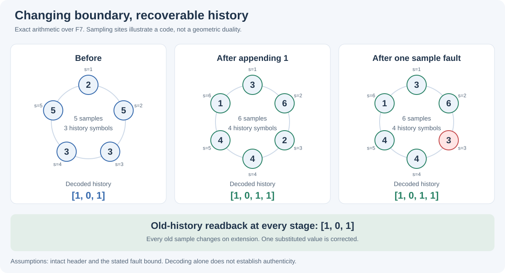

# 0206 — Compatible history surfaces and bounded reconstruction

Status: executed external finite-arithmetic calibration, 2026-09-19.
The elementary propositions below have proofs; the separate finite campaign
checks their implementation on its declared inputs. This is a model of
history-preserving extension after a proposed breakthrough, not a generator or
certificate of endogenous breakthrough.

Direction: Mingli Yuan's proposal that new evolution freedoms coexist with all
past history encoded on a surface. Argument, implementation and self-review:
Codex (OpenAI), through Mingli Yuan's authorized account proxy. Account use is
not his authorship, review, endorsement or a correctness guarantee. The prose,
code, fixtures and generated illustration are original project contributions
under Unknown v0.3. References below are bibliographic links; no third-party
text, source code, figures, datasets or page images are incorporated.

## 1. The next distinction

[0080](0080-finite-surface-universal-lift-imagination.md) proposed a marked
surface carrier, while [0088](0088-historical-distributivity-character-v0.md)
kept process residuals behind a reusable characteristic.
[0057](0057-typed-vacua-constant-boundary-braids.md) showed why a constant
interface can coexist with nontrivial history, and why a few winding readings
do not recover that history.

The present question adds a stronger demand: the current boundary record must
reconstruct the entire retained past, even when its displayed symbols change.
Three distinct objects are needed:

1. an ordered history;
2. its boundary encoding, together with a trusted format header;
3. the part a particular observer reads.

The model reconstructs words over seven toy symbols. It does not serialize
Adva's native source, occurrence, causal branching, diagram or History types.
The labels T, X and K below are a toy observation policy, not wire types.

## 2. Finite carrier and resource contract

Fix p=7. A history of length k is a word
\[
h=(a_0,\ldots,a_{k-1})\in\mathbb F_7^k,\qquad 0\le k\le5.
\]
The alphabet contains explicit labels 0,...,6. Arbitrary event identifiers are
not reduced modulo 7. Leading and trailing zero labels are genuine events.

Set N_k=k+2 and use ordered sample points
\[
\alpha_i=i\bmod7,\qquad i=1,\ldots,N_k.
\]
They are distinct because N_k<=7. The boundary record is the trusted header
(codec version, p, k, ordered points), plus
\[
E_k(h)=\left(P_h(\alpha_i)\right)_{i=1}^{N_k},\qquad
P_h(s)=\sum_{j=0}^{k-1}a_js^j.
\tag{1}
\]
For k=0 the polynomial is zero and the two samples are zero.

These are sampling sites, without a prescribed geometric surface, local
propagation law or physical metric. The term surface denotes the proposed
role of the record, not a proved geometric realization.

The [frozen contract](../../experiments/history_surface/contract.json)
allows one campaign with at most 40,000 case checks, 40,000 decoder calls,
250,000 candidate subsets, 60 seconds wall time, 55 CPU seconds, 256 MiB
address space, a 1 MiB report and zero continuations. Fixed loops and counters
bound arithmetic work; the parent process enforces time and process limits.
The code permits at most 21 interpolation candidates per decoder call.

## 3. Proposition: faithful reconstruction

**For every fixed k, E_k is injective and admits a computable inverse on its
image.**

Proof. If two histories have equal samples, their difference polynomial has
degree at most k-1 and at least N_k distinct roots. A nonzero polynomial over
a field cannot have more roots than its degree, so the difference is zero.
All coefficients, including zero coefficients, are recovered by interpolation
at any k distinct sample sites. The length in the header is essential. The
empty case is immediate.

This is the polynomial-evaluation construction underlying Reed–Solomon
codes, applied here to ordered toy histories. The coding principle is
classical, not a claimed new discovery. The application and witnesses are
original; see the source in §10.

Let C_k=E_k(F_7^k). Write D_k for the inverse on C_k. For j<=k define
\[
R_{j\leftarrow k}=E_j\circ\operatorname{prefix}_j\circ D_k.
\tag{2}
\]
This is a readback map: it decodes, takes an old prefix, and re-encodes it.
It is not ordinary restriction to a spatial subregion.

## 4. Proposition: old history and new freedom coexist

**Readback is compatible across any finite sequence of stages:**
\[
R_{i\leftarrow j}R_{j\leftarrow k}=R_{i\leftarrow k},
\qquad i\le j\le k.
\tag{3}
\]
**For each old codeword b in C_j, exactly 7^(k-j) codewords in C_k read
back to b.**

Proof. E_j and D_j cancel on clean codewords, and prefixes compose. If
b=E_j(h), its compatible later words are exactly (h,u), with
u in F_7^(k-j). Injectivity of E_k distinguishes all these words.

Consequently R is a surjective linear map with a kernel of dimension k-j.
Old observations of the form f(h[:j]) remain available by composition with
readback. They need not distinguish the new suffix.

A change from allowed next symbols {0,1} to {0,1,2} therefore changes the
number of compatible one-step continuations from two to three, while each
continuation has the same old prefix. The experiment supplies these two sets
explicitly. It does not establish the endogenous proposal, verification and
reuse obligations of [0091](0091-endogenous-scope-breakthrough-and-venture-ledger.md).

## 5. Proposition: every old displayed symbol can change

For k<5, append a new symbol a to h. At every old site,
\[
P_{(h,a)}(\alpha_i)
=P_h(\alpha_i)+a\alpha_i^k.
\tag{4}
\]
The update also adds the new sample at alpha_(N_k+1).

**If a is nonzero, every old sample changes, although (2) still recovers
the old history exactly.**

Proof. For k<5, the old sample points are 1,...,k+2, all nonzero in F_7.
Hence a alpha_i^k is nonzero. Equation (3) gives old-history preservation.
If a=0, the header length and extra site still distinguish the extended word.

For the retained example:

| Stage | Decoded history | Boundary samples |
|---|---|---|
| Old | (1,0,1) | (2,5,3,3,5) |
| Extended | (1,0,1,1) | (3,6,2,4,4,1) |
| One substituted sample | To be reconstructed | (3,6,3,4,4,1) |

The first five samples all change on extension. The corrupted third row
still decodes to (1,0,1,1), whose old prefix is (1,0,1).

This is a precise version of continued global change with retained old
interpretation. It specifies which sites change; it does not assign a
physical speed or prove a geometric flow equation.

## 6. Proposition: a bounded notion of stability

Use Hamming distance, the number of unequal sample values, within a fixed
header. For k>=1, distinct codewords satisfy
\[
d_H(E_k(h),E_k(g))\ge N_k-k+1=3.
\tag{5}
\]

Proof. Their difference polynomial has at most k-1 roots, so at least
N_k-(k-1) sample values differ. The bound is attained by a degree k-1
polynomial with k-1 of the sample points as its roots.

Therefore:

- any one substituted symbol is uniquely correctable;
- any two known erased locations leave k samples and allow reconstruction;
- more generally, the root-count uniqueness argument applies when
  2e+s<=N_k-k, for e substitutions and s known erasures.

The implemented profile accepts e=0 or e=1 and explicitly rejects
insufficient redundancy. It interpolates from candidate k-subsets and checks
each candidate against every available sample. A candidate within the
declared radius is unique by (5). It returns Unknown if its candidate budget
ends before producing one or completing the finite candidate family.

This gives a discrete error-correction notion of stability, distinct from
Lyapunov stability of a continuous flow and from slope stability of a bundle.
Under the stated fault bound at each stage, decode-and-extend preserves all
old prefixes by induction. The header must remain intact.

## 7. Negative controls: what the surface does not certify

### 7.1 Too few samples lose history

The histories (0,0,0) and (2,4,1) give the polynomials 0 and
(s-1)(s-2). Both vanish at the two sites 1 and 2. Two samples do not identify
an arbitrary three-symbol history.

### 7.2 Three partial readings can lose global order

For this toy observer, T reads symbols 0,1; X reads 2,3; K reads 4,5,6,
retaining order within each subsequence. The histories (0,2,4) and (2,0,4)
give the same three partial readings but different full codewords.
The representation must retain global ordering beyond these projections.

### 7.3 An intact header is part of the hypothesis

All-zero words of different lengths have identical values at any common
sample sites. The trusted history length preserves their distinction.
Repeated or reordered sample locations, wrong counts and unsupported symbols
are refused by this profile. Future header protection is a separate task.

### 7.4 Correction is not authenticity

The actual history (0,0,0) encodes to (0,0,0,0,0). Change two sample values
to obtain
\[
y=(0,0,2,6,0).
\]
The alternative history (2,4,1) encodes to (0,0,2,6,5), at distance one
from y. The decoder therefore returns the alternative history.

This expected control succeeds: the decoder correctly finds the unique
nearby codeword, but the actual fault exceeded its hypothesis. Its output
explicitly says authenticity is not established. A surface that stores an
algebraically valid history does not by itself establish that those events
really happened.

### 7.5 Capacity and fuel do not silently expand

At k=5, there are already seven sample sites. Appending a sixth event would
need eight distinct sites to retain the same one-error guarantee over F_7.
The profile refuses it and leaves the previous record intact.

Each sample occupies three bits in a direct representation, so the payload
uses 3(k+2) bits, excluding the header, decoder, work space and evidence.
Distinguishing all 7^k histories alone requires at least ceil(log2(7^k))
bits. Fixed surface dimension does not imply fixed information capacity.

Zero candidate fuel returns Unknown. Neither refusal changes the field,
erases the prior history or establishes an unrestricted impossibility.

## 8. Executed evidence

The [source and reproduction instructions](../../experiments/history_surface/README.md)
and [retained report](../../experiments/history_surface/evidence/run-01.json)
give 23,029 passing case checks:

| Family | Count |
|---|---:|
| Independent direct evaluation versus Horner encoding | 343 |
| Clean length-three histories | 343 |
| Every single-site nonzero substitution on those histories | 10,290 |
| Every pair of erasures on those histories | 3,430 |
| All one-symbol extensions | 2,401 |
| Incremental sample-update identities | 2,401 |
| Old-history readback after each extension | 2,401 |
| Minimum distance, exhaustively over 58,653 pairs | 1 aggregate check |
| Every binary word of lengths zero through five | 63 |
| Prefix reconstruction | 321 |
| Readback composition | 1,023 |
| Negative controls | 10 |
| Explicit continuation-set extension | 1 |
| Rewrite and fault example | 1 |

The run made 23,709 decoder calls and tried 44,301 interpolation subsets.
Worker elapsed time was about 1.40 seconds and peak resident memory about
23.1 MiB on this host; these are measurements, not complexity bounds.
The report is 7,776 bytes. It retains source/contract digests, a digest of the
ordered case ledger, counts, witnesses and unresolved obligations. The fixture
generation order is fixed so the checks can be replayed. No primary run failed.

No native Adva calls were made. The retained results are not native
certificates, no claim registry entry is added, and no library content is
imported or migrated.

## 9. What is now established, and the next question

Within this finite model, an expanding family of boundary records can have
all of the following simultaneously:

1. faithful history reconstruction;
2. compatible old-history readback;
3. multiple distinct admissible continuations;
4. changes at every old sample site;
5. exact correction within an explicitly bounded fault model.

The model assumes the history being encoded has already been supplied. It
does not establish that a boundary description captures arbitrary native
causal histories, nor that a breakthrough was generated internally.

A concrete next problem is to bind each proposed surface update to an
independently checked process event while preserving the two-error
counterexample as a control. A later geometric realization would additionally
need a marked surface, a reconstruction theorem and a costed update law.
Those are separate obligations, rather than consequences of polynomial coding.

## 10. Minimal source trail

- I. S. Reed and G. Solomon, *Polynomial Codes Over Certain Finite Fields*,
  Journal of the Society for Industrial and Applied Mathematics 8 (1960),
  300–304, [DOI](https://doi.org/10.1137/0108018).
  Historical source of the polynomial coding principle; the root-count proof
  above states the precise finite assumptions used here.
- C. H. Bennett, *Logical Reversibility of Computation* (1973),
  [original article transcription](https://www.cs.princeton.edu/courses/archive/fall04/cos576/papers/bennett73.html).
  History retention is relevant to reversible simulation; it does not supply
  this surface realization.
- F. Pastawski, B. Yoshida, D. Harlow and J. Preskill,
  *Holographic Quantum Error-Correcting Codes: Toy Models for the
  Bulk/Boundary Correspondence* (2015),
  [author manuscript](https://arxiv.org/abs/1503.06237).
  Bulk/boundary encoding is an instructive comparison. This classical finite
  word model establishes no quantum code, gravity duality or area law.
