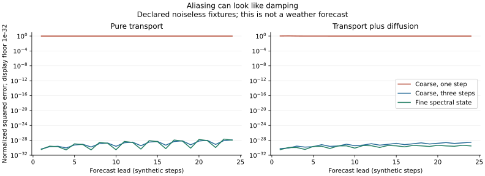
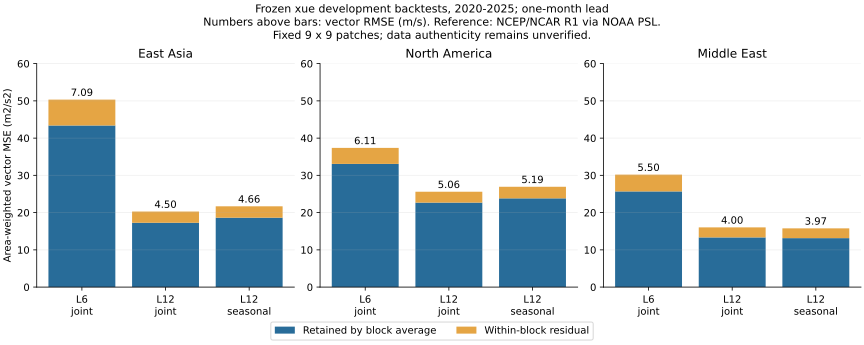

# Research 0229: Spectral memory, local constraints, and weather errors

Status: completed external finite experiments, in the requested order:
information loss and prediction; finite periodicity and local constraints;
frozen xue development-backtest errors. No native semantic admission,
four-dimensional monotile construction, or operational forecast is added.

Authored by Codex (OpenAI), contributed under Unknown v0.3 through Mingli
Yuan's authorized GitHub account proxy. Account ownership implies neither
his authorship, review, endorsement nor a correctness guarantee.

## 1. Question, carrier, and evidence boundary

[Research 0228](0228-taixuan-hierarchy-observers-and-spectra.md) supplied a
two-level Taixuan address family, not a geometric tile. This continuation
chooses its cyclic-coordinate version, `Z = (Z/9Z)^4`, and the coarse address
`a = floor(z/3)` with `a in {0,1,2}^4`. Each coarse cell contains 81 points;
the total is 6,561. Characters of this **declared group law** give a Fourier
basis. This is an ordinary finite tensor Fourier basis on the address family,
not a newly discovered harmonic system or a spectrum uniquely forced by a
historical text. The alternative `(Z/3Z)^8` law remains different.

The practical question is whether a spectrum helps identify what a finite
observer loses, how that loss affects prediction, and which apparent
conclusions need more information. Four synthetic address coordinates are
used in stage 1; their evolution index is separate. They are not identified
with physical spacetime. Stage 3 uses two actual spatial grid axes and retains
time and vector-component labels separately.

All candidate code, run contracts and evidence were prepared outside public
repositories. The [experiment directory](../../experiments/taixuan_spectral_analysis_v1/README.md)
contains the original instruments and reviewed aggregate outputs. External
software, xue coefficients, source arrays and the existing spherical evaluator
remain separate inputs. The Rust authority, library import obligations,
dependency lock and paused Lorentzian-frame work are untouched.

## 2. Stage 1: a coarse learner can mistake phase cancellation for damping

Let `R` average the 81 children of each coarse cell, and `E` repeat a coarse
value over its children. Then `RE = I`, `P = ER` is an orthogonal projection
for uniform weights, and `Q = I-P` retains the detail. For a fine character

```
chi_k(z) = exp(2 pi i k.z / 9),
H(k) = product_j [(1 + exp(2 pi i k_j/9) + exp(4 pi i k_j/9))/3],
R chi_k(a) = H(k) exp(2 pi i k.a / 3).
```

Thus frequencies with the same residue modulo 3 share one coarse character.
The coarse coefficient is a sum of fine coefficients with their complex
transfer factors. Block averaging is not an ideal Fourier low-pass filter.

The declared real-space dynamics combine a unit shift in each coordinate
with nearest-neighbor diffusion. Their analytic multiplier is

```
lambda(k) = exp(-2 pi i (k_0+k_1+k_2+k_3)/9)
            * [1 - alpha sum_j (2-2 cos(2 pi k_j/9))].
```

The checker generates trajectories by real-space shifts and neighbor sums,
then learns multipliers from data; it does not generate training steps by
inserting this analytic multiplier. Comparing the learned and analytic
multipliers is a separate numerical check.

The contract fixes `alpha = 0, 1/32`, 19 training frames, three independently
specified test initial states, three observed history frames and 24 prediction
steps. Each visible coarse frequency mixes three fine frequencies. A fourth
invisible mode and a later fourth-alias stress fixture are declared in advance.
There is no rank, penalty or seed search.

| Dynamics | Coarse one-step AR NMSE | Coarse three-step AR NMSE | Fine learner, read back coarsely NMSE |
| --- | ---: | ---: | ---: |
| Pure transport | 1.0000 | 8.13e-30 | 7.01e-30 |
| Transport plus diffusion | 1.01796 | 4.77e-30 | 1.40e-30 |

NMSE here is the sum of squared test errors divided by the sum of squared
test reference values, pooled over states and leads. It is not RMSE. The
near-roundoff errors occur in a deliberately noiseless linear family that
the three-step and fine models can represent; they imply no weather skill.

Under pure transport, the largest fitted coarse AR1 multiplier magnitude is
`4.08e-16`, although the fine dynamics preserve the norm. The training coarse
signal has cancelling phases: fitting a single multiplier interprets this
mixture as almost complete one-step damping. In this fixture, memory or
retained fine coefficients recover the evolution.



Three limits matter:

- Adding the predeclared fourth distinct alias in the diffusive case gives
  the three-step learner NMSE `0.059392`. Three history samples are sufficient
  for the original family, not a universal closure. The fine learner explicitly
  refuses the two untrained conjugate modes rather than silently erasing them.
- The mode `cos(2 pi * 3 z_0/9)` has zero coarse reading at every pure-transport
  step but retains squared norm `3280.5`. No length of this particular coarse
  observation history can identify its amplitude. Its invisibility does not
  imply that it decays or lacks long-term importance.
- The future-poison check verifies that the fit accessor uses only the
  training bundle. It is a narrow code-path check, not an independent audit
  of arbitrary leakage. Test trajectories are constructed after fitting.

The Qiong address `(2,1,1,2)` remains an explicitly retained coarse readout in
the evidence. The head name supplies no additional dynamic law.

### Why temporal memory appears

For any fixed linear evolution `T`, decompose the fine state as `f_t = E y_t + d_t`,
where `y_t = R f_t` and `d_t` is in the range of `Q`. Define the block maps
`B = RTE`, `C = RT|range(Q)`, `G = QTE`, and `D = QT|range(Q)`. Direct substitution gives

```
y_(t+1) = B y_t + C d_t,
d_(t+1) = G y_t + D d_t,
y_(t+1) = B y_t + C D^t d_0
          + sum_(j=0)^(t-1) C D^(t-1-j) G y_j.
```

This algebra explains the experiment without assuming that forgotten detail
is noise. Eliminating detail generally leaves both memory and an unresolved
initial-detail term. Decay needs an additional condition on the detail
evolution and its coupling; coarse observation alone supplies none. This
experiment does not test deletion of odd moments or odd spherical degrees.

## 3. Stage 2: periods, power ambiguity, and local constraints

A translation `p` preserves a finite field exactly when every nonzero Fourier
coefficient satisfies `k.p = 0 mod 9`. Integer enumeration checks all 6,561
candidate translations for three declared supports:

| Field | Torus translations preserving it, including zero |
| --- | ---: |
| Constant | 6,561 |
| One period-three stripe | 2,187 |
| Four primitive coordinate modes | 1 |

The last field has no nonzero period **inside this torus**, but its extension
to the integer lattice still has periods `9 e_j`. Finite spectral asymmetry
does not prove infinite aperiodicity. The unique intrinsic hierarchy and
geometric local-matching obligations of Research 0228 remain open.

The first bounded search found no pair with equal autocorrelation outside
translation/reflection equivalence among all 512 binary length-9 words, or
among all 17,550 four-element subsets of `Z/27Z`. This is a retained negative
result for those finite families only. It is not evidence that power generally
determines arrangement.

A separately declared continuation then checked **one** analytical construction,
with `U={0,1,4}`, `V={0,10,12}` in `Z/27Z`:

```
A = U+V = {0,1,4,10,11,12,13,14,16},
B = U-V = {0,1,4,15,16,17,18,19,21}.
```

Both sums have no collisions. Their indicator transforms are respectively
`F_U F_V` and `F_U conjugate(F_V)`, so their Fourier powers agree. The checker
also verifies identical integer cyclic autocorrelations directly. Exhausting
all 54 translations/reflections confirms that the two sets are inequivalent.
Yet the motif with occupied offsets `{0,1,9}` occurs zero times in A and once
in B. All 325 distinct positive triple-offset pairs were checked, with the
first unequal count retained.

This provides a precise obstruction to a power-only local-admissibility test:
a rule forbidding that motif accepts A and rejects B, while their powers
agree. These are finite binary-word constraints, not the contact rules of an
actual geometric monotile. A full complex spectrum retains phase and is
invertible; the ambiguity concerns **power**, not Fourier analysis itself.
Three-point correlations, equivalently their two-frequency Fourier transform,
can distinguish this pair. They are not identified with Adva's native
three-computation vocabulary merely because three points occur.

## 4. Stage 3: frozen xue errors on the three named regions

The diagnostic uses the existing monthly 500 hPa east/north wind coefficients
from L6 and L12 joint multivariate models, plus each model's own seasonal
climatology. Their original fitting period is 1979–2014, validation is
2015–2019, and the 72 target months are 2020–2025. These target years were
already inspected during earlier development. This is a retrospective
development comparison, not a new untouched holdout or a retraining exercise.

The numerical reference is the frozen NCEP/NCAR Reanalysis 1 input supplied
by [NOAA PSL](https://psl.noaa.gov/data/gridded/data.ncep.reanalysis.html),
using the recorded monthly
[eastward wind source](https://downloads.psl.noaa.gov/Datasets/ncep.reanalysis.derived/pressure/uwnd.mon.mean.nc)
and [northward wind source](https://downloads.psl.noaa.gov/Datasets/ncep.reanalysis.derived/pressure/vwnd.mon.mean.nc).
The run checks nine input hashes, including both source NetCDF files,
processed arrays, backtest archives, reports and the external spherical
evaluator. Recorded source hashes agree in both model archives. Raw NetCDF
hashing is a consistency check; the existing NetCDF-to-NPZ extraction is not
independently reimplemented here.

Before evaluation, the contract fixes three 9 by 9 patches on the native
2.5-degree grid:

| Patch | Latitude centers | Longitude centers |
| --- | --- | --- |
| East Asia | 22.5–42.5 N | 140–160 E |
| North America | 30–50 N | 285–305 E (75–55 W) |
| Middle East | 17.5–37.5 N | 40–60 E |

They are centered on the previously named regions but differ from earlier,
broader audit boxes. There is no interpolation, geographical search or
selection based on measured errors. Cell weights use spherical areas with
latitude boundaries 1.25 degrees either side of each center, normalized
within each patch. Both wind components share a cell's weight. Components
are averaged in their declared local east/north frames, without additional
parallel transport; the result is this coordinate-component diagnostic.

The 9 by 9 error field is decomposed into nine weighted 3 by 3 block averages
and its within-block residual. Those energies add in the declared weighted
metric. This is the same ternary observation idea applied to two native
spatial axes; it does not invent two extra physical coordinates.

| Region | Lead, months | L6 joint vector RMSE | L12 joint vector RMSE | L12 detail fraction | L12 joint MSE relative to L12 seasonal MSE |
| --- | ---: | ---: | ---: | ---: | ---: |
| East Asia | 1 | 7.095 | 4.504 | 14.85% | -6.49% |
| East Asia | 6 | 7.210 | 4.629 | 14.52% | -1.23% |
| North America | 1 | 6.113 | 5.060 | 11.41% | -4.94% |
| North America | 6 | 6.119 | 5.133 | 11.54% | -2.18% |
| Middle East | 1 | 5.495 | 4.004 | 16.79% | +1.67% |
| Middle East | 6 | 5.423 | 4.037 | 16.56% | +3.35% |

Vector RMSE is in m/s and means the square root of mean weighted squared
east/north vector error, not wind-speed magnitude RMSE. Negative percentages
in the last column are improvements; positive values are degradations.
All 24 declared combinations, including both seasonal baselines, remain in
the [aggregate evidence](../../experiments/taixuan_spectral_analysis_v1/xue-evidence.json).



L12 improves on L6 for all six joint-model patch/lead comparisons. That gain
does not by itself establish better anomaly prediction: finer spherical
representation also improves the seasonal background. Against its own
seasonal baseline, L12 gains modestly in East Asia and North America and
loses modestly in the Middle East. No uncertainty interval or statistical
significance is claimed for these descriptive development comparisons.

Between 83.21% and 88.59% of L12 joint error energy survives block averaging.
Thus the error is not concentrated entirely in omitted within-block detail.
This supports investigating coarse evolution and memory alongside spatial
refinement. It does not identify a particular missing physical mechanism.

### Spectrum and boundary sensitivity

The tensor DFT is applied to `sqrt(weight) * error`, separately for each
component and month. Its bands use `max(|k_lat|,|k_lon|)=0,1,2..4`. The result
is a coordinate spectrum of a weighted patch, not a spherical-harmonic degree
spectrum or a measured atmospheric dispersion relation.

A predeclared orthonormal type-II cosine transform provides a different
boundary convention. Its high band begins at `max(index)>=3`, roughly above
one cycle across the patch, while the DFT high band begins at two integer
cycles. These are explicitly different filters, not interchangeable estimates.
For one-month L12 joint errors the DFT high-band fractions are 13.37%, 13.07%
and 15.19%; the cosine values are 5.51%, 3.18% and 7.60%, respectively.
Patch boundaries materially affect this attribution. Block detail fractions
and Fourier high-band fractions must not be conflated.

The largest relative defects across all 24 rows are `6.86e-16` for the block
energy identity, `8.98e-16` for DFT Parseval and `8.20e-16` for cosine Parseval.
These validate numerical accounting in the chosen metric, not source truth.

### The user's data-authenticity reservation remains open

The user questions authenticity of the entire data chain, not merely an
isolated display or processing step. This report retains that concern without
reducing it to a narrower claim. Matching hashes, reproducing calculations,
and checking the same source against its own archive establish consistency;
they do not establish physical authenticity, eliminate the concern, or imply
fraud or responsibility by any party. No independent observational or
reanalysis-source replication was performed. Every weather conclusion here
is conditional on the frozen inputs and stated conventions.

This work does not establish a three-region teleconnection, attribute a
typhoon or ENSO event, or validate any December 2026 prediction. Its targets
are historical monthly means. It does not replace the xue forecast website.
The figures and aggregates are independent research outputs, not official
NOAA products; data use follows the [PSL source statement](https://psl.noaa.gov/disclaimer/).

## 5. Executed checks, limits, and useful continuation

The two synthetic stages, the separately contracted homometry witness, and
the xue diagnostic each passed once and passed one unchanged fresh-process
replay. Their numerical result objects match exactly across those replays;
timing and process-memory metadata differ normally. The retained replay
record gives result digests and both run costs. All permitted numerical
launches in these contracts are now spent. The two figures were rendered once
under a separate bounded presentation contract.

Stage 1 charges 17,281,269 case units per launch; stage 2 charges 37,745.
The witness exhausts 54 rigid symmetries and 325 triple-offset pairs. Weather
evaluation fixes nine inputs totaling 964,060,911 bytes and 24 diagnostic rows.
Each numerical worker is supervised by a wall timeout and CPU/address-space
limits. Missing private inputs must return `Unavailable`, not a fresh `Pass`.
Finite search absence, the fourth-alias failure and the Middle East baseline
degradation are retained. A pass describes instrument completion within scope,
not success of every scientific hypothesis.

The next useful experiment would keep the existing coarse field callable,
compare a coarse seasonal learner with and without a fixed amount of temporal
memory, and measure incremental benefit against both its seasonal baseline
and an explicit retained-detail channel. Regions, lags and validation periods
would need a new contract before fitting, with an independent source check
as a separate obligation. The present result does not justify discarding
all high frequencies, all phases or all odd information, and it does not
complete the four-dimensional Einstein construction.
