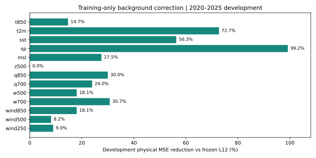

# Native background correction and display interpolation

Date: 2026-09-24. Author: Codex (OpenAI), contributed under Unknown v0.3,
through Mingli Yuan's authorized account proxy. Account ownership is not
personal authorship, review, endorsement or a correctness guarantee.

This is a finite external numerical continuation of [Research 0229](0229-spectral-memory-local-constraints-and-weather-errors.md),
requested to improve the existing xue forecast. A three-frame memory attempt
failed the declared selection gate. A separately contracted training-only
background correction passed it. On the already exposed 2020–2025 development
interval, the selected correction reduces aggregate normalized physical MSE
by 28.7623% and 500 hPa vector MSE by 8.2019% against frozen L12.
This is a correction to the representation of the seasonal background, not
evidence that temporal memory or a new Taixuan/Einstein spectrum improves
meteorological dynamics. No native authority or library obligation changes.
The paused Lorentzian experiment is not resumed.

## Boundaries and chronology

Both contracts retain 1979–2014 training, 2015–2019 validation, and 2020–2025
development targets. These periods were already exposed in previous work;
there is no untouched confirmation set or as-of historical reanalysis archive.
For each lead, an origin precedes its target. No 2026 observation is used.
The displayed forecast still starts from December 2025 and predicts calendar
month means for January–June 2026. It was generated September 24, 2026 and is
explicitly a retrospective historical-origin experiment, not a live forecast.

All choices, numerical limits, source hashes and protected obligations are in
[the memory contract](../../experiments/spectral_memory_forecast_v1/contract.json)
and [the successor background contract](../../experiments/native_background_forecast_v1/contract.json).
The latter pins the former's completed selection and receipt, recording why a
different attempt was made. Its single training family does not retune the
failed memory candidate or lower the two-percent channel threshold.

## The memory trial: retained negative result

The fixed low-degree part of the existing L12 state has 778 coefficients. It
is not the independently trained L6 model. Retain the fine L12 components and
fit direct 1–6-month ridge maps on 64 training-only low-degree EOF coordinates,
using either one or three history frames. Four penalties and two blends give
48 ridge fits and 16 validation candidates. Choose one global candidate per
history family, then a whole-channel switch only when validation improves by
at least 2%, with incumbent and seasonal alternatives.

No channel passes this gate. The three-frame family's largest per-channel
gain is approximately 1.913% for wind500. The selected model remains the
incumbent in every channel and is not promoted. Computational completion is
`Pass`; scientific improvement is absent under this finite contract. The
single training launch used 24.519 seconds wall time, 24.545 seconds CPU,
and 980,660 KiB peak resident memory. Its independent verification was not
launched, since no new forecast was selected. The negative trial's unused
allowance is not transferred to the successor.

## Correct the background, retain the learned anomaly

Let c_m be the frozen L12 monthly coefficient climatology and a_hat the frozen
learner's forecast anomaly. Let B_m be the arithmetic mean of the physical
native-grid reference field for calendar month m over 1979–2014, using only
training-valid samples and the fixed physical domain. For identity channels,

    corrected(x) = B_m(x) + synthesize_L12(a_hat)(x).

For positive specific humidity, whose learned state is logarithmic,

    corrected_q(x) = B_m,q(x) * exp(synthesize_L12(a_hat_q)(x)).

This is a multiplicative anomaly about the arithmetic physical background.
It is not an additive correction in log units, and it is scored in kg/kg.
Each channel must lower mean physical validation MSE across all six leads by
at least 2%; otherwise retain its complete original forecast. Twelve of the
thirteen channels switch. z500 improves only 1.404% in validation and remains
unchanged. The native seasonal-only comparator is reported but is not a
candidate selected by this contract.

Means have 36 training samples per month on the admitted domain. No held-out
observation enters those means. Selection is written before development
forecast construction and scoring. Reference arrays, pressure screening and
spatial weights are the same for the old and corrected score. Native direct
incumbent scores agree with archived spectral-Gram accounting within the
contract's 1e-8 relative tolerance.

| Channel | Development physical MSE reduction vs L12 |
| --- | ---: |
| t850 | 14.708% |
| t2m | 72.736% |
| sst | 56.305% |
| sp | 99.201% |
| msl | 27.542% |
| z500 | 0.000% |
| q850 | 29.990% |
| q700 | 23.973% |
| w500 | 18.062% |
| w700 | 30.725% |
| wind850 | 18.052% |
| wind500 | 8.202% |
| wind250 | 9.006% |

The aggregate first divides each physical MSE by the frozen original L6
training seasonal error for that channel, then equally averages 13 channels
and six leads. Old L12 = 0.6969806353; selected corrected = 0.4965129415;
native seasonal = 0.5303941775. The much larger improvement against old L12
than against native seasonal reflects an important background representation
error; it is not an equally large gain in anomaly predictability. These are
MSE reductions, not RMSE reductions, wind-speed changes or accuracy rates.

The predeclared numerical promotion gate requires at least 0.5% aggregate
gain, at most 0.5% wind500 degradation, and at most 5% degradation in any
channel. It passes without changing the selected parameters. Numerical
training used 99.081 seconds wall, 99.042 seconds CPU and 1,192,788 KiB RSS.
Its budget is one training launch, 300 seconds wall, 270 seconds CPU, 4 GiB
address space and 250 MB output. Verification used the separately pinned
implementation once: 15.9998 seconds wall, 16.055 seconds CPU, 729,132 KiB RSS,
within 240-second wall and 210-second CPU bounds. Both launch allowances are
now spent. Parent wall timeout, worker CPU/address-space/file-size limits and
persistent launch ledger enforce this cooperative experimental boundary;
these are not adversarial native certificates. Total output size is also
checked after execution. Unoptimized Python is required; assertions and
NumPy checks are not claimed to survive arbitrary interpreter alteration.

## Independent reconstruction and regional diagnostic

[The independent check](../../experiments/native_background_forecast_v1/quality-check.json)
recomputes every training background, replays the saved anomaly model, and
uses explicit four-corner interpolation in place of the trainer's SciPy
interpolator. All 16 output fields, finite masks and coarse subsets agree
exactly; maximum reported grid errors are zero. This is independent code
reconstruction using the same source arrays, not independent data acquisition.

The same fixed 9-by-9 patches and leads 1 and 6 from Research 0229 remain
diagnostic only; no regional parameter is fitted. Vector RMSE in m/s:

| Region | Lead | Original | Corrected |
| --- | ---: | ---: | ---: |
| East Asia | 1 | 4.5038 | 4.4009 |
| East Asia | 6 | 4.6286 | 4.5221 |
| North America | 1 | 5.0600 | 4.9981 |
| North America | 6 | 5.1329 | 5.0738 |
| Middle East | 1 | 4.0042 | 3.7339 |
| Middle East | 6 | 4.0372 | 3.7555 |

The corrections reduce these particular aggregate errors. They do not establish
the reality, cause or teleconnection of a specific three-region weather event.

## Output grids and the user's interpolation question

The full corrected field is no longer an L12-band-limited field: the native
background is part of the model. `forecast.npz` deliberately exposes
`spectral_anomaly_coefficients`, not a misleading total `coefficients` key.
`background.npz`, channel selection and frozen learned maps are all needed
for reproduction. Native backgrounds are interpolated with nonnegative
bilinear weights, normalized over finite neighbors; a nearest fixed native
mask and predicted surface-pressure screening define the output domain.
The 1.25-degree grid is a sampling grid, not independently demonstrated
predictive resolution. Its 2.5-degree download is exactly its `::2` subset;
the original separately trained L6 forecast remains a distinct immutable file.

The production browser before this change used Catmull–Rom bicubic spatial
reconstruction. It clamped a scalar or each u/v component to the central
2-by-2 range, then computed the wind magnitude. Time display mixed monthly
frames linearly. Point probes read the nearest quantized stored grid cell.
Pressure and height contour paths additionally smooth with a separable
Gaussian; the filled wind/temperature fields do not use that contour filter.

Clamping components does not bound vector magnitude by neighbor magnitudes.
For a concrete original 4-by-4 patch, use cardinal unit vectors E, N, W, S:

    E W S N
    W E N S
    S N E W
    N S W E

At the central half-cell Catmull–Rom weights are [-1,9,9,-1]/16 on each axis.
Every sample has norm 1. The reconstructed components are both 25/32, within
the central component range [0,1], but the norm is 25*sqrt(2)/32 = 1.1048543.
The real WebGL shader passes a pixel-level counterexample near this point.
The added bilinear path stays at or below the neighbor norm and nearest
sampling retains the original unit speeds, to palette quantization tolerance.
This is a constructed possibility witness, not a measured 10.5% bias of the
actual three observed weather structures.

The revised map defaults to bilinear and offers original-grid and legacy
bicubic comparison. In valid support, bilinear weights are nonnegative and
sum to one, so the triangle inequality bounds the interpolated vector norm
by the largest supporting norm. Original-grid mode disables spatial
reconstruction, contour pre-smoothing and frame mixing. The word original
here means the published quantized forecast cells, not raw observations.
A scalar ceiling-code no-data check also prevents reserved missing values
from being displayed as high temperatures or humidity in the central support.

[Runge's interpolation phenomenon](https://docs.scipy.org/doc/scipy/reference/generated/scipy.interpolate.BarycentricInterpolator.html)
concerns oscillation of global polynomial interpolants; the demonstrated
local cubic overshoot is related in spirit but is not that construction.
[Runge–Kutta](https://docs.scipy.org/doc/scipy/reference/generated/scipy.integrate.RK45.html)
is an ODE time integration family, not the name of this interpolation
phenomenon. Spherical truncation/ringing, discrete palettes, nonlinear
humidity reconstruction and source/model bias are separate issues. A smoother
map cannot certify any of them. Display switches do not change forecast bytes.

## Release and remaining limits

The [release receipt](../../experiments/native_background_forecast_v1/release-check.json) records build, 122 web unit checks,
17 actual WebGL shader checks, desktop/mobile integration, native Xue and Zarr
round trips for 11 bundles, and preservation of the 312 original scientific
objects. A first web test failure was the fixed expected model list lacking
the newly added fifth experiment; the fixture was updated and rerun. It did
not alter any numerical result. No numerical training was repeated to repair
frontend integration. Frozen numerical reports keep their original pending
release field; the later release receipt records its completion explicitly.

Website: [corrected experimental map](https://climatetensor.io/?lang=zh&model=ctcal12&type=wind500),
[report and downloads](https://climatetensor.io/calibration.html),
[version catalog](https://climatetensor.io/research/resolutions.json).

The user's explicit doubt about data authenticity remains an open research
obligation. File hashes and exact replay show internal integrity, not that
the reference data, learned fields or apparent teleconnections are physically
true. No independent source replication, observation assimilation, typhoon
classification or ENSO diagnosis is supplied. Surface pressure and SST remain
download-only, and predicted SST still includes values below the source's
271.35 K floor. Specific humidity is not relative humidity, 2 m air
temperature is not ground temperature, and pressure vertical velocity is
not geometric vertical wind speed.

Reference inputs remain outside Adva: NOAA/OAR/PSL NCEP/NCAR Reanalysis 1 and
ERSSTv5 cached products. The complete numerical report records their source
identifiers and digests; this note does not independently authenticate them.
NOAA data are acknowledged, no ownership of those data is claimed, and our
forecasts are not official NOAA products. Third-party Python, xue and browser
implementations remain separate dependencies under their own licenses.
The Adva publication unit contains original methods, aggregate outputs and
this exposition; no source fields, learned coefficient archives, upstream
renderer source or dependency implementation is imported.
