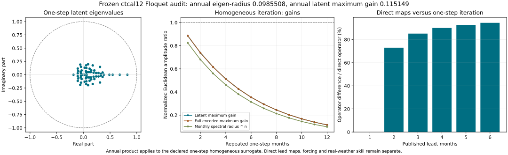

# 0232 — Floquet checks of the frozen first forecast method

**Status:** actual frozen model checked; direct propagation-family consistency
fails. The explicitly defined iterated one-step homogeneous extension contracts.
No training, forecast replacement, December field generation, native operation
or real-atmosphere stability claim.

Authored by Codex (OpenAI), through Mingli Yuan's authorized GitHub account
proxy. Account use is not his authorship, review or correctness endorsement.
Original contribution under Unknown v0.3.

## Question and protected interpretation

Following Research 0231, the user explicitly required Floquet checks in the
current first forecast method. The first ideal annual-spectrum experiment's
claim remains conditional on periodic coefficients and homogeneous linear
dynamics. Nonlinear and stochastic forcing require separate treatment.
This audit inspects the actual `ctcal12` parameters frozen in Research 0231,
rather than substituting the ideal scalar calibration multiplier 0.7788007831.

The parameter file has a 12 by 2698 climatology, 2698 fixed channel scales,
a 2698 by 64 EOF basis V and six 64 by 2698 lead maps R_h. The frozen source
confirms that **only climatology is indexed by month**; the maps are not.
Six direct anomalies reconstructed from the saved parameters agree with the
published arrays to maximum absolute 7.816e-14 in coefficient units.
Training normalization is unchanged and no source field is refitted.

## Which annual operator is actually defined?

With row coordinates,

    x(t) = (c(t) - b_month(t)) / scale,
    z(t) = x(t) V,
    direct forecast: xhat(t+h) = z(t) R_h.

The explicit iterated one-step extension re-encodes its own output:

    B = R_1 V,
    z(t+1) = z(t) B,
    z(t+12) = z(t) B^12.

In column coordinates, annual monodromy is `(B^12)^T`. Constant B is a valid
special case of a periodic homogeneous linear system, so its Floquet spectrum
is computable. There is no fitted month-dependent transition family A_1,...,A_12
in this product. The periodic affine background does not establish such a family.

The finite spectrum characterizes this declared homogeneous extension. It does
not automatically characterize all independently fitted direct-lead predictions,
nonlinear humidity decoding, physical energy or real atmospheric dynamics.
The compressed coordinates are an observer representation, not an identified
world process or native Adva identity.

## Numerical result

| Quantity | Value |
| --- | ---: |
| Monthly latent spectral radius | 0.82440071645 |
| Annual spectral radius | 0.09855083910 |
| Annual latent maximum singular value | 0.11514852592 |
| Annual full normalized coefficient maximum singular value | 0.11520147496 |
| Largest latent gain at months 1–12 | 0.88536586410 |
| Largest full coefficient gain at months 1–12 | 0.88632743588 |

All 64 latent annual multiplier moduli are below one. The slowest eigenmode
retains about 9.855% amplitude after a year in the homogeneous extension.
An arbitrary normalized EOF initial vector has annual norm ratio at most
11.515%. The two numbers differ because eigenvalues and singular values answer
different questions. No finite-month amplification is found in the declared
Euclidean norms at months 1–12; these are not physical atmospheric energy norms.

The leading mode is positive real and has no phase rotation. There are 56
nonreal monthly modes. The strongest complex annual pair has modulus
5.1174e-6 and principal argument +/-1.38453 radians (+/-79.3276 degrees).
This is rotation in the complex modal coefficient plane, not a geographic wind
turn. An annual principal argument alone does not identify an unaliased frequency.



## The published direct maps do not compose

Since V has orthonormal columns, the full normalized operator discrepancy
between the published h-month map and one-step iteration can be measured as

    ||R_h - B^(h-1) R_1||_F / ||R_h||_F.

| Lead, months | Relative operator difference | Difference for actual Dec-2025 encoded initial state |
| --- | ---: | ---: |
| 1 | 0.00% | 0.00% |
| 2 | 72.95% | 65.72% |
| 3 | 85.16% | 78.07% |
| 4 | 90.01% | 85.67% |
| 5 | 92.65% | 83.45% |
| 6 | 94.45% | 86.00% |

All 15 ordered positive (i,j) combinations with i+j<=6 were also checked:
compare `R_(i+j)` with `(R_i V) R_j`. Relative differences span
72.95–79.29%, far beyond the predeclared numerical consistency tolerance 1e-8.

Thus the six direct maps do not realize the homogeneous monthly propagation
family implied by their own one-step map. **The annual number 0.09855 cannot
be reported as the annual evolution of the complete published direct forecast.**
These differences are not forecast errors or skill losses. Direct regression
is a valid statistical forecasting approach and need not obey a semigroup on a
compressed observed state. Lost memory and separate lead fitting are possible
contributors, not established causes in this audit.

## Why the inhomogeneous remainder matters

Define realized one-step innovations using the same frozen operator:

    e(t+1) = z(t+1) - z(t) B.
    z(t+12) = z(t) B^12 + sum[j=1..12] e(t+j) B^(12-j).

This identity closes within 1.78e-15 across all three retained splits.
For 72 exposed development target months in 2020–2025:

| Normalized latent quantity | RMS |
| --- | ---: |
| Historical endpoint state | 3.254793 |
| Homogeneous propagation from 12 months earlier | 0.124284 |
| Accumulated realized innovations | 3.215236 |

The last/first RMS ratio is 98.785%. RMS terms do not add and this is not a
variance-explained percentage. The identity deliberately uses realized future
innovations, sometimes crossing split boundaries. It is an ex-post algebraic
decomposition, not a 12-month operational hindcast or an independent skill test.

One-step innovation/state RMS ratios are 85.11% in training, 90.99% in
validation and 88.30% in exposed development. Innovations combine omitted
state, biases, nonlinear dynamics, stochastic forcing and measurement errors;
this audit does not identify their separate contributions. Homogeneous decay
does not imply that real anomalies disappear, because innovations continually
repopulate the observed state. This makes the user's qualification about
nonlinearity and random forcing operationally consequential.

## Checks, failures and finite scope

The first diagnostic stopped after 1.151 s wall at historical date masks:
NumPy 2.4 rejects comparing datetime64 arrays directly with string literals.
The first contract, source and failure receipt remain under `attempt-1/`.
A one-launch continuation changed only those comparisons to explicit
`numpy.datetime64` constants. Scientific inputs, cases and thresholds did not
change. The successor completed in 2.876 s wall / 2.893 s CPU with peak RSS
163,612 KiB. Each diagnostic had a 180 s wall / 150 s CPU / 3 GiB / 30 MB
budget; the continuation fixes aggregate launch allowance at two. No further
automatic retry or ledger reset is permitted.

Controls include EOF orthogonality (Frobenius error 1.34e-14), reconstruction
of all six published anomalies, annual eigenvalue mapping (max discrepancy
6.72e-15), matrix powers against explicit products, and independently iterated
full 2698-coordinate states (max discrepancy 2.78e-17). Original analytic
controls check damped rotation, a stable nonnormal matrix with transient growth,
and a deliberately inconsistent direct map. Computational completion does not
turn the failed direct-family criterion into a pass.

A separate read-only verifier uses column coordinates, NumPy eigenvalues,
`matrix_power` and direct SVD rather than the audit's row products and Gram
norms. It verifies the model hash, four principal values and all six operator
discrepancies. Its first command stopped before matrix work because its chosen
directory did not co-locate contract.json and report.json. The corrected
co-located input invocation is retained under a two-invocation cap, without
source or numerical changes. Bounds are 60 s wall / 40 s CPU / 3 GiB.
See its receipt for the actual maximum difference.

## Reproduction and next unresolved obligation

[Public report and original reproduction bundle](https://climatetensor.io/research/floquet-forecast-audit-v1/)
contain source, contracts, aggregate results and retained failures. The already
public frozen parameter file can independently reproduce the principal checks:

```sh
curl -fL https://climatetensor.io/research/native-background-l12-v1/model.npz -o model.npz
OPENBLAS_NUM_THREADS=1 OMP_NUM_THREADS=1 python3 verify.py --root . --model model.npz
```

Run outside the Adva repository after unpacking the public bundle. Python
3.11.15 and NumPy 2.4.6 were used. Full historical innovation reconstruction
also needs the frozen projection cache and forecast, whose hashes and paths
are in contract.json; they are not bundled in Adva. Missing inputs must remain
Unavailable. SciPy 1.17.1 and Matplotlib 3.11.2 remain separate dependencies.
The original full run's launch allowance is spent; the public verifier is the
read-only reproduction route, not permission to reset an experiment ledger.

A future periodic transition learner would need an explicit state/memory
choice, monthly transition family and remainder treatment, with training-only
estimation and held-out annual/forecast comparisons against baselines. That is
an unexecuted design obligation. This diagnostic neither installs such a model
nor establishes its superior skill. The frozen original predictions and all
Research 0231 findings remain unchanged, including unavailable December 2026
fields and unresolved source authenticity.

References: [Research 0231](0231-frozen-japan-jet-and-floquet-scope.md);
[DaCunha and Davis on periodic linear systems](https://arxiv.org/abs/0901.3841).
External results supply their stated assumptions, not a native certificate.
